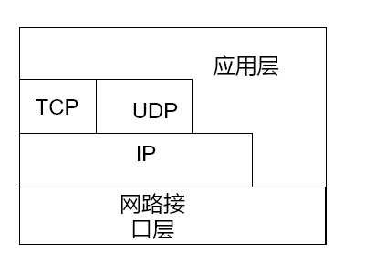
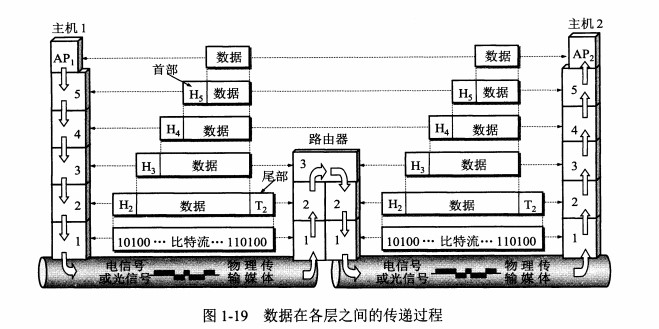

# 计算机网络体系结构

## 五层协议

- #### **应用层** ：
  
  为特定应用程序提供数据传输服务，例如 HTTP、DNS 等协议。数据单位为报文。

- #### **传输层** ：
  
  负责向两台<mark>主机进程</mark>之间的通信提供通用的数据传输服务。由于应用层协议很多，定义通用的传输层协议就可以支持不断增多的应用层协议。运输层包括两种协议：
  
  - 传输控制协议 TCP，提供面向连接、可靠的数据传输服务，数据单位为报文段；
  - 用户数据报协议 UDP，提供无连接、尽最大努力的数据传输服务（不保证可靠），数据单位为用户数据报。
  - TCP 主要提供完整性服务，UDP 主要提供及时性服务。
  
  由于一台主机可同时运行多个线程，因此运输层有复用和分用的功能。所谓复用就是指多个应用层进程可同时使用下面运输层的服务，分用和复用相反，是运输层把收到的信息分别交付上面应用层中的相应进程。

- #### **网络层** ：
  
  为主机提供数据传输服务。网络层把传输层传递下来的报文段或者用户数据报封装成分组。在 TCP/IP 体系结构中，由于网络层使用 **IP 协议**，因此分组也叫 **IP 数据报** ，简称 **数据报**。网络层也叫做**网际层**或**IP层**。

- #### **数据链路层** ：
  
  网络层针对的还是主机之间的数据传输服务，而主机之间可以有很多链路，链路层协议就是为同一链路的主机提供数据传输服务。 在两个相邻节点之间传送数据时，**数据链路层将网络层交下来的 IP 数据报组装成帧**，在两个相邻节点间的链路上传送帧。每一帧包括数据和必要的控制信息（如同步信息，地址信息，差错控制等）。

- #### **物理层** ：
  
  考虑的是怎样在相邻计算机节点之间传输数据比特流。物理层（physical layer）的作用是实现相邻计算机节点之间比特流的透明传送，尽可能屏蔽掉具体传输介质和物理设备的差异。使其上面的数据链路层不必考虑网络的具体传输介质是什么。“透明传送比特流”表示经实际电路传送后的比特流没有发生变化，对传送的比特流来说，这个电路好像是看不见的。

## OSI

其中表示层和会话层用途如下：

- **表示层** ：数据压缩、加密以及数据描述，这使得应用程序不必关心在各台主机中数据内部格式不同的问题。
- **会话层** ：建立及管理会话。

五层协议没有表示层和会话层，而是将这些功能留给应用程序开发者处理。

## TCP/IP

它只有四层，相当于五层协议中数据链路层和物理层合并为网络接口层。

TCP/IP 体系结构不严格遵循 OSI 分层概念，应用层可能会直接使用 IP 层或者网络接口层。

## 数据在各层之间的传递过程

在向下的过程中，需要添加下层协议所需要的首部或者尾部，而在向上的过程中不断拆开首部和尾部。

路由器只有下面三层协议，因为路由器位于网络核心中，不需要为进程或者应用程序提供服务，因此也就不需要传输层和应用层。

## 总结

图片来源：https://blog.csdn.net/yaopeng_2005/article/details/7064869

## 从输入网址到获得页面的网络请求过程

- 查询 DNS

- 浏览器获得域名对应的IP地址后，发起TCP三次握手

- TCP/IP连接建立起来后，浏览器就可以向服务器发送HTTP请求了

- TLS 握手
  
  - 客户端发送一个 `ClientHello` 消息到服务器端，消息中同时包含了它的 Transport Layer Security (TLS) 版本，可用的加密算法和压缩算法。
  - 服务器端向客户端返回一个 `ServerHello` 消息，消息中包含了服务器端的TLS版本，服务器所选择的加密和压缩算法，以及数字证书认证机构（Certificate Authority，缩写 CA）签发的服务器公开证书，证书中包含了公钥。客户端会使用这个公钥加密接下来的握手过程，直到协商生成一个新的对称密钥
  - 客户端根据自己的信任CA列表，验证服务器端的证书是否可信。如果认为可信，客户端会生成一串伪随机数，使用服务器的公钥加密它。这串随机数会被用于生成新的对称密钥
  - 服务器端使用自己的私钥解密上面提到的随机数，然后使用这串随机数生成自己的对称主密钥
  - 客户端发送一个 `Finished` 消息给服务器端，使用对称密钥加密这次通讯的一个散列值
  - 服务器端生成自己的 hash 值，然后解密客户端发送来的信息，检查这两个值是否对应。如果对应，就向客户端发送一个 `Finished` 消息，也使用协商好的对称密钥加密
  - 从现在开始，接下来整个 TLS 会话都使用对称秘钥进行加密，传输应用层（HTTP）内容

- HTTP 服务器请求处理
  
  HTTPD(HTTP Daemon)在服务器端处理请求/响应。最常见的 HTTPD 有 Linux 上常用的 Apache 和 nginx，以及 Windows 上的 IIS。
  
  - HTTPD 接收请求
  - 服务器验证其上已经配置了 google.com 的虚拟主机
  - 服务器验证 google.com 接受 GET 方法
  - 服务器验证该用户可以使用 GET 方法(根据 IP 地址，身份信息等)
  - 如果服务器安装了 URL 重写模块（例如 Apache 的 mod_rewrite 和 IIS 的 URL Rewrite），服务器会尝试匹配重写规则，如果匹配上的话，服务器会按照规则重写这个请求
  - 服务器根据请求信息获取相应的响应内容，这种情况下由于访问路径是 “/“ ,会访问首页文件（你可以重写这个规则，但是这个是最常用的）。
  - 服务器会使用指定的处理程序分析处理这个文件，假如 Google 使用 PHP，服务器会使用 PHP 解析 index 文件，并捕获输出，把 PHP 的输出结果返回给请求者

- 服务器接受到这个请求，根据路径参数，经过后端的一些处理生成HTML页面代码返回给浏览器

- 浏览器拿到完整的HTML页面代码开始解析和渲染，如果遇到引用的外部[js](http://lib.csdn.net/base/javascript)，CSS,图片等静态资源，它们同样也是一个个的HTTP请求，都需要经过上面的步骤

- 浏览器根据拿到的资源对页面进行渲染，最终把一个完整的页面呈现给用户

# 核心概念

### 电路交换与分组交换

#### 1. 电路交换

电路交换用于电话通信系统，两个用户要通信之前需要建立一条专用的物理链路，并且在整个通信过程中始终占用该链路。由于通信的过程中不可能一直在使用传输线路，因此电路交换对线路的利用率很低，往往不到 10%。

#### 2. 分组交换

每个分组都有首部和尾部，包含了源地址和目的地址等控制信息，在同一个传输线路上同时传输多个分组互相不会影响，因此在同一条传输线路上允许同时传输多个分组，也就是说分组交换不需要占用传输线路。

在一个邮局通信系统中，邮局收到一份邮件之后，先存储下来，然后把相同目的地的邮件一起转发到下一个目的地，这个过程就是存储转发过程，分组交换也使用了存储转发过程。

### 时延

总时延 = 排队时延 + 处理时延 + 传输时延 + 传播时延

#### 1. 排队时延

分组在路由器的输入队列和输出队列中排队等待的时间，取决于网络当前的通信量。

#### 2. 处理时延

主机或路由器收到分组时进行处理所需要的时间，例如分析首部、从分组中提取数据、进行差错检验或查找适当的路由等。

#### 3. 传输时延

主机或路由器传输数据帧所需要的时间。
$$
delay =\frac{l(bit)}{v(bit/s)}
$$

其中 l 表示数据帧的长度，v 表示传输速率。

#### 4. 传播时延

电磁波在信道中传播所需要花费的时间，电磁波传播的速度接近光速。
$$
delay = \frac{l(m)}{v(m/s)}
$$

其中 l 表示信道长度，v 表示电磁波在信道上的传播速度。