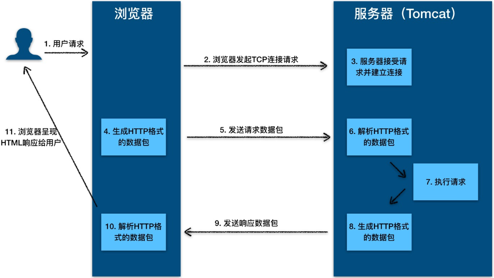

# HTTP

## HTTP 的本质

HTTP 协议是浏览器与服务器之间的数据传送协议。作为应用层协议，HTTP 是基于 TCP/IP 协议来传递数据的（HTML 文件、图片、查询结果等），HTTP 协议不涉及数据包（Packet）传输，主要规定了客户端和服务器之间的通信格式。

下面我通过一个例子来告诉你 HTTP 的本质是什么。

假如浏览器需要从远程 HTTP 服务器获取一个 HTML 文本，在这个过程中，浏览器实际上要做两件事情。

- 与服务器建立 Socket 连接。
- 生成**请求数据**并通过 Socket 发送出去。

第一步比较容易理解，浏览器从地址栏获取用户输入的网址和端口，去连接远端的服务器，这样就能通信了。

我们重点来看第二步，这个请求数据到底长什么样呢？都请求些什么内容呢？或者换句话说，浏览器需要告诉服务端什么信息呢？

首先最基本的是，你要让服务端知道你的意图，你是想获取内容还是提交内容；其次你需要告诉服务端你想要哪个内容。那么要把这些信息以一种什么样的格式放到请求里去呢？这就是 HTTP 协议要解决的问题。也就是说，**HTTP 协议的本质就是一种浏览器与服务器之间约定好的通信格式**。那浏览器与服务器之间具体是怎么工作的呢？



从图上你可以看到，这个过程是：

1. 用户通过浏览器进行了一个操作，比如输入网址并回车，或者是点击链接，接着浏览器获取了这个事件。

2. 浏览器向服务端发出 TCP 连接请求。

3. 服务程序接受浏览器的连接请求，并经过 TCP 三次握手建立连接。

4. 浏览器将请求数据打包成一个 HTTP 协议格式的数据包。

5. 浏览器将该数据包推入网络，数据包经过网络传输，最终达到端服务程序。

6. 服务端程序拿到这个数据包后，同样以 HTTP 协议格式解包，获取到客户端的意图。

7. 得知客户端意图后进行处理，比如提供静态文件或者调用服务端程序获得动态结果。

8. 服务器将响应结果（可能是 HTML 或者图片等）按照 HTTP 协议格式打包。

9. 服务器将响应数据包推入网络，数据包经过网络传输最终达到到浏览器。

10. 浏览器拿到数据包后，以 HTTP 协议的格式解包，然后解析数据，假设这里的数据是 HTML。

11. 浏览器将 HTML 文件展示在页面上。

## 1. URL、URI、URN区

- URI（Uniform Resource Identifier，统一资源标识符）
  
  web服务器资源的名字，例如： index.html

- URL（Uniform Resource Locator，统一资源定位符）

- URN（Uniform Resource Name，统一资源名称），例如 urn:isbn:0-486-27557-4。

URI 包含 URL 和 URN，目前 WEB 只有 URL 比较流行，所以见到的基本都是 URL。


## 2. HTTP的请求和响应报文

### （1）请求报文


**GET请求**


**POST请求**


### （2）响应报文


**200响应**


**404响应**


参考资料：

- [这一次,让我们再深入一点 - HTTP报文 - 掘金](https://juejin.im/post/5a4f782c5188257326469d7c)

## 3. HTTP状态

服务器返回的 **响应报文** 中第一行为状态行，包含了状态码以及原因短语，用来告知客户端请求的结果。

| 状态码 | 类别                     | 原因短语          |
|:--- |:---------------------- |:------------- |
| 1XX | Informational（信息性状态码）  | 接收的请求正在处理     |
| 2XX | Success（成功状态码）         | 请求正常处理完毕      |
| 3XX | Redirection（重定向状态码）    | 需要进行附加操作以完成请求 |
| 4XX | Client Error（客户端错误状态码） | 服务器无法处理请求     |
| 5XX | Server Error（服务器错误状态码） | 服务器处理请求出错     |

### （1）1XX 信息

- **100 Continue** ：表明到目前为止都很正常，客户端可以继续发送请求或者忽略这个响应。

### （2）2XX 成功

- **200 OK**
- **204 No Content** ：请求已经成功处理，但是返回的响应报文不包含实体的主体部分。一般在只需要从客户端往服务器发送信息，而不需要返回数据时使用。
- **206 Partial Content** ：表示客户端进行了范围请求。响应报文包含由 Content-Range 指定范围的实体内容。

### （3）3XX 重定向

- **301 Moved Permanently** ：永久性重定向
- **302 Found** ：临时性重定向
- **303 See Other** ：和 302 有着相同的功能，但是 303 明确要求客户端应该采用 GET 方法获取资源。
- 注：虽然 HTTP 协议规定 301、302 状态下重定向时不允许把 POST 方法改成 GET 方法，但是大多数浏览器都会在 301、302 和 303 状态下的重定向把 POST 方法改成 GET 方法。
- **304 Not Modified** ：如果请求报文首部包含一些条件，例如：If-Match，If-Modified-Since，If-None-Match，If-Range，If-Unmodified-Since，如果不满足条件，则服务器会返回 304 状态码。
- **307 Temporary Redirect** ：临时重定向，与 302 的含义类似，但是 307 要求浏览器不会把重定向请求的 POST 方法改成 GET 方法。

### （4）4XX 客户端错误

- **400 Bad Request** ：请求报文中存在语法错误。
- **401 Unauthorized** ：该状态码表示发送的请求需要有认证信息（BASIC 认证、DIGEST 认证）。如果之前已进行过一次请求，则表示用户认证失败。
- **403 Forbidden** ：请求被拒绝，服务器端没有必要给出拒绝的详细理由。
- **404 Not Found**

### （5）5XX 服务器错误

- **500 Internal Server Error** ：服务器正在执行请求时发生错误。
- **503 Service Unavailable** ：服务器暂时处于超负载或正在进行停机维护，现在无法处理请求。

## 4. HTTP方法

客户端发送的 **请求报文** 第一行为请求行，包含了方法字段。

### （1）GET

> 获取资源

当前网络请求中，绝大部分使用的是 GET 方法。

### （2）HEAD

> 获取报文首部

和 GET 方法一样，但是不返回报文实体主体部分。

主要用于确认 URL 的有效性以及资源更新的日期时间等。

### （3）POST

> 传输实体主体

POST 主要用来传输数据，而 GET 主要用来获取资源。

### （4）PUT

> 上传文件

由于自身不带验证机制，任何人都可以上传文件，因此存在安全性问题，一般不使用该方法。

```
PUT /new.html HTTP/1.1
Host: example.com
Content-type: text/html
Content-length: 16

<p>New File</p>
```

### （5）PATCH

> 对资源进行部分修改

PUT 也可以用于修改资源，但是只能完全替代原始资源，PATCH 允许部分修改。

```
PATCH /file.txt HTTP/1.1
Host: www.example.com
Content-Type: application/example
If-Match: "e0023aa4e"
Content-Length: 100

[description of changes]
```

### （6）DELETE

> 删除文件

与 PUT 功能相反，并且同样不带验证机制。

```
DELETE /file.html HTTP/1.1
```

### （7）OPTIONS

> 查询支持的方法

查询指定的 URL 能够支持的方法。

会返回 Allow: GET, POST, HEAD, OPTIONS 这样的内容。

### （8）CONNECT

> 要求在与代理服务器通信时建立隧道

使用 SSL（Secure Sockets Layer，安全套接层）和 TLS（Transport Layer Security，传输层安全）协议把通信内容加密后经网络隧道传输。

```
CONNECT www.example.com:443 HTTP/1.1
```


### （9）TRACE

> 追踪路径

服务器会将通信路径返回给客户端。

发送请求时，在 Max-Forwards 首部字段中填入数值，每经过一个服务器就会减 1，当数值为 0 时就停止传输。

通常不会使用 TRACE，并且它容易受到 XST 攻击（Cross-Site Tracing，跨站追踪）。

## 5. GET和POST的区别

> 就下面的找几个点和面试官侃侃而谈即可，不可能全部都记得，想到什么讲什么吧

- GET 被强制服务器支持

- GET请求发送数据更小
  
  浏览器对URL的长度有限制，所以GET请求不能代替POST请求发送大量数据

- GET请求是幂等的
  
  幂等的意味着对同一URL的多个请求应该返回同样的结果

- POST请求不能被缓存

- POST请求相对GET请求是「安全」的
  
  - 这里安全的含义仅仅是指是非修改信息

- GET用于信息获取，而且是安全的和幂等的
  
  - 所谓安全的意味着该操作用于获取信息而非修改信息。换句话说，GET 请求一般不应产生副作用。就是说，它仅仅是获取资源信息，就像数据库查询一样，不会修改，增加数据，不会影响资源的状态。

- POST是用于修改服务器上的资源的请求

- 发送包含未知字符的用户输入时，POST 比 GET 更稳定也更可靠

**引申：说完原理性的问题，我们从表面上来看看GET和POST的区别：**

- GET是从服务器上获取数据，POST是向服务器传送数据。 GET和 POST只是一种传递数据的方式，GET也可以把数据传到服务器，他们的本质都是发送请求和接收结果。只是组织格式和数据量上面有差别，http协议里面有介绍
- GET是把参数数据队列加到提交表单的ACTION属性所指的URL中，值和表单内各个字段一一对应，在URL中可以看到。POST是通过HTTP POST机制，将表单内各个字段与其内容放置在HTML HEADER内一起传送到ACTION属性所指的URL地址。用户看不到这个过程。 因为GET设计成传输小数据，而且最好是不修改服务器的数据，所以浏览器一般都在地址栏里面可以看到，但POST一般都用来传递大数据，或比较隐私的数据，所以在地址栏看不到，能不能看到不是协议规定，是浏览器规定的。
- 对于GET方式，服务器端用Request.QueryString获取变量的值，对于POST方式，服务器端用Request.Form获取提交的数据。 没明白，怎么获得变量和你的服务器有关，和GET或POST无关，服务器都对这些请求做了封装
- GET传送的数据量较小，不能大于2KB。POST传送的数据量较大，一般被默认为不受限制。但理论上，IIS4中最大量为80KB，IIS5中为100KB。 POST基本没有限制，我想大家都上传过文件，都是用POST方式的。只不过要修改form里面的那个type参数
- GET安全性非常低，POST安全性较高。 如果没有加密，他们安全级别都是一样的，随便一个监听器都可以把所有的数据监听到。

## 6. 如何理解HTTP协议是无状态的

HTTP协议是无状态的（stateless），指的是协议对于事务处理没有记忆能力，服务器不知道客户端是什么状态。也就是说，打开一个服务器上的网页和上一次打开这个服务器上的网页之间没有任何联系。HTTP是一个无状态的面向连接的协议，无状态不代表HTTP不能保持TCP连接，更不能代表HTTP使用的是UDP协议（无连接）。 

缺少状态意味着如果后续处理需要前面的信息，则它必须重传，这样可能导致每次连接传送的数据量增大。另一方面，在服务器不需要先前信息时它的应答就较快。

## 7. 什么是短连接和长连接

在HTTP/1.0中默认使用短连接。也就是说，客户端和服务器每进行一次HTTP操作，就建立一次连接，任务结束就中断连接。当客户端浏览器访问的某个HTML或其他类型的Web页中包含有其他的Web资源（如JavaScript文件、图像文件、CSS文件等），每遇到这样一个Web资源，浏览器就会重新建立一个HTTP会话。

而从HTTP/1.1起，默认使用长连接，用以保持连接特性。使用长连接的HTTP协议，会在响应头加入这行代码：

```javascript
Connection:keep-alive
```

在使用长连接的情况下，当一个网页打开完成后，客户端和服务器之间用于传输HTTP数据的TCP连接不会关闭，客户端再次访问这个服务器时，会继续使用这一条已经建立的连接。Keep-Alive不会永久保持连接，它有一个保持时间，可以在不同的服务器软件（如Apache）中设定这个时间。实现长连接需要客户端和服务端都支持长连接。

HTTP协议的长连接和短连接，实质上是TCP协议的长连接和短连接。

## 8. Cookie

HTTP 协议是无状态的，主要是为了让 HTTP 协议尽可能简单，使得它能够处理大量事务。HTTP/1.1 引入 Cookie 来保存状态信息。

Cookie 是服务器发送到用户浏览器并保存在本地的一小块数据，它会在浏览器下次向同一服务器再发起请求时被携带并发送到服务器上。它用于告知服务端两个请求是否来自同一浏览器，并保持用户的登录状态。

### （1）用途

- 会话状态管理（如用户登录状态、购物车、游戏分数或其它需要记录的信息）
- 个性化设置（如用户自定义设置、主题等）
- 浏览器行为跟踪（如跟踪分析用户行为等）

Cookie 曾一度用于客户端数据的存储，因为当时并没有其它合适的存储办法而作为唯一的存储手段，但现在随着现代浏览器开始支持各种各样的存储方式，Cookie 渐渐被淘汰。由于服务器指定 Cookie 后，浏览器的每次请求都会携带 Cookie 数据，会带来额外的性能开销（尤其是在移动环境下）。新的浏览器 API 已经允许开发者直接将数据存储到本地，如使用 Web storage API （本地存储和会话存储）或 IndexedDB。

### （2）创建过程

服务器发送的响应报文包含 Set-Cookie 首部字段，客户端得到响应报文后把 Cookie 内容保存到浏览器中。

```
HTTP/1.0 200 OK
Content-type: text/html
Set-Cookie: yummy_cookie=choco
Set-Cookie: tasty_cookie=strawberry

[page content]
```

客户端之后对同一个服务器发送请求时，会从浏览器中读出 Cookie 信息通过 Cookie 请求首部字段发送给服务器。

```
GET /sample_page.html HTTP/1.1
Host: www.example.org
Cookie: yummy_cookie=choco; tasty_cookie=strawberry
```

### （3）分类

- 会话期 Cookie：浏览器关闭之后它会被自动删除，也就是说它仅在会话期内有效。
- 持久性 Cookie：指定一个特定的过期时间（Expires）或有效期（max-age）之后就成为了持久性的 Cookie。

```
Set-Cookie: id=a3fWa; Expires=Wed, 21 Oct 2015 07:28:00 GMT;
```

### （4）JavaScript 获取 Cookie

通过 `Document.cookie` 属性可创建新的 Cookie，也可通过该属性访问非 HttpOnly 标记的 Cookie。

```javascript
document.cookie = "yummy_cookie=choco";
document.cookie = "tasty_cookie=strawberry";
console.log(document.cookie);
```

### （5）Secure 和 HttpOnly

标记为 Secure 的 Cookie 只应通过被 HTTPS 协议加密过的请求发送给服务端。但即便设置了 Secure 标记，敏感信息也不应该通过 Cookie 传输，因为 Cookie 有其固有的不安全性，Secure 标记也无法提供确实的安全保障。

标记为 HttpOnly 的 Cookie 不能被 JavaScript 脚本调用。因为跨域脚本 (XSS) 攻击常常使用 JavaScript 的 `Document.cookie`API 窃取用户的 Cookie 信息，因此使用 HttpOnly 标记可以在一定程度上避免 XSS 攻击。

```
Set-Cookie: id=a3fWa; Expires=Wed, 21 Oct 2015 07:28:00 GMT; Secure; HttpOnly
```

### （6）作用域

Domain 标识指定了哪些主机可以接受 Cookie。如果不指定，默认为当前文档的主机（不包含子域名）。如果指定了 Domain，则一般包含子域名。例如，如果设置 Domain=mozilla.org，则 Cookie 也包含在子域名中（如 developer.mozilla.org）。

Path 标识指定了主机下的哪些路径可以接受 Cookie（该 URL 路径必须存在于请求 URL 中）。以字符 %x2F (“/“) 作为路径分隔符，子路径也会被匹配。例如，设置 Path=/docs，则以下地址都会匹配：

- /docs
- /docs/Web/
- /docs/Web/HTTP

## 9. Session

除了可以将用户信息通过 Cookie 存储在用户浏览器中，也可以利用 Session 存储在服务器端，存储在服务器端的信息更加安全。

Session 可以存储在服务器上的文件、数据库或者内存中，现在最常见的是将 Session 存储在内存型数据库中，比如 Redis。

使用 Session 维护用户登录的过程如下：

- 用户进行登录时，用户提交包含用户名和密码的表单，放入 HTTP 请求报文中；
- 服务器验证用户名和密码；
- 如果正确则把用户信息存储到 Redis 中，它在 Redis 中的 ID 称为 Session ID；
- 服务器返回的响应报文的 Set-Cookie 首部字段包含了这个 Session ID，客户端收到响应报文之后将该 Cookie 值存入浏览器中；
- 客户端之后对同一个服务器进行请求时会包含该 Cookie 值，服务器收到之后提取出 Session ID，从 Redis 中取出用户信息，继续之后的业务操作。

应该注意 Session ID 的安全性问题，不能让它被恶意攻击者轻易获取，那么就不能产生一个容易被猜到的 Session ID 值。此外，还需要经常重新生成 Session ID。在对安全性要求极高的场景下，例如转账等操作，除了使用 Session 管理用户状态之外，还需要对用户进行重新验证，比如重新输入密码，或者使用短信验证码等方式。


## 10. 浏览器禁用 Cookie

此时无法使用 Cookie 来保存用户信息，只能使用 Session。除此之外，不能再将 Session ID 存放到 Cookie 中，而是使用 URL 重写技术，将 Session ID 作为 URL 的参数进行传递。

## 11. Cookie 与 Session 选择

- Cookie 只能存储 ASCII 码字符串，而 Session 则可以存取任何类型的数据，因此在考虑数据复杂性时首选 Session；
- Cookie 存储在浏览器中，容易被恶意查看。如果非要将一些隐私数据存在 Cookie 中，可以将 Cookie 值进行加密，然后在服务器进行解密；
- 对于大型网站，如果用户所有的信息都存储在 Session 中，那么开销是非常大的，因此不建议将所有的用户信息都存储到 Session 中。

## 12. HTTPS安全性

**HTTP 有以下安全性问题：**

- 使用明文进行通信，内容可能会被窃听；
- 不验证通信方的身份，通信方的身份有可能遭遇伪装；
- 无法证明报文的完整性，报文有可能遭篡改。

HTTPs（Hyper Text Transfer Protocol over Secure Socket Layer），是以安全为目标的HTTP通道，简单讲是HTTP的安全版。

HTTPs 并不是新协议，而是让 HTTP 先和 SSL（Secure Sockets Layer）通信，再由 SSL 和 TCP 通信。也就是说 HTTPs 使用了隧道进行通信。

通过使用 SSL，HTTPs 具有了加密（防窃听）、认证（防伪装）和完整性保护（防篡改）。（1）对称密钥加密

对称密钥加密（Symmetric-Key Encryption），加密和解密使用同一密钥。

- 优点：运算速度快；
- 缺点：无法安全地将密钥传输给通信方。

### （2）非对称密钥加密

非对称密钥加密，又称公开密钥加密（Public-Key Encryption），加密和解密使用不同的密钥。

公开密钥所有人都可以获得，通信发送方获得接收方的公开密钥之后，就可以使用公开密钥进行加密，接收方收到通信内容后使用私有密钥解密。

非对称密钥除了用来加密，还可以用来进行签名。因为私有密钥无法被其他人获取，因此通信发送方使用其私有密钥进行签名，通信接收方使用发送方的公开密钥对签名进行解密，就能判断这个签名是否正确。

- 优点：可以更安全地将公开密钥传输给通信发送方；
- 缺点：运算速度慢。


### （3）HTTPS 采用的加密方式

HTTPs 采用混合的加密机制，使用非对称密钥加密用于传输对称密钥来保证安全性，之后使用对称密钥加密进行通信来保证效率。


## 13. SSL/TLS协议的握手过程

我们知道，HTTP 协议都是明文传输内容，在早期只展示静态内容时没有问题。伴随着互联网的快速发展，人们对于网络传输安全性的要求也越来越高，HTTPS 协议因此出现。如上图所示，在 HTTPS 加密中真正起作用的其实是 SSL/TLS 协议。SSL/TLS 协议作用在 HTTP 协议之下，对于上层应用来说，原来的发送接收数据流程不变，这就很好地兼容了老的 HTTP 协议，这也是软件开发中分层实现的体现。

### SSL (Secure Socket Layer，安全套接字层)

SSL为Netscape所研发，用以保障在Internet上数据传输之安全，利用数据加密(Encryption)技术，可确保数据在网络上之传输过程中不会被截取，当前为3.0版本。

SSL协议可分为两层： SSL记录协议（SSL Record Protocol）：它建立在可靠的传输协议（如TCP）之上，为高层协议提供数据封装、压缩、加密等基本功能的支持。 SSL握手协议（SSL Handshake Protocol）：它建立在SSL记录协议之上，用于在实际的数据传输开始前，通讯双方进行身份认证、协商加密算法、交换加密密钥等。

### TLS (Transport Layer Security，传输层安全协议)

用于两个应用程序之间提供保密性和数据完整性。 TLS 1.0是IETF（Internet Engineering Task Force，Internet工程任务组）制定的一种新的协议，它建立在SSL 3.0协议规范之上，是SSL 3.0的后续版本，可以理解为SSL 3.1，它是写入了 RFC 的。该协议由两层组成： TLS 记录协议（TLS Record）和 TLS 握手协议（TLS Handshake）。较低的层为 TLS 记录协议，位于某个可靠的传输协议（例如 TCP）上面。

SSL/TLS 握手是为了**安全**地协商出一份**对称加密**的秘钥，这个过程很有意思，下面我们一起来了解一下。


### （1）client hello

握手第一步是客户端向服务端发送 Client Hello 消息，这个消息里包含了一个客户端生成的随机数 **Random1**、客户端支持的**加密套件**（Support Ciphers）和 SSL Version 等信息。

### （2）server hello

第二步是服务端向客户端发送 Server Hello 消息，这个消息会从 Client Hello 传过来的 Support Ciphers 里确定一份加密套件，这个套件决定了后续加密和生成摘要时具体使用哪些算法，另外还会生成一份随机数 **Random2**。注意，至此客户端和服务端都拥有了两个随机数（Random1+ Random2），这两个随机数会在后续生成对称秘钥时用到。

### [（3）server certificate](https://frank-lam.github.io/fullstack-tutorial/#/计算机网络?id=（3）server-certificate)

这一步是服务端将自己的证书下发给客户端，让客户端验证自己的身份，客户端验证通过后取出证书中的公钥。

### [（4）Server Hello Done](https://frank-lam.github.io/fullstack-tutorial/#/计算机网络?id=（4）server-hello-done)

Server Hello Done 通知客户端 Server Hello 过程结束。

### [（5）Client Key Exchange](https://frank-lam.github.io/fullstack-tutorial/#/计算机网络?id=（5）client-key-exchange)

上面客户端根据服务器传来的公钥生成了 **PreMaster Key**，Client Key Exchange 就是将这个 key 传给服务端，服务端再用自己的私钥解出这个 **PreMaster Key** 得到客户端生成的 **Random3**。至此，客户端和服务端都拥有 **Random1**+ **Random2** + **Random3**，两边再根据同样的算法就可以生成一份秘钥，握手结束后的应用层数据都是使用这个秘钥进行对称加密。

为什么要使用三个随机数呢？这是因为 SSL/TLS 握手过程的数据都是明文传输的，并且多个随机数种子来生成秘钥不容易被暴力破解出来。

### [（6）Change Cipher Spec(Client)](https://frank-lam.github.io/fullstack-tutorial/#/计算机网络?id=（6）change-cipher-specclient)

这一步是客户端通知服务端后面再发送的消息都会使用前面协商出来的秘钥加密了，是一条事件消息。

### [（7）Finished(Client)](https://frank-lam.github.io/fullstack-tutorial/#/计算机网络?id=（7）finishedclient)

客户端发送Finished报文。该报文包含连接至今全部报文的整理校验值。这次握手协议是否能成功，要以服务器是否能够正确解密该报文作为判定标准。

### [（8）Change Cipher Spec(Server)](https://frank-lam.github.io/fullstack-tutorial/#/计算机网络?id=（8）change-cipher-specserver)

服务器同样发送Change Cipher Spec报文给客户端

### [（9）Finished(Server)](https://frank-lam.github.io/fullstack-tutorial/#/计算机网络?id=（9）finishedserver)

服务器同样发送Finished报文给客户端

### [（10-11）Application Data](https://frank-lam.github.io/fullstack-tutorial/#/计算机网络?id=（10-11）application-data)

到这里，双方已安全地协商出了同一份秘钥，所有的应用层数据都会用这个秘钥加密后再通过 TCP 进行可靠传输。

### [（12）Alert：warning, close notify](https://frank-lam.github.io/fullstack-tutorial/#/计算机网络?id=（12）alert：warning-close-notify)

最后由客户端断开连接。断开连接时，发送close_notify报文。上图做了一些省略，在这步之后再发送一种叫做MAC（Message Authentication Code）的报文摘要。MAC能够查知报文是否遭到篡改，从而保护报文的完整性。

### [（*）demand client certificate](https://frank-lam.github.io/fullstack-tutorial/#/计算机网络?id=（）demand-client-certificate)

Certificate Request 是服务端要求客户端上报证书，这一步是可选的，对于安全性要求高的场景会用到。

### [（*）check server certificate](https://frank-lam.github.io/fullstack-tutorial/#/计算机网络?id=（）check-server-certificate)

客户端收到服务端传来的证书后，先从 CA 验证该证书的合法性，验证通过后取出证书中的服务端公钥，再生成一个随机数 **Random3**，再用服务端公钥非对称加密 **Random3** 生成 **PreMaster Key**。


参考资料：

- [SSL_handshake_with_two_way_authentication_with_certificates.svg](https://upload.wikimedia.org/wikipedia/commons/a/ae/SSL_handshake_with_two_way_authentication_with_certificates.svg)
- [SSL/TLS 握手过程详解 - 简书](https://www.jianshu.com/p/7158568e4867)
- [图解SSL/TLS协议 - 阮一峰的网络日志](http://www.ruanyifeng.com/blog/2014/09/illustration-ssl.html)
- [【慕课视频】ios开发网络协议https请求视频教程](https://www.imooc.com/learn/969)
- [学习HTTP/2 | levy](http://levy.work/2017-12-28-http2/)
- [详解 https 是如何确保安全的？ - 后端 - 掘金](https://juejin.im/entry/570469035bbb500051d4eceb)

## [14. 数字签名、数字证书、SSL、https是什么关系？](https://frank-lam.github.io/fullstack-tutorial/#/计算机网络?id=_14-数字签名、数字证书、ssl、https是什么关系？)

HTTPS 是建立在密码学基础之上的一种安全通信协议，严格来说是基于 HTTP 协议和 SSL/TLS 的组合。理解 HTTPS 之前有必要弄清楚一些密码学的相关基础概念，比如：明文、密文、密码、密钥、对称加密、非对称加密、信息摘要、数字签名、数字证书。接下来我会逐个解释这些术语，文章里面提到的『数据』、『消息』都是同一个概念，表示用户之间通信的内容载体，此外文章中提到了以下几个角色：

- Alice：消息发送者
- Bob：消息接收者
- Attacker：中间攻击者
- Trent：第三方认证机构

### [密码](https://frank-lam.github.io/fullstack-tutorial/#/计算机网络?id=密码)

密码学中的“密码”术语与网站登录时用的密码（password）是不一样的概念，password 翻译过来其实是“口令”，它是用于认证用途的一组文本字符串。

而密码学中的密码（cipher）是一套算法(algorithm)，这套算法用于对消息进行加密和解密，从明文到密文的过程称之为加密，密文反过来生成明文称之为解密，加密算法与解密算法合在一起称为密码算法。

### [密钥](https://frank-lam.github.io/fullstack-tutorial/#/计算机网络?id=密钥)

密钥（key）是在使用密码算法过程中输入的一段参数。同一个明文在相同的密码算法和不同的密钥计算下会产生不同的密文。很多知名的密码算法都是公开的，密钥才是决定密文是否安全的重要参数，通常密钥越长，破解的难度越大，比如一个8位的密钥最多有256种情况，使用穷举法，能非常轻易的破解。根据密钥的使用方法，密码可分为对称加密和公钥加密。

### [对称加密](https://frank-lam.github.io/fullstack-tutorial/#/计算机网络?id=对称加密)

对称密钥（Symmetric-key algorithm）又称为共享密钥加密，加密和解密使用相同的密钥。常见的对称加密算法有DES、3DES、AES、RC5、RC6。对称密钥的优点是计算速度快，但是它有缺点，接收者需要发送者告知密钥才能解密，因此密钥如何安全的发送给接收者成为了一个问题。


Alice 给 Bob 发送数据时，把数据用对称加密后发送给 Bob，发送过程中由于对数据进行了加密，因此即使有人窃取了数据也没法破解，因为它不知道密钥是什么。但是同样的问题是 Bob 收到数据后也一筹莫展，因为它也不知道密钥是什么，那么 Alice 是不是可以把数据和密钥一同发给 Bob 呢。当然不行，一旦把密钥和密钥一起发送的话，那就跟发送明文没什么区别了，因为一旦有人把密钥和数据同时获取了，密文就破解了。所以对称加密的密钥配是个问题。如何解决呢，公钥加密是一个办法。

### [公钥加密（非对称加密）](https://frank-lam.github.io/fullstack-tutorial/#/计算机网络?id=公钥加密（非对称加密）)

公开密钥加密（public-key cryptography）简称公钥加密，这套密码算法包含配对的密钥对，分为加密密钥和解密密钥。发送者用加密密钥进行加密，接收者用解密密钥进行解密。加密密钥是公开的，任何人都可以获取，因此加密密钥又称为公钥（public key），解密密钥不能公开，只能自己使用，因此它又称为私钥（private key）。常见的公钥加密算法有 RSA。

还是以Alice 给 Bob 发送数据为例，公钥加密算法由接收者 Bob 发起

1. Bob 生成公钥和私钥对，私钥自己保存，不能透露给任何人。
2. Bob 把公钥发送给 Alice，发送过程中即使被人窃取也没关系
3. Alice 用公钥把数据进行加密，并发送给 Bob，发送过程中被人窃取了同样没关系，因为没有配对的私钥进行解密是没法破解的
4. Bob 用配对的私钥解密。


虽然公钥加密解决了密钥配送的问题，但是你没法确认公钥是不是合法的，Bob 发送的公钥你不能肯定真的是 Bob 发的，因为也有可能在 Bob 把公钥发送给 Alice 的过程中出现中间人攻击，把真实的公钥掉包替换。而对于 Alice 来说完全不知。还有一个缺点是它的运行速度比对称加密慢很多。

### [消息摘要](https://frank-lam.github.io/fullstack-tutorial/#/计算机网络?id=消息摘要)

消息摘要（message digest）函数是一种用于判断数据完整性的算法，也称为散列函数或哈希函数，函数返回的值叫散列值，散列值又称为消息摘要或者指纹（fingerprint）。这种算法是一个不可逆的算法，因此你没法通过消息摘要反向推倒出消息是什么。所以它也称为**单向散列函数**。下载软件时如何确定是官方提供的完整版呢，如果有中间人在软件里面嵌入了病毒，你也不得而知。所以我们可以使用散列函数对消息进行运算，生成散列值，通常软件提供方会同时提供软件的下载地址和软件的散列值，用户把软件下载后在本地用相同的散列算法计算出散列值，与官方提供的散列值对比，如果相同，说明该软件是完成的，否则就是被人修改过了。常用的散列算法有MD5、SHA。


下载 Eclipse 时，官方网站同时提供了软件地址和消息摘要


散列函数可以保证数据的完整性，识别出数据是否被篡改，但它并不能识别出数据是不是伪装的，因为中间人可以把数据和消息摘要同时替换，数据虽然是完整的，但真实数据被掉包了，接收者收到的并不是发送者发的，而是中间人的。消息认证是解决数据真实性的办法。认证使用的技术有消息认证码和数字签名。

### [消息认证码](https://frank-lam.github.io/fullstack-tutorial/#/计算机网络?id=消息认证码)

消息认证码（message authentication code）是一种可以确认消息完整性并进行认证（消息认证是指确认消息来自正确的发送者）的技术，简称 MAC。消息认证码可以简单理解为一种与密钥相关的单向散列函数。


Alice 给 Bob 发送消息前，先把共享密钥（key）发送给 Bob，Alice 把消息计算出 MAC 值，连同消息一起发送给 Bob，Bob 接收到消息和 MAC 值后，与本地计算得到 MAC 值对比，如果两者相同，就说明消息是完整的，而且可以确定是 Alice 发送的，没有中间人伪造。不过，消息认证码同样会遇到对称加密的密钥配送问题，因此解决密钥配送问题还是要采用公钥加密的方式。

此外，消息认证码还有一个无法解决的问题，Bob 虽然可以识别出消息的篡改和伪装，但是 Alice 可以否认说：“我没发消息，应该是 Bob 的密钥被 Attacker 盗取了，这是 Attacker 发的吧”。Alice 这么说你还真没什么可以反驳的，那么如何防止 Alice 不承认呢，数字签名可以实现。

### [数字签名](https://frank-lam.github.io/fullstack-tutorial/#/计算机网络?id=数字签名)

Alice 发邮件找 Bob 借1万钱，因为邮件可以被人篡改（改成10万），也可以被伪造（Alice 根本就没发邮件，而是 Attacker 伪造 Alice 在发邮件），Alice 借了钱之后还可以不承认（不是我借的，我没有签名啊）。

**消息认证码**可以解决篡改和伪造的问题，Alice 不承认自己借了钱时，Bob 去找第三方机构做公正，即使这样，公正方也没法判断 Alice 有没有真的借钱，因为他们俩共享了密钥，也就是说两个都可以计算出正确的 MAC 值，Bob 说：“明明你发的消息和 MAC 值和我自己生成的 MAC 值一样，肯定是你发的消息”，Alice 说：“你把密钥透露给了其他人，是他发的邮件，你找他去吧”。Alice 矢口否认。

数字签名（Digital Signature）就可以解决否认的问题，发送消息时，Alice 和 Bob 使用不同的密钥，把公钥加密算法反过来使用，发送者 Alice 使用私钥对消息进行签名，而且只能是拥有私钥的 Alice 可以对消息签名，Bob 用配对的公钥去验证签名，第三方机构也可以用公钥验证签名，如果验证通过，说明消息一定是 Alice 发送的，抵赖也不行，因为你只有 Alice 可以生成签名。这就防止了否认的问题。


它的流程是:

第一步：发送者 Alice **把消息哈希函数处理生成消息摘要，摘要信息使用私钥加密之后生成签名**，连同消息一起发送给接收者 Bob。

第二步：数据经过网络传输，Bob收到数据后，把签名和消息分别提取出来。

第三步：对签名进行验证，验证的过程是先把消息提取出来做同样的Hash处理，得到消息摘要，再与 Alice 传过来的签名用公钥解密，如果两者相等，就表示签名验证成功，否则验证失败，表示不是 Alice发的。


### [公钥证书](https://frank-lam.github.io/fullstack-tutorial/#/计算机网络?id=公钥证书)

公钥密码在数字签名技术里面扮演举足轻重的角色，但是如何保证公钥是合法的呢，如果是遭到中间人攻击，掉包怎么办？这个时候公钥就应该交给一个第三方权威机构来管理，这个机构就是认证机构（Certification Authority）CA，CA 把用户的姓名、组织、邮箱地址等个人信息收集起来，还有此人的公钥，并由 CA 提供数字签名生成公钥证书（Public-Key Certificate）PKC，简称证书。


Alice 向 Bob 发送消息时，是通过 Bob 提供的公钥加密后的数据，而 Alice 获取的公钥并不是由 Bob 直接给的，而是由委托一个受信任的第三方机构给的。

1. Bob 生成密钥对，私钥自己保管，公钥交给认证机构 Trent。
2. Trent 经过一系列严格的检查确认公钥是 Bob 本人的
3. Trent 事先也生成自己的一套密钥对，用自己的私钥对 Bob 的公钥进行数字签名并生成数字证书。证书中包含了 Bob 的公钥。公钥在这里是不需要加密的，因为任何人获取 Bob 的公钥都没事，只要确定是 Bob 的公钥就行。
4. Alice 获取 Trent 提供的证书。
5. Alice 用 Trent 提供的公钥对证书进行签名验证，签名验证成功就表示证书中的公钥是 Bob 的。
6. 于是 Alice 就可以用 Bob 提供的公钥对消息加密后发送给 Bob。
7. Bob 收到密文后，用与之配对的私钥进行解密。

至此，一套比较完善的数据传输方案就完成了。HTTPS（SSL/TLS）就是在这样一套流程基础之上建立起来的。

参考资料：

- [数字签名、数字证书、SSL、https是什么关系？ - 知乎](https://www.zhihu.com/question/52493697)
- [【Python之禅 】HTTPS 为什么更安全，先看这些](https://zhuanlan.zhihu.com/p/25324735)

## 15. HTTP和HTTPS的区别

- http是HTTP协议运行在TCP之上。所有传输的内容都是明文，客户端和服务器端都无法验证对方的身份。
- https是HTTP运行在SSL/TLS之上，SSL/TLS运行在TCP之上。所有传输的内容都经过加密，加密采用对称加密，但对称加密的密钥用服务器方的证书进行了非对称加密。此外客户端可以验证服务器端的身份，如果配置了客户端验证，服务器方也可以验证客户端的身份。
- https协议需要到ca申请证书，一般免费证书很少，需要交费。
- http是超文本传输协议，信息是明文传输，https 则是具有安全性的ssl加密传输协议
- http和https使用的是完全不同的连接方式用的端口也不一样,前者是80,后者是443。
- http的连接很简单,是无状态的
- HTTPS协议是由SSL+HTTP协议构建的可进行加密传输、身份认证的网络协议 要比http协议安全

## 16. HTTP2.0特性

HTTP/2的通过支持请求与响应的多路复用来减少延迟，通过压缩HTTP首部字段将协议开销降至最低，同时增加对请求优先级和服务器端推送的支持。

### （1）二进制分帧

先来理解几个概念：

帧：HTTP/2 数据通信的最小单位消息：指 HTTP/2 中逻辑上的 HTTP 消息。例如请求和响应等，消息由一个或多个帧组成。

流：存在于连接中的一个虚拟通道。流可以承载双向消息，每个流都有一个唯一的整数ID。

HTTP/2 采用二进制格式传输数据，而非 HTTP 1.x 的文本格式，二进制协议解析起来更高效。 HTTP / 1 的请求和响应报文，都是由起始行，首部和实体正文（可选）组成，各部分之间以文本换行符分隔。HTTP/2 将请求和响应数据分割为更小的帧，并且它们采用二进制编码。

HTTP/2 中，同域名下所有通信都在单个连接上完成，该连接可以承载任意数量的双向数据流。每个数据流都以消息的形式发送，而消息又由一个或多个帧组成。多个帧之间可以乱序发送，根据帧首部的流标识可以重新组装。

### （2）多路复用

多路复用，代替原来的序列和阻塞机制。所有就是请求的都是通过一个 TCP连接并发完成。 HTTP 1.x 中，如果想并发多个请求，必须使用多个 TCP 链接，且浏览器为了控制资源，还会对单个域名有 6-8个的TCP链接请求限制，如下图，红色圈出来的请求就因域名链接数已超过限制，而被挂起等待了一段时间。


在 HTTP/2 中，有了二进制分帧之后，HTTP /2 不再依赖 TCP 链接去实现多流并行了，在 HTTP/2中：

- 同域名下所有通信都在单个连接上完成。
- 单个连接可以承载任意数量的双向数据流。
- 数据流以消息的形式发送，而消息又由一个或多个帧组成，多个帧之间可以乱序发送，因为根据帧首部的流标识可以重新组装。

这一特性，使性能有了极大提升：

- **同个域名只需要占用一个 TCP 连接**，消除了因多个 TCP 连接而带来的延时和内存消耗。
- 单个连接上可以并行交错的请求和响应，之间互不干扰。
- 在HTTP/2中，每个请求都可以带一个31bit的优先值，0表示最高优先级， 数值越大优先级越低。有了这个优先值，客户端和服务器就可以在处理不同的流时采取不同的策略，以最优的方式发送流、消息和帧。

### （3）服务器推送

服务端可以在发送页面HTML时主动推送其它资源，而不用等到浏览器解析到相应位置，发起请求再响应。例如服务端可以主动把JS和CSS文件推送给客户端，而不需要客户端解析HTML时再发送这些请求。

服务端可以主动推送，客户端也有权利选择是否接收。如果服务端推送的资源已经被浏览器缓存过，浏览器可以通过发送RST_STREAM帧来拒收。主动推送也遵守同源策略，服务器不会随便推送第三方资源给客户端。

### （4）头部压缩

HTTP 1.1请求的大小变得越来越大，有时甚至会大于TCP窗口的初始大小，因为它们需要等待带着ACK的响应回来以后才能继续被发送。HTTP/2对消息头采用HPACK（专为http/2头部设计的压缩格式）进行压缩传输，能够节省消息头占用的网络的流量。而HTTP/1.x每次请求，都会携带大量冗余头信息，浪费了很多带宽资源。

# 域名系统

DNS 是一个分布式数据库，提供了主机名和 IP 地址之间相互转换的服务。这里的分布式数据库是指，每个站点只保留它自己的那部分数据。

域名具有层次结构，从上到下依次为：根域名、顶级域名、二级域名。


DNS 可以使用 UDP 或者 TCP 进行传输，使用的端口号都为 53。大多数情况下 DNS 使用 UDP 进行传输，这就要求域名解析器和域名服务器都必须自己处理超时和重传从而保证可靠性。在两种情况下会使用 TCP 进行传输：

- 如果返回的响应超过的 512 字节（UDP 最大只支持 512 字节的数据）。
- 区域传送（区域传送是主域名服务器向辅助域名服务器传送变化的那部分数据）。

本地域名服务器向根域名服务器的查询的迭代查询。迭代查询的特点：当根域名服务器收到本地域名服务器发出的迭代查询请求报文时，要么给出所要查询的 IP 地址，要么告诉本地服务器：“你下一步应当向哪一个域名服务器进行查询”。然后让本地服务器进行后续的查询。根域名服务器通常是把自己知道的顶级域名服务器的 IP 地址告诉本地域名服务器，让本地域名服务器再向顶级域名服务器查询。顶级域名服务器在收到本地域名服务器的查询请求后，要么给出所要查询的 IP 地址，要么告诉本地服务器下一步应当向哪一个权限域名服务器进行查询。最后，本地域名服务器得到了所要解析的 IP 地址或报错，然后把这个结果返回给发起查询的主机。

# 文件传送协议

FTP 使用 TCP 进行连接，它需要两个连接来传送一个文件：

- 控制连接：服务器打开端口号 21 等待客户端的连接，客户端主动建立连接后，使用这个连接将客户端的命令传送给服务器，并传回服务器的应答。
- 数据连接：用来传送一个文件数据。

根据数据连接是否是服务器端主动建立，FTP 有主动和被动两种模式：

- 主动模式：服务器端主动建立数据连接，其中服务器端的端口号为 20，客户端的端口号随机，但是必须大于 1024，因为 0~1023 是熟知端口号。


- 被动模式：客户端主动建立数据连接，其中客户端的端口号由客户端自己指定，服务器端的端口号随机。


主动模式要求客户端开放端口号给服务器端，需要去配置客户端的防火墙。被动模式只需要服务器端开放端口号即可，无需客户端配置防火墙。但是被动模式会导致服务器端的安全性减弱，因为开放了过多的端口号。

# 动态主机配置协议

DHCP (Dynamic Host Configuration Protocol) 提供了即插即用的连网方式，用户不再需要手动配置 IP 地址等信息。

DHCP 配置的内容不仅是 IP 地址，还包括子网掩码、网关 IP 地址。

DHCP 工作过程如下：

1. 客户端发送 Discover 报文，该报文的目的地址为 255.255.255.255:67，源地址为 0.0.0.0:68，被放入 UDP 中，该报文被广播到同一个子网的所有主机上。如果客户端和 DHCP 服务器不在同一个子网，就需要使用中继代理。
2. DHCP 服务器收到 Discover 报文之后，发送 Offer 报文给客户端，该报文包含了客户端所需要的信息。因为客户端可能收到多个 DHCP 服务器提供的信息，因此客户端需要进行选择。
3. 如果客户端选择了某个 DHCP 服务器提供的信息，那么就发送 Request 报文给该 DHCP 服务器。
4. DHCP 服务器发送 Ack 报文，表示客户端此时可以使用提供给它的信息。


# 远程登录协议

TELNET 用于登录到远程主机上，并且远程主机上的输出也会返回。

TELNET 可以适应许多计算机和操作系统的差异，例如不同操作系统系统的换行符定义。

# 电子邮件协议

一个电子邮件系统由三部分组成：用户代理、邮件服务器以及邮件协议。

邮件协议包含发送协议和读取协议，发送协议常用 SMTP，读取协议常用 POP3 和 IMAP。


## 1. SMTP

SMTP 只能发送 ASCII 码，而互联网邮件扩充 MIME 可以发送二进制文件。MIME 并没有改动或者取代 SMTP，而是增加邮件主体的结构，定义了非 ASCII 码的编码规则。


## 2. POP3

POP3 的特点是只要用户从服务器上读取了邮件，就把该邮件删除。

## 3. IMAP

IMAP 协议中客户端和服务器上的邮件保持同步，如果不手动删除邮件，那么服务器上的邮件也不会被删除。IMAP 这种做法可以让用户随时随地去访问服务器上的邮件。

# 常用端口

| 应用       | 应用层协议  | 端口号     | 传输层协议   | 备注                 |
| -------- | ------ | ------- | ------- | ------------------ |
| 域名解析     | DNS    | 53      | UDP/TCP | 长度超过 512 字节时使用 TCP |
| 动态主机配置协议 | DHCP   | 67/68   | UDP     |                    |
| 简单网络管理协议 | SNMP   | 161/162 | UDP     |                    |
| 文件传送协议   | FTP    | 20/21   | TCP     | 控制连接 21，数据连接 20    |
| 远程终端协议   | TELNET | 23      | TCP     |                    |
| 超文本传送协议  | HTTP   | 80      | TCP     |                    |
| 简单邮件传送协议 | SMTP   | 25      | TCP     |                    |
| 邮件读取协议   | POP3   | 110     | TCP     |                    |
| 网际报文存取协议 | IMAP   | 143     | TCP     |                    |

# Web 页面请求过程

## 1. DHCP 配置主机信息

- 假设主机最开始没有 IP 地址以及其它信息，那么就需要先使用 DHCP 来获取。
- 主机生成一个 DHCP 请求报文，并将这个报文放入具有目的端口 67 和源端口 68 的 UDP 报文段中。
- 该报文段则被放入在一个具有广播 IP 目的地址(255.255.255.255) 和源 IP 地址（0.0.0.0）的 IP 数据报中。
- 该数据报则被放置在 MAC 帧中，该帧具有目的地址 FF:FF:FF:FF:FF:FF，将广播到与交换机连接的所有设备。
- 连接在交换机的 DHCP 服务器收到广播帧之后，不断地向上分解得到 IP 数据报、UDP 报文段、DHCP 请求报文，之后生成 DHCP ACK 报文，该报文包含以下信息：IP 地址、DNS 服务器的 IP 地址、默认网关路由器的 IP 地址和子网掩码。该报文被放入 UDP 报文段中，UDP 报文段有被放入 IP 数据报中，最后放入 MAC 帧中。
- 该帧的目的地址是请求主机的 MAC 地址，因为交换机具有自学习能力，之前主机发送了广播帧之后就记录了 MAC 地址到其转发接口的交换表项，因此现在交换机就可以直接知道应该向哪个接口发送该帧。
- 主机收到该帧后，不断分解得到 DHCP 报文。之后就配置它的 IP 地址、子网掩码和 DNS 服务器的 IP 地址，并在其 IP 转发表中安装默认网关。

## 2. ARP 解析 MAC 地址

- 主机通过浏览器生成一个 TCP 套接字，套接字向 HTTP 服务器发送 HTTP 请求。为了生成该套接字，主机需要知道网站的域名对应的 IP 地址。
- 主机生成一个 DNS 查询报文，该报文具有 53 号端口，因为 DNS 服务器的端口号是 53。
- 该 DNS 查询报文被放入目的地址为 DNS 服务器 IP 地址的 IP 数据报中。
- 该 IP 数据报被放入一个以太网帧中，该帧将发送到网关路由器。
- DHCP 过程只知道网关路由器的 IP 地址，为了获取网关路由器的 MAC 地址，需要使用 ARP 协议。
- 主机生成一个包含目的地址为网关路由器 IP 地址的 ARP 查询报文，将该 ARP 查询报文放入一个具有广播目的地址（FF:FF:FF:FF:FF:FF）的以太网帧中，并向交换机发送该以太网帧，交换机将该帧转发给所有的连接设备，包括网关路由器。
- 网关路由器接收到该帧后，不断向上分解得到 ARP 报文，发现其中的 IP 地址与其接口的 IP 地址匹配，因此就发送一个 ARP 回答报文，包含了它的 MAC 地址，发回给主机。

## 3. DNS 解析域名

- 知道了网关路由器的 MAC 地址之后，就可以继续 DNS 的解析过程了。
- 网关路由器接收到包含 DNS 查询报文的以太网帧后，抽取出 IP 数据报，并根据转发表决定该 IP 数据报应该转发的路由器。
- 因为路由器具有内部网关协议（RIP、OSPF）和外部网关协议（BGP）这两种路由选择协议，因此路由表中已经配置了网关路由器到达 DNS 服务器的路由表项。
- 到达 DNS 服务器之后，DNS 服务器抽取出 DNS 查询报文，并在 DNS 数据库中查找待解析的域名。
- 找到 DNS 记录之后，发送 DNS 回答报文，将该回答报文放入 UDP 报文段中，然后放入 IP 数据报中，通过路由器反向转发回网关路由器，并经过以太网交换机到达主机。

## 4. HTTP 请求页面

- 有了 HTTP 服务器的 IP 地址之后，主机就能够生成 TCP 套接字，该套接字将用于向 Web 服务器发送 HTTP GET 报文。

- 在生成 TCP 套接字之前，必须先与 HTTP 服务器进行三次握手来建立连接。生成一个具有目的端口 80 的 TCP SYN 报文段，并向 HTTP 服务器发送该报文段。

- HTTP 服务器收到该报文段之后，生成 TCP SYN ACK 报文段，发回给主机。

- 连接建立之后，浏览器生成 HTTP GET 报文，并交付给 HTTP 服务器。

- HTTP 服务器从 TCP 套接字读取 HTTP GET 报文，生成一个 HTTP 响应报文，将 Web 页面内容放入报文主体中，发回给主机。

- 浏览器收到 HTTP 响应报文后，抽取出 Web 页面内容，之后进行渲染，显示 Web 页面。
1. DNS 解析：浏览器查询 DNS，获取域名对应的 IP 地址：具体过程包括浏览器搜索自身的 DNS 缓存、搜索操作系统的 DNS 缓存、读取本地的 Host 文件和向本地 DNS 服务器进行查询等。对于向本地 DNS 服务器进行查询，如果要查询的域名包含在本地配置区域资源中，则返回解析结果给客户机，完成域名解析(此解析具有权威性)；如果要查询的域名不由本地 DNS 服务器区域解析，但该服务器已缓存了此网址映射关系，则调用这个 IP 地址映射，完成域名解析（此解析不具有权威性）。如果本地域名服务器并未缓存该网址映射关系，那么将根据其设置发起递归查询或者迭代查询；

2. TCP 连接：浏览器获得域名对应的 IP 地址以后，浏览器向服务器请求建立链接，发起三次握手；

3. 发送 HTTP 请求：TCP 连接建立起来后，浏览器向服务器发送 HTTP 请求；

4. 服务器处理请求并返回 HTTP 报文：服务器接收到这个请求，并根据路径参数映射到特定的请求处理器进行处理，并将处理结果及相应的视图返回给浏览器；

5. 浏览器解析渲染页面：浏览器解析并渲染视图，若遇到对 js 文件、css 文件及图片等静态资源的引用，则重复上述步骤并向服务器请求这些资源；浏览器根据其请求到的资源、数据渲染页面，最终向用户呈现一个完整的页面。

6. 连接结束。  
