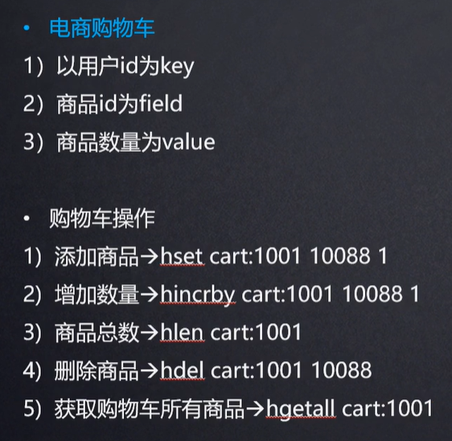
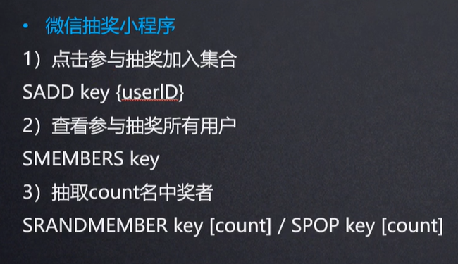
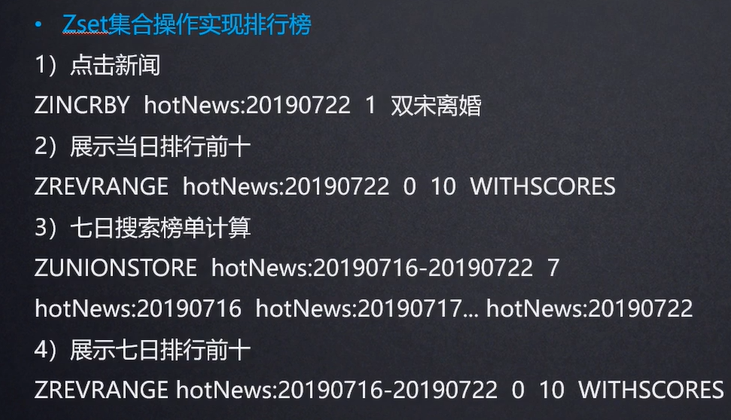

Redis支持五种数据类型：string（字符串），hash（哈希），list（列表），set（集合）及zset(sorted set：有序集合)等

# 键key

## 命令

Redis 键命令用于管理 redis 的键

`DEL key`

>  该命令用于在 key 存在时删除 key。 

`DUMP key`

> 序列化给定 key ，并返回被序列化的值。

`EXISTS key` 

> 检查给定 key 是否存在。 

`EXPIRE key seconds`

> 为给定 key 设置过期时间（以秒计）。 

`PEXPIRE key milliseconds`

> 设置 key 的过期时间以毫秒计。

`TTL key` 

以秒为单位，返回给定 key 的剩余生存时间(TTL, time to live) 

`PTTL key` 

> 以毫秒为单位返回 key 的剩余的过期时间。

`PERSIST key` 

> 移除 key 的过期时间，key 将持久保持。 

`KEYS pattern` 

> 查找所有符合给定模式( pattern)的 key 。 

`keys 通配符`     

> 获取所有与pattern匹配的key,返回所有与该匹配 
>   通配符： 
> 
> \* 代表所有 
> . 表一个字符 

`RENAME key newkey` 

> 修改Key的名称

`MOVE key db` 

> 将当前数据库的 key 移动到给定的数据库 db 当中 

`TYPE key` 

> 返回 key 所储存的值的类型

## 应用场景

`EXPIRE key seconds`
1、限时的优惠活动信息
2、网站数据缓存（对于一些需要定时更新的数据，例如：积分排行榜）
3、手机验证码
4、限制网站访客访问频率（例如：1分钟最多访问10次）

### Key的命名建议

1. key不要太长，尽量不要超过1024字节，这不仅消耗内存，而且会降低查找的效率；
2. key也不要太短，太短的话，key的可读性会降低；
3. 在一个项目中，key最好使用统一的命名模式，例如user:123:password;
4. key名称区分大小写

# String

## 简介

string是redis最基本的类型，一个key对应一个value。

string类型是二进制安全的。意思是redis的string可以包含任何数据。比如jpg图片或者序列化的对象。
string类型是Redis最基本的数据类型，一个键最大能存储512MB。 

 二进制安全是指，在传输数据时，保证二进制数据的信息安全，也就是不被篡改、破译等，如果被攻击，能够及时检测出来。

二进制安全特点： 
    1、编码、解码发生在客户端完成，执行效率高 
    2、不需要频繁的编解码，不会出现乱码

## String命令

#### 赋值语法：

`SET KEY_NAME   VALUE`

> SET 命令用于设置给定 key 的值。如果 key 已经存储值， SET 就覆写旧值，且无视类型 

`SETNX key value`  

> 解决分布式锁方案之一，先拿setnx来争抢锁，抢到之后，再用expire给锁加一个过期时间防止锁忘记了释放。
> 只有在 key 不存在时设置 key 的值。Setnx（SET if Not eXists） 命令在指定的 key 不存在时，为 key 设置指定的值

`MSET key value [key value ...]`

> 同时设置一个或多个 key-value 对

#### 取值语法：

`GET KEY_NAME` 

> Redis GET命令用于获取指定 key 的值。如果 key 不存在，返回 nil 。如果key 储存的值不是字符串类型，返回一个错误。 

`GETRANGE key start end` 

> 用于获取存储在指定 key 中字符串的子字符串。字符串的截取范围由 start 和 end 两个偏移量决定(包括 start 和 end 在内)

`GETBIT key offset`

> 对 key 所储存的字符串值，获取指定偏移量上的位(bit)

`MGET key1 [key2..]`

> 获取所有(一个或多个)给定 key 的值

`GETSET  KEY_NAME  VALUE`

> Getset 命令用于设置指定 key 的值，并返回 key 的旧值,当 key 不存在时，返回 nil 

`STRLEN key`

> 返回 key 所储存的字符串值的长度

#### 删除语法：

`DEL KEY_Name`

> 删除指定的KEY，如果存在，返回值数字类型。 

#### 自增/自减：

`INCR KEY_Name` 

> Incr 命令将 key 中储存的数字值增1。如果 key 不存在，那么 key 的值会先被初始化为 0 ，然后再执行 INCR 操作 

`INCRBY KEY_Name 增量值` 

> Incrby 命令将 key 中储存的数字加上指定的增量值 

`DECR KEY_NAME 或 DECYBY KEY_NAME 减值` 

> decR 命令将 key 中储存的数字减1

#### 字符串拼接：

`APPEND  KEY_NAME VALUE` 

> Append 命令用于为指定的 key 追加至未尾，如果不存在，为其赋值 

## 应用场景：

1. String通常用于保存单个字符串或JSON字符串数据

2. 因String是二进制安全的，所以你完全可以把一个图片文件的内容作为字符串来存储

3. 计数器（常规key-value缓存应用。常规计数: 阅读量，微博数, 粉丝数）
   
   INCR等指令本身就具有原子操作的特性，所以我们完全可以利用redis的INCR、INCRBY、DECR、DECRBY等指令来实现原子计数的效果。假如，在某种场景下有3个客户端同时读取了mynum的值（值为2），然后对其同时进行了加1的操作，那么，最后mynum的值一定是5。

4. spring session 整合实现session 共享

5. 分布式系统全局序列号

# 哈希(Hash)

## 简介

Redis hash 是一个string类型的field和value的映射表，hash特别**适合用于存储对象**。 Redis 中每个 hash 可以存储 2^32 - 1 键值对（40多亿）可以看成具有KEY和VALUE的MAP容器，该类型非常适合于存储值对象的信息， 
如：uname,upwd,age等。该类型的数据仅占用很少的磁盘空间（相比于JSON） 

优点：

- 同类数据归类存储，方便管理
- 相比 string 操作，cpu 与内存消耗小
- 相比 string 更节省内存

缺点：

- 过期功能不能使用在 field 上，只能用在 key 上
- Redis 集群下不适合大规模使用

## Hash命令

#### 赋值语法：

`HSET KEY  FIELD  VALUE`    

> 为指定的KEY，设定FILD/VALUE  

`HMSET  KEY  FIELD VALUE [FIELD1,VALUE1]……` 

> 同时将多个 field-value (域-值)对设置到哈希表 key 中。 

#### 取值语法：

`HGET KEY FIELD`

> 获取存储在HASH中的值，根据FIELD得到VALUE

`HMGET key field[field1]`

> 获取key所有给定字段的值 

`HGETALL key` 

> 返回HASH表中所有的字段和值     

`HKEYS key`

> 获取所有哈希表中的字段

`HLEN key`   

> 获取哈希表中字段的数量

#### 删除语法：

`HDEL KEY field1[field2]`    

> 删除一个或多个HASH表字段 

#### 其它语法：

`HSETNX key field value` 

> 只有在字段 field 不存在时，设置哈希表字段的值

`HINCRBY key field increment` 

> 为哈希表 key 中的指定字段的整数值加上增量 increment 。

`HINCRBYFLOAT key field increment` 

> 为哈希表 key 中的指定字段的浮点数值加上增量 increment 。

`HEXISTS key field` 

> 查看哈希表 key 中，指定的字段是否存在

## 应用场景：

常用于存储一个对象。

购物车：

那为什么不用 string 存储一个对象？

hash 是最接近关系数据库结构的数据类型，可以将数据库一条记录或程序中一个对象转换成hashmap 存放在redis中。

用户ID为查找的key，存储的value用户对象包含姓名，年龄，生日等信息，如果用普通的 key-value结构来存储，主要有以下2种存储方式：

- 第一种方式将用户ID作为查找key,把其他信息封装成一个对象以序列化的方式存储，这种方式的缺点是，增加了序列化/反序列化的开销，并且在需要修改其中一项信息时，需要把整个对象取回，并且修改操作需要对并发进行保护，引入CAS等复杂问题。
- 第二种方法是这个用户信息对象有多少成员就存成多少个key-value对儿，用用户ID+对应属性的名称作为唯一标识来取得对应属性的值，虽然省去了序列化开销和并发问题，但是用户ID为重复存储，如果存在大量这样的数据，内存浪费还是非常可观的。

总结：
Redis提供的Hash很好的解决了这个问题，Redis的Hash实际是内部存储的Value为一个HashMap，并提供了直接存取这个Map成员的接口

# List类型

## 简介

Redis列表是简单的字符串列表，按照插入顺序排序。你可以添加一个元素到列表的头部（左边）或者尾部（右边）一个列表最多可以包含 2^32 - 1 个元素 (4294967295, 每个列表超过40亿个元素) 
类似JAVA中的 LinkedList

## 命令

#### 赋值语法:

`LPUSH key value1 [value ...]` 

> 将一个或多个值插入到列表头部(从左侧添加)

`RPUSH key value1 [value ...]`  

> 在列表中添加一个或多个值(从右侧添加)

`LPUSHX key value`   

> 将一个值插入到已存在的列表头部。如果列表不在，操作无效

`RPUSHX key value`   

> 一个值插入已存在的列表尾部(最右边)。如果列表不在，操作无效。

#### 取值语法：

`LLEN key`      

> 获取列表长度

`LINDEX key index`   

> 通过索引获取列表中的元素

`LRANGE key start stop`  

> 获取列表指定范围内的元素
> 
> 描述： 返回列表中指定区间内的元素，区间以偏移量 START 和 STOP 指定。 其中 0 表示列表的第一个元素， 1 表示列表的第二个元素，以此类推。也可以使用负数下标，以 -1 表示列表的最后一个元素， -2 表示列表的倒数第二个元素，以此类推。

#### 删除语法：

`LPOP key`  

> 移出并获取列表的第一个元素(从左侧删除)

`RPOP key`  

> 移除列表的最后一个元素，返回值为移除的元素(从右侧删除)

`BLPOP key1 [key2 ] timeout` 

> 移出并获取列表的第一个元素， 如果列表没有元素会阻塞列表直到等待超时或发现可弹出元素为止。

`BRPOP key1 [key2 ] timeout` 

> 移出并获取列表的最后一个元素， 如果列表没有元素会阻塞列表直到等待超时或发现可弹出元素为止。

`LTRIM key start stop`   

> 对一个列表进行修剪(trim)，就是说，让列表只保留指定区间内的元素，不在指定区间之内的元素都将被删除。

#### 修改语法：

`LSET key index value`  

> 通过索引设置列表元素的值

`LINSERT key BEFORE|AFTER world value` 

> 在列表的元素前或者后插入元素
> 描述：将值 value 插入到列表 key 当中，位于值 world 之前或之后。

#### 高级语法：

`RPOPLPUSH source destination` 

> 移除列表的最后一个元素，并将该元素添加到另一个列表并返回    
> 示例描述：
> 
> RPOPLPUSH a1  a2   //a1的最后元素移到a2的左侧
> RPOPLPUSH a1  a1  //循环列表，将最后元素移到最左侧

`BRPOPLPUSH source destination timeout` 

> 从列表中弹出一个值，将弹出的元素插入到另外一个列表中并返回它； 如果列表没有元素会阻塞列表直到等待超时或发现可弹出元素为止。

## 应用场景

1. 对数据量大的集合数据删减 
2. 任务队列 

#### 对数据量大的集合数据删减

列表数据显示、关注列表、粉丝列表、留言评价等…分页、热点新闻（Top5)等
利用LRANGE还可以很方便的实现分页的功能,在博客系统中，每片博文的评论也可以存入一个单独的list中。

#### 任务队列

list通常用来实现一个消息队列，而且可以确保先后顺序，不必像MySQL那样还需要通过ORDER BY来进行排序 ，**rpush**生产消息，**lpop**消费消息。当lpop没有消息的时候，要适当sleep一会再重试。 

微信，微博消息流。

#### 任务队列介绍(生产者和消费者模式)：

在处理Web客户端发送的命令请求时，某些操作的执行时间可能会比我们预期的更长一些，通过将待执行任务的相关信息放入队列里面，并在之后对队列进行处理，用户可以推迟执行那些需要一段时间才能能完成的操作，这种将工作交给任务处理器来执行的做法被称为任务队列（task queue）。

RPOPLPUSH source destination 
移除列表的最后一个元素，并将该元素添加到另一个列表并返回    
示例描述：

常用案例：
1:订单系统的下单流程、
2:用户系统登录注册短信等 
用户登录成功后，
三个资源：
  列表页面  (登录后就允许访问）
  实名认证页面(登录后就允许访问）
  转帐页面  (登录后、还要实名认证后）

# Set类型

## 简介

Redis 的 Set 是 **String 类型**的**无序**集合。集合成员是**唯一**的，这就意味着集合中不能出现重复的数据。
**Redis 中集合是通过哈希表实现的**，所以添加，删除，查找的复杂度都是 O(1)。

集合中最大的成员数为 2^32 - 1 (4294967295, 每个集合可存储40多亿个成员)。类似于JAVA中的 Hashtable集合

redis的集合对象set的**底层存储结构**特别神奇，底层使用了intset和hashtable两种数据结构存储，intset我们可以理解为数组，hashtable就是普通的哈希表（key为set的值，value为null）。
intset内部其实是一个数组（int8_t coentents[]数组），而且存储数据的时候是有序的，因为在查找数据的时候是通过二分查找来实现的。

## 命令

#### 赋值语法：

 `SADD key member1 [member2]` 

> 向集合添加一个或多个成员 

#### 取值语法：

 `SCARD key` 

> 获取集合的成员数 

`SMEMBERS key`  

> 返回集合中的所有成员 

`SISMEMBER key member`  

> 判断 member 元素是否是集合 key 的成员(应用：验证是否存在判断） 

`SRANDMEMBER key [count]` 

> 返回集合中一个或多个随机数       

#### 删除语法：

`SREM key member1 [member2]` 

> 移除集合中一个或多个成员

`SPOP key [count]`  

> 移除并返回集合中的一个随机元素

`SMOVE source destination member` 

> 将 member 元素从 source 集合移动到 destination 集合

#### 差集语法：

`SDIFF key1  [key2]`   

> 返回给定所有集合的差集(左侧） 

`SDIFFSTORE destination key1 [key2]`  

> 返回给定所有集合的差集并存储在 destination 中

#### 交集语法：

`SINTER key1 [key2]`  

> 返回给定所有集合的交集(共有数据） 

`SINTERSTORE destination key1 [key2]`  

> 返回给定所有集合的交集并存储在 destination 中

#### 并集语法：

`SUNION key1 [key2]` 

> 返回所有给定集合的并集 

`SUNIONSTORE destination key1 [key2]`  

> 所有给定集合的并集存储在 destination 集合中

## 应用场景

常应用于：对两个集合间的数据[计算]进行交集、并集、差集运算 
1、以非常方便的实现如共同关注、共同喜好、二度好友等功能。对上面的所有集合操作，你还可以使用不同的命令选择将结果返回给客户端还是存储到一个新的集合中。

关注模型。

2、利用唯一性，可以统计访问网站的所有独立 IP

# ZSET

## 简介

1. Redis 有序集合和集合一样也是string类型元素的集合,且不允许重复的成员。
2. 不同的是每个元素都会关联一个double类型的分数。redis正是通过分数来为集合中的成员进行从小到大的排序。
3. 有序集合的成员是唯一的,但分数(score)却可以重复。
4. 集合是通过哈希表实现的，所以添加，删除，查找的复杂度都是O(1)。 集合中最大的成员数为 2^32 - 1 (4294967295, 每个集合可存储40多亿个成员)。

Redis的ZSet是有序、且不重复 
（很多时候，我们都将redis中的有序集合叫做zsets，这是因为在redis中，有序集合相关的操作指令都是以z开头的）

## 命令

#### 赋值语法：

`ZADD key score1 member1 [score2 member2]` 

> 向有序集合添加一个或多个成员，或者更新已存在成员的分数  

#### 取值语法：

 `ZCARD key`  

> 获取有序集合的成员数

 `ZCOUNT key min max` 

> 计算在有序集合中指定区间分数的成员数

`ZRANK key member` 

> 返回有序集合中指定成员的索引

`ZRANGE key start stop [WITHSCORES]` 

> 通过索引区间返回有序集合成指定区间内的成员(低到高)

`ZREVRANGE key start stop [WITHSCORES]` 

> 返回有序集中指定区间内的成员，通过索引，分数从高到底

#### 删除语法：

`del key`   

> 移除集合 

`ZREM key member [member ...]` 

> 移除有序集合中的一个或多个成员

`ZREMRANGEBYRANK key start stop` 

> 移除有序集合中给定的排名区间的所有成员(第一名是0)(低到高排序)

`ZREMRANGEBYSCORE key min max` 

> 移除有序集合中给定的分数区间的所有成员

## 应用场景

常应用于：排行榜 

1. 比如twitter 的public timeline可以以发表时间作为score来存储，这样获取时就是自动按时间排好序的。
2. 比如一个存储全班同学成绩的Sorted Set，其集合value可以是同学的学号，而score就可以是其考试得分，这样在数据插入集合的时候，就已经进行了天然的排序。
3. 还可以用Sorted Set来做带权重的队列，比如普通消息的score为1，重要消息的score为2，然后工作线程可以选择按score的倒序来获取工作任务。让重要的任务优先执行。

4. 实现延时队列？
   
   使用sortedset，拿时间戳作为score，消息内容作为key调用zadd来生产消息，消费者用**zrangebyscore**指令获取N秒之前的数据轮询进行处理。 