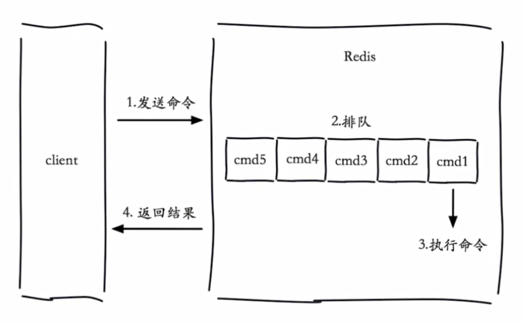
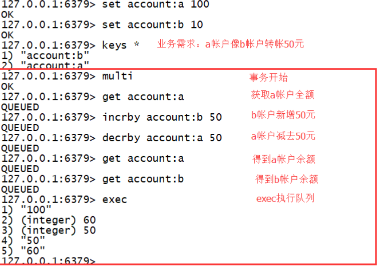
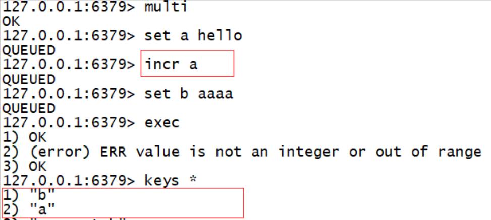

# Redis 慢查询

## 生命周期



客户端超时不一定是慢查询，但慢查询是客户端超时的一个可能原因，这是因为慢**查询发生在第三阶段**

## 两个配置

### slowlog-max-len

FIFO的队列，

固定长度

默认值为 config get slowlog-max-len=128

### slowlog-log-slower-than

慢查询阈值（单位：微秒）  

slowlog-log-slower-than=0 记录所有命令（几乎没有意义）

<<0 不记录

默认值为 config get slowlog-log-slower-than=1000

### 配置方法

config set slowlog-max-len=XXX

config set slowlog-log-slower-than=XXXX

## 慢查询命令

- `slowlog get[n]`
  
  > 获取慢查询队列

- `slowlog len`
  
  > 获取慢查询队列长度

- `slowlog reset`
  
  > 清空慢查询队列

## 运维经验

config set slowlog-max-len=1000

config set slowlog-log-slower-than=100

定期持久化慢查询

# Pipeline

## 介绍

首先要注意每次pipeline携带数据量不能太大 

pipeline可以提高Redis批量处理的并发的能力，但是并不能无节制的使用 如果批量执行的命令数量过大，则很容易对网络及客户端造成很大影响，此时可以把命令分割，每次发送少量的命令到服务端执行 

pipeline每次只能作用在一个Redis节点上 

# Redis 发布订阅

## 简介

Redis 发布订阅(pub/sub)是一种消息通信模式：发送者(pub)发送消息，订阅者(sub)接收消息。

Redis 客户端可以订阅任意数量的频道。

## 示例

下图展示了频道 channel1 ， 以及订阅这个频道的三个客户端 —— client2 、 client5 和 client1 之间的关系：


当有新消息通过 PUBLISH 命令发送给频道 channel1 时，这个消息就会被发送给订阅它的三个客户端：


## 命令

#### 订阅频道：

`SUBSCRIBE channel [channel ...]`

> 订阅给定的一个或多个频道的信息

`PSUBSCRIBE pattern [pattern ...]`

> 订阅一个或多个符合给定模式的频道。

#### 发布频道：

`PUBLISH channel message` 

> 将信息发送到指定的频道。

#### 退订频道：

`UNSUBSCRIBE [channel [channel ...]]` 

> 指退订给定的频道。

`PUNSUBSCRIBE [pattern [pattern ...]]`

> 退订所有给定模式的频道。

## 应用场景

这一功能最明显的用法就是构建实时消息系统，比如普通的即时聊天，群聊等功能

1. 在一个博客网站中，有100个粉丝订阅了你，当你发布新文章，就可以推送消息给粉丝们。

2. 微信公众号模式
   
   缺点：在消费者下线的情况下，生产的消息会丢失，得使用专业的消息队列 

# bitmap 位图

通过一个bit位来表示某个元素对应的值或者状态,其中的key就是对应元素本身。Bitmaps 本身不是一种数据结构，实际上它就是字符串，但是它可以对字符串的位进行操作。 Bitmaps 单独提供了一套命令，所以在Redis 中使用 Bitmaps 和使用字符串的方法不太相同。可以把 Bitmaps 想象成一个以位为单位的数组，数组的每个单元只能存储 0 和 1，数组的下标在Bitmaps中叫做偏移量。

## bitmap位图的概念

首先来看一个例子，字符串 big，

字母b的ASCII码为98，转换成二进制为 `01100010`
字母i的ASCII码为105，转换成二进制为 `01101001`
字母g的ASCII码为103，转换成二进制为 `01100111`

如果在Redis中，设置一个key，其值为big，此时可以get到big这个值，也可以获取到 big的ASCII码每一个位对应的值，也就是0或1

例如：

```shell
127.0.0.1:6379> set hello big
OK
127.0.0.1:6379> getbit hello 0      # b的二进制形式的第1位，即为0
(integer) 0
127.0.0.1:6379> getbit hello 1      # b的二进制形式的第2位，即为1
(integer) 1
```

big长度为3个字节，对应的长度为24位，使用getbit命令可以获取到big对应的位的对应的值，所以Redis是可以直接对位进行操作的。

## 常用命令

`SETBIT key offset value`   

> 对 `key` 所储存的字符串值，设置指定偏移量上的位(bit)的值 `value`。
> 
> 返回字符串值指定偏移量上原来储存的位(bit)。

`GETBIT key offset`           

> 获取指定偏移量上的位(bit)。
> 
> 当 `offset` 比字符串值的长度大，或者 `key` 不存在时，返回 `0` 。
> 
> 返回字符串值指定偏移量上的位(bit)。

`bitcount key [start end]`       

> 获取位图指定范围(start到end,单位为字节，如果不指定就是获取全部)位值为1的个数

`BITOP operation destkey key [key ...]`       

> 对一个或多个保存二进制位的字符串 `key` 进行位元操作，并将结果保存到 `destkey` 上。
> 
> `operation` 可以是 `AND` 、 `OR` 、 `NOT` 、 `XOR` 这四种操作中的任意一种：
> 
> - `BITOP AND destkey key [key ...]` ，对一个或多个 `key` 求逻辑并，并将结果保存到 `destkey` 。
> - `BITOP OR destkey key [key ...]` ，对一个或多个 `key` 求逻辑或，并将结果保存到 `destkey` 。
> - `BITOP XOR destkey key [key ...]` ，对一个或多个 `key` 求逻辑异或，并将结果保存到 `destkey`。
> - `BITOP NOT destkey key` ，对给定 `key` 求逻辑非，并将结果保存到 `destkey` 。

注意：BITOP 的复杂度为 O(N) ，当处理大型矩阵(matrix)或者进行大数据量的统计时，最好将任务指派到附属节点(slave)进行，避免阻塞主节点。

`bitpos key targetBit [start] [end]` 

> 计算位图指定范围(start到end,单位为字节，如果不指定就是获取全部)第一个偏移量对应的值等于targetBit（ 1 或者 0 ）的位置 

## bitmap位图应用

如果一个网站有1亿用户，假如user_id用的是整型，长度为32位，每天有5千万独立用户访问，如何判断是哪5千万用户访问了网站

#### 方式一：用set来保存

使用set来保存数据运行一天需要占用的内存为

32bit * 50000000 = (4 * 50000000) / 1024 /1024 MB，约为200MB
运行一个月需要占用的内存为6G，运行一年占用的内存为72G

#### 方式二：使用bitmap的方式

如果user_id访问网站，则在user_id的索引上设置为1，没有访问网站的user_id，其索引设置为0，此种方式运行一天占用的内存为

1 * 100000000 = 100000000 / 1014 /1024/ 8MB，约为12.5MB
运行一个月占用的内存为375MB，一年占用的内存容量为4.5G

由此可见，使用bitmap可以节省大量的内存资源

## bitmap使用经验

bitmap是string类型，单个值最大可以使用的内存容量为512MB
setbit时是设置每个value的偏移量，可以有较大耗时
bitmap不是绝对好，用在合适的场景最好

# HyperLoglog

## HyperLoglog介绍

Redis HyperLogLog 是用来做基数统计的算法，HyperLogLog 的优点是，在输入元素的数量或者体积非常非常大时，计算基数所需的空间总是固定的、并且是很小的。

在 Redis 里面，每个 HyperLogLog 键只需要花费 12 KB 内存，就可以计算接近 2^64 个不同元素的基 数。这和计算基数时，元素越多耗费内存就越多的集合形成鲜明对比。

但是，因为 HyperLogLog 只会根据输入元素来计算基数，而不会储存输入元素本身，所以 HyperLogLog 不能像集合那样，返回输入的各个元素。

> 基数：
> 
> 比如数据集 {1, 3, 5, 7, 5, 7, 8}， 那么这个数据集的基数集为 {1, 3, 5 ,7, 8}, 基数(不重复元素)为5。 基数估计就是在误差可接受的范围内，快速计算基数。

## 2.2 常用命令

`pfadd key element [element...]`              

> 向hyperloglog添加元素

`pfcount key [key...]`

> 计算hyperloglog的独立总数

`prmerge` destkey sourcekey [sourcekey...]        

> 合并多个hyperloglog

例子：

```shell
127.0.0.1:6379> pfadd unique_ids1 'uuid_1' 'uuid_2' 'uuid_3' 'uuid_4'       # 向unique_ids1中添加4个元素
(integer) 1
127.0.0.1:6379> pfcount unique_ids1         # 查看unique_ids1中元素的个数
(integer) 4
127.0.0.1:6379> pfadd unique_ids1 'uuid_1' 'uuid_2' 'uuid_3' 'uuid_10'      # 再次向unique_ids1中添加4个元素
(integer) 1
127.0.0.1:6379> pfcount unique_ids1         # 由于两次添加的value有重复，所以unique_ids1中只有5个元素
(integer) 5
127.0.0.1:6379> pfadd unique_ids2 'uuid_1' 'uuid_2' 'uuid_3' 'uuid_4'       # 向unique_ids2中添加4个元素
(integer) 1
127.0.0.1:6379> pfcount unique_ids2         # 查看unique_ids2中元素的个数
(integer) 4
127.0.0.1:6379> pfadd unique_ids2 'uuid_4' 'uuid_5' 'uuid_6' 'uuid_7'       # 再次向unique_ids2中添加4个元素
(integer) 1
127.0.0.1:6379> pfcount unique_ids2         # 再次查看unique_ids2中元素的个数，由于两次添加的元素中有一个重复，所以有7个元素
(integer) 7
127.0.0.1:6379> pfmerge unique_ids1 unique_ids2     # 合并unique_ids1和unique_ids2
OK
127.0.0.1:6379> pfcount unique_ids1         # unique_ids1和unique_ids2中有重复元素，所以合并后的hyperloglog中只有8个元素
(integer) 8
```

## HyperLoglog内存消耗(百万独立用户)

例子：

```shell
127.0.0.1:6379> flushall            # 清空Redis中所有的key和value
OK
127.0.0.1:6379> info                # 查看Redis占用的内存量
...省略

# Memory

used_memory:833528
used_memory_human:813.99K           # 此时Redis中没有任何键值对，占用814k内存
used_memory_rss:5926912
used_memory_rss_human:5.65M
used_memory_peak:924056
used_memory_peak_human:902.40K
total_system_memory:1023938560
total_system_memory_human:976.50M
used_memory_lua:37888
used_memory_lua_human:37.00K
maxmemory:0
maxmemory_human:0B
maxmemory_policy:noeviction
mem_fragmentation_ratio:7.11
mem_allocator:jemalloc-3.6.0
...省略
```

运行如下python代码：

```python
import redis
import time

client = redis.StrictRedis(host='192.168.81.101',port=6379)
key = 'unique'

for i in range(1000000):
    client.pfadd(key,i)
```

等待python代码运行完成，再次查看Redis占用的内存数

```shell
127.0.0.1:6379> info
...省略

# Memory

used_memory:849992
used_memory_human:830.07K
used_memory_rss:5939200
used_memory_rss_human:5.66M
used_memory_peak:924056
used_memory_peak_human:902.40K
total_system_memory:1023938560
total_system_memory_human:976.50M
used_memory_lua:37888
used_memory_lua_human:37.00K
maxmemory:0
maxmemory_human:0B
maxmemory_policy:noeviction
mem_fragmentation_ratio:6.99
mem_allocator:jemalloc-3.6.0
...省略
```

可以看到，使用hyperloglog向redis中存入100万条数据，需占用的内存为

830.07K - 813.99K约为16k
占用的内存很少。

## HyperLoglog使用注意

当然天下没有免费的午餐，hyperloglog也有非常明显的局限性

首先，hyperloglog有一定的错误率，在使用hyperloglog进行数据统计的过程中，hyperloglog给出的数据不一定是对的
按照维基百科的说法，使用hyperloglog处理10亿条数据，占用1.5Kb内存时，错误率为2%
其次，没法从hyperloglog中取出单条数据，这很容易理解，使用16KB的内存保存100万条数据，此时还想把100万条数据取出来，显然是不可能的

使用hyperloglog进行数据统计时，需要考虑三个因素：

- 是否需要很少的内存去解决问题，
- 是否能容忍错误
- 是否需要单条数据

# Redis多数据库

Redis下，数据库是由一个整数索引标识，而不是由一个数据库名称。默认情况下，一个客户端连接到数据库0。

redis配置文件中下面的参数来控制数据库总数：

database 16  //(从0开始 1 2 3 …15)

`select 数据库`

> 数据库的切换

`move key名称 数据库`

> 移动数据（将当前key移动另个库)数据库清空：

 `flushdb`    

> 清除当前数据库的所有key

`flushall`   

> 清除整个Redis的数据库所有key

# Redis事务

Redis 事务可以一次执行多个命令，（按顺序地串行化执行，执行中不会被其它命令插入，不许加塞）

## 简介

Redis 事务可以一次执行多个命令（允许在一次单独的步骤中执行一组命令）， 并且带有以下两个重要的保证：

- 批量操作在发送 EXEC 命令前被放入队列缓存。
- 收到 EXEC 命令后进入事务执行，事务中任意命令执行失败，其余的命令依然被执行。
- 在事务执行过程，其他客户端提交的命令请求不会插入到事务执行命令序列中。
1. Redis会将一个事务中的所有命令序列化，然后按顺序执行
2. 执行中不会被其它命令插入

一个事务从开始到执行会经历以下三个阶段：

- 开始事务。
- 命令入队。
- 执行事务。

#### 事务的错误处理1：

队列中的某个命令出现了报告错误，执行时整个的所有队列都会被取消。

#### 事务的错误处理2：

如果执行的某个命令报出了错误，则只有报错的命令不会被执行，而其它的命令都会执行，不会回滚。

## 命令

`DISCARD` 

> 取消事务，放弃执行事务块内的所有命令。

`EXEC`

>  执行所有事务块内的命令。

`MULTI` 

> 标记一个事务块的开始。

`UNWATCH` 

> 取消 WATCH 命令对所有 key 的监视。

`WATCH key [key ...]` 

> 监视一个(或多个) key ，如果在事务执行之前这个(或这些) key 被其他命令所改动，那么事务将被打断。

## Redis 不支持回滚（roll back）

正因为redis不支持回滚功能，才使得redis在事务上可以保持简洁和快速。

#### 示例1 MULTI EXEC

转帐功能，A向B帐号转帐50元
一个事务的例子，它先以 MULTI 开始一个事务，然后将多个命令入队到事务中，最后由 EXEC 命令触发事务



1. 输入Multi命令开始，输入的命令都会依次进入命令队列中，但不会执行
2. 直到输入Exec后，Redis会将之前的命令队列中的命令依次执行

#### 示例2 DISCARD放弃队列运行

1输入Multi命令开始，输入的命令都会依次进入命令队列中，但不会执行
2直到输入Exec后，Redis会将之前的命令队列中的命令依次执行。
3命令队列的过程中可以通过discard来放弃队列运行

#### 示例3事务的错误处理

如果执行的某个命令报出了错误，则只有报错的命令不会被执行，而其它的命令都会执行，不会回滚。



#### 示例4事务的错误处理

事务的错误处理：
队列中的某个命令出现了报告错误，执行时整个的所有队列都会被取消。

由于之前的错误，事务执行失败

##### 示例5事务的WATCH

WATCH key [key ...] 
监视一个(或多个) key ，如果在事务执行之前这个(或这些) key 被其他命令所改动，那么事务将被打断。

需求：某一帐户在一事务内进行操作，在提交事务前，另一个进程对该帐户进行操作。

#### 示例5 UNWATCH

Redis Unwatch 命令用于取消 WATCH 命令对所有 key 的监视。
如果在执行WATCH命令之后，EXEC命令或DISCARD命令先被执行的话，那就不需要再执行UNWATCH了

## 应用场景

一组命令必须同时都执行，或者都不执行。
我们想要保证一组命令在执行的过程之中不被其它命令插入。

商品秒杀（活动）。