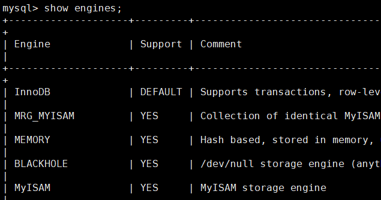

# 架构概览


**1.连接层**
最上层是一些客户端和连接服务，包含本地sock通信和大多数基于客户端、服务端工具实现的类似tcp/ip的通信。主要完成一些类似于连接处理，授权认证，及相关的安全方案。在该层上引入了线程池的概念，为通过认证安全接入的客户端提供线程。同时实现了**基于SSL** 的安全链接。服务器会自动为安全接入的每个客户端验证它所具有的操作权限。

**2.服务层**
主要完成大多数的核心服务功能，如SQL接口，并完成缓存的查询，SQL的分析及优化，部分内置函数的执行，所有跨存储引擎的功能也在这层实现，如过程，函数等。在该层，服务器会解析查询并创建对应的内部解析树，并完成其相应的优化，如确定查询表的顺序，是否利用索引等，最后生成相应 的执行操作，如果是select语句，服务器会查询内部缓存，如果缓存空间足够大，

|   |    |
|--|--|
|Management Serveices & Utilities |系统管理和控制工具|
|SQL Interface: |SQL 接口。接受用户的 SQL 命令，并且返回用户需要查询的结果。比如 select from就是调用 SQL Interface|
|Parser |解析器。 SQL 命令传递到解析器的时候会被解析器验证和解析|
|Optimizer| 查询优化器。 SQL 语句在查询之前会使用查询优化器对查询进行优化，比如有where 条件时，优化器来决定先投影还是先过滤。|
|Cache 和 Buffer| 查询缓存。如果查询缓存有命中的查询结果，查询语句就可以直接去查询缓存中取数据。这个缓存机制是由一系列小缓存组成的。比如表缓存，记录缓存，key 缓存，权限缓存等|

**3.引擎层**
存储引擎真正负责了MySQL中数据的存储和提取，服务器通过API与存储引擎通信，不同的存储引擎具有的功能不同。这样我们根据自己的实际需求进行选取。

**4.存储层**
将数据存储在运行于裸设备的文件系统上，并完成与存储引擎的交互。


#### SQL执行顺序

编写顺序

```SQL
SELECT DISTINCT
	<select list>
FROM
	<left_table> <join_type>
JOIN
	<right_table> ON <join_condition>
WHERE
	<where_condition>
GROUP BY
	<group_by_list>
HAVING
	<having_condition>
ORDER BY
	<order_by_condition>
LIMIT
	<limit_params>
```

执行顺序

```sql
FROM	
	<left_table>
ON 		
	<join_condition>
	<join_type>
JOIN
	<right_table>
WHERE		
	<where_condition>
GROUP BY 	
	<group_by_list>
HAVING		
	<having_condition>
SELECT DISTINCT		
	<select list>
ORDER BY	
	<order_by_condition>
LIMIT		
	<limit_params>
```


#### 查询流程

1. mysql 客户端通过协议与 mysql 服务器建连接，发送查询语句，先检查**查询缓存**，如果命中，直接返回结果，否则进行语句解析,也就是说，在解析查询之前，服务器会先访问查询缓存(query cache)——它存储 SELECT 语句以及相应的查询结果集。如果某个查询结果已经位于缓存中，服务器就不会再对查询进行解析、优化、以及执行。它仅仅将缓存中的结果返回给用户即可，这将大大提高系统的性能。
2. 语法解析器和预处理：首先 mysql 通过关键字将 SQL 语句进行**解析**，并生成一颗对应的“解析树”。mysql 解析器将使用 mysql 语法规则验证和解析查询；预处理器则根据一些 mysql 规则进一步检查解析数是否合法。
3. 查询**优化**器：当解析树被认为是合法的了，并且由优化器将其转化成执行计划。一条查询可以有很多种执行方式，最后都返回相同的结果。优化器的作用就是找到这其中最好的执行计划。
4. 然后，mysql 默认使用的 BTREE 索引，并且一个大致方向是：无论怎么折腾 sql，至少在目前来说，mysql 最多只用到表中的一个索引。

# 存储引擎

`show engines`查看所有的数据库引擎



`show variables like '%storage_engine%'` 查看默认的数据库引擎

重点介绍几种常用的存储引擎， 并对比各个存储引擎之间的区别， 如下表所示 ： 

| 特点         | InnoDB               | MyISAM   | MEMORY | MERGE | NDB  |
| ------------ | -------------------- | -------- | ------ | ----- | ---- |
| 存储限制     | 64TB                 | 有       | 有     | 没有  | 有   |
| 事务安全     | ==支持==             |          |        |       |      |
| 锁机制       | ==行锁(适合高并发)== | ==表锁== | 表锁   | 表锁  | 行锁 |
| B树索引      | 支持                 | 支持     | 支持   | 支持  | 支持 |
| 哈希索引     |                      |          | 支持   |       |      |
| 全文索引     | 支持(5.6版本之后)    | 支持     |        |       |      |
| 集群索引     | 支持                 |          |        |       |      |
| 数据索引     | 支持                 |          | 支持   |       | 支持 |
| 索引缓存     | 支持                 | 支持     | 支持   | 支持  | 支持 |
| 数据可压缩   |                      | 支持     |        |       |      |
| 空间使用     | 高                   | 低       | N/A    | 低    | 低   |
| 内存使用     | 高                   | 低       | 中等   | 低    | 高   |
| 批量插入速度 | 低                   | 高       | 高     | 高    | 高   |
| 支持外键     | ==支持==             |          |        |       |      |

下面我们将重点介绍最长使用的两种存储引擎： InnoDB、MyISAM ， 另外两种 MEMORY、MERGE ， 了解即可。


# Innodb

## 数据的存储

在整个数据库体系结构中，我们可以使用不同的存储引擎来存储数据，而绝大多数存储引擎都以二进制的形式存储数据；这一节会介绍 InnoDB 中对数据是如何存储的。

在 InnoDB 存储引擎中，所有的数据都被**逻辑地**存放在表空间中，表空间（tablespace）是存储引擎中最高的存储逻辑单位，在表空间的下面又包括段（segment）、区（extent）、页（page）：

[](https://raw.githubusercontent.com/Draveness/Analyze/master/contents/Database/images/mysql/Tablespace-segment-extent-page-row.jpg)

同一个数据库实例的所有表空间都有相同的页大小；默认情况下，表空间中的页大小都为 16KB，当然也可以通过改变 `innodb_page_size` 选项对默认大小进行修改，需要注意的是不同的页大小最终也会导致区大小的不同：

[](https://raw.githubusercontent.com/Draveness/Analyze/master/contents/Database/images/mysql/Relation Between Page Size - Extent Size.png)

从图中可以看出，在 InnoDB 存储引擎中，一个区的大小最小为 1MB，页的数量最少为 64 个。

## 存储方式

MySQL 使用 InnoDB 存储表时，会将**表的定义**和**数据索引**等信息分开存储，其中前者存储在 `.frm` 文件中，后者存储在 `.ibd` 文件中，这一节就会对这两种不同的文件分别进行介绍。


#### 事务控制

```sql
start transaction;
......
commit;
```

#### 外键约束

MySQL支持外键的存储引擎只有InnoDB ， 在创建外键的时候， 要求父表必须有对应的索引 ， 子表在创建外键的时候， 也会自动的创建对应的索引。


### innodb引擎的4大特性

1.插入缓冲（insert buffer)

2.二次写(double write)

3.自适应哈希索引(ahi)

4.预读(read ahead)


### 各种不同 mysql 版本的Innodb的改进

#### MySQL5.6 下 Innodb 引擎的主要改进：

1. online DDL

2. memcached NoSQL 接口
3. transportable tablespace（ alter table discard/import tablespace）
4. MySQL 正常关闭时，可以 dump 出 buffer pool 的（ space， page_no），重启时 reload，加快预热速度
5. 索引和表的统计信息持久化到 mysql.innodb_table_stats 和mysql.innodb_index_stats，可提供稳定的执行计划
6. Compressed row format 支持压缩表

#### MySQL 5.7 innodb 引擎主要改进

1. 修改 varchar 字段长度有时可以使用 online DDL

2. Buffer pool 支持在线改变大小

3. Buffer pool 支持导出部分比例

4. 支持新建 innodb tablespace，并可以在其中创建多张表

5. 磁盘临时表采用 innodb 存储，并且存储在 innodb temp tablespace 里面，以前是 myisam 存储

6. 透明表空间压缩功能


