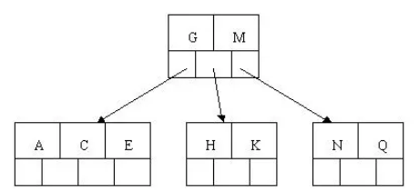
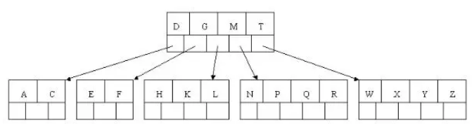

1.索引的概述

## 1.1 索引是什么

MySQL官方对索引的定义为：索引（index）是帮助MySQL高效获取数据的数据结构（有序）。在数据之外，数据库系统还维护者满足特定查找算法的数据结构，这些数据结构以某种方式引用（指向）数据， 这样就可以在这些数据结构上实现高级查找算法，这种数据结构就是索引。如下面的==示意图==所示 : 

 

左边是数据表，一共有两列七条记录，最左边的是数据记录的物理地址（注意逻辑上相邻的记录在磁盘上也并不是一定物理相邻的）。为了加快Col2的查找，可以维护一个右边所示的二叉查找树，每个节点分别包含索引键值和一个指向对应数据记录物理地址的指针，这样就可以运用二叉查找快速获取到相应数据。

一般来说索引本身也很大，不可能全部存储在内存中，因此索引往往以索引文件的形式存储在磁盘上。索引是数据库中用来提高性能的最常用的工具。


## 索引的优劣势

### 优势：

- 提高数据检索的效率，降低数据库的IO成本。
- 通过索引列对数据进行排序，降低数据排序的成本，降低了CPU的消耗。

### 劣势：

- 虽然索引大大提高了查询速度，同时却会降低更新表的速度，如对表进行INSERT、UPDATE和DELETE。因为更新表时，MySQL不仅要保存数据，还要保存一下索引文件；每次更新添加了索引列的字段，都会调整因为更新所带来的键值变化后的索引信息。
- 实际上索引也是一张表，该表保存了主键与索引字段，并指向实体表的记录，所以索引列也是要占用空间的。


# 2.MySQL的索引

## 索引结构

索引是在MySQL的存储引擎层中实现的，而不是在服务器层实现的。所以每种存储引擎的索引都不一定完全相同，也不是所有的存储引擎都支持所有的索引类型的。MySQL目前提供了以下4种索引：

- BTREE 索引 ： 最常见的索引类型，大部分索引都支持 B 树索引。
- HASH 索引：只有Memory引擎支持 ， 使用场景简单 。哈希索引适合等值查询，但是不无法进行范围查询 哈希索引没办法利用索引完成排序 哈希索引不支持多列联合索引的最左匹配规则 如果有大量重复键值得情况下，哈希索引的效率会很低，因为存在哈希碰撞问题
- R-tree 索引（空间索引）：空间索引是MyISAM引擎的一个特殊索引类型，主要用于地理空间数据类型，通常使用较少，不做特别介绍。
- Full-text （全文索引） ：全文索引也是MyISAM的一个特殊索引类型，主要用于全文索引，InnoDB从Mysql5.6版本开始支持全文索引。

<center><b>MyISAM、InnoDB、Memory三种存储引擎对各种索引类型的支持</b></center>
| 索引        | InnoDB引擎      | MyISAM引擎 | Memory引擎 |
| ----------- | --------------- | ---------- | ---------- |
| BTREE索引   | 支持            | 支持       | 支持       |
| HASH 索引   | 不支持          | 不支持     | 支持       |
| R-tree 索引 | 不支持          | 支持       | 不支持     |
| Full-text   | 5.6版本之后支持 | 支持       | 不支持     |

我们平常所说的索引，如果没有特别指明，都是指B+树（多路搜索树，并不一定是二叉的）结构组织的索引。其中聚集索引、复合索引、前缀索引、唯一索引默认都是使用 B+tree 索引，统称为 索引。

## BTree

为了描述B-Tree，首先定义一条数据记录为一个二元组[key, data]，key为记录的键值，对于不同数据记录，key是互不相同的；data为数据，记录除key外的数据。

一颗m叉的BTree特性如下：

- 树中每个节点最多包含m个孩子。
- 除根节点与叶子节点外，每个节点至少有[ceil(m/2)]个孩子。
- 若根节点不是叶子节点，则至少有两个孩子。
- 所有的叶子节点都在同一层。
- 每个非叶子节点由n个key与n+1个指针组成，其中[ceil(m/2)-1] <= n <= m-1 

### 初始化介绍

以5叉BTree为例，key的数量：公式推导 $$[ceil(m/2)-1] <= n <= m-1$$。所以 2 <= n <=4 。当n>4时，中间节点分裂到父节点，两边节点分裂。

插入 C N G A H E K Q M F W L T Z D P R X Y S 数据为例。

演变过程如下：

1) 插入前4个字母 C N G A 

 

2) 插入H，n>4，中间元素G字母向上分裂到新的节点

 

3) 插入E，K，Q不需要分裂

 

4) 插入M，中间元素M字母向上分裂到父节点G

 

5) 插入F，W，L，T不需要分裂

 

6) 插入Z，中间元素T向上分裂到父节点中 

 

7) 插入D，中间元素D向上分裂到父节点中。然后插入P，R，X，Y不需要分裂

 

8) 最后插入S，NPQR节点n>5，中间节点Q向上分裂，但分裂后父节点 DGMT 的n>5，中间节点M向上分裂

 

到此，该BTREE树就已经构建完成了， BTREE树和二叉树相比， 查询数据的效率更高， 因为对于相同的数据量来说，BTREE的层级结构比二叉树小，因此搜索速度快。

非叶子节点只不存储真实的数据，只存储指引搜索方向的数据项，如 17、35 并不真实存在于数据表中。

### 查找过程


如果要查找数据项 29，那么首先会把磁盘块 1 由磁盘加载到内存，此时发生一次 IO，在内存中用二分查找确定 29在 17 和 35 之间，锁定磁盘块 1 的 P2 指针，内存时间因为非常短（相比磁盘的 IO）可以忽略不计，通过磁盘块 1的 P2 指针的磁盘地址把磁盘块 3 由磁盘加载到内存，发生第二次 IO，29 在 26 和 30 之间，锁定磁盘块 3 的 P2 指针，通过指针加载磁盘块 8 到内存，发生第三次 IO，同时内存中做二分查找找到 29，结束查询，总计三次 IO。
真实的情况是，3 层的 b+树可以表示上百万的数据，如果上百万的数据查找只需要三次 IO，性能提高将是巨大的，如果没有索引，每个数据项都要发生一次 IO，那么总共需要百万次的 IO，显然成本非常非常高。


## B+Tree

B+Tree是BTree的变体，也是一种多路查找树。

1. 所有关键字都出现在叶子结点的链表中（稠密索引），且链表中的关键字恰好是有序的；
2. 不可能在非叶子结点命中；
3. 非叶子结点相当于是叶子结点的索引（稀疏索引），叶子结点相当于是存储（关键字）数据的数据层；
4. 更适合文件索引系统； 

由于B+Tree只有叶子节点保存key信息，查询任何key都要从root走到叶子。所以B+Tree的查询效率更加稳定。


### MyISAM索引实现

MyISAM引擎使用B+Tree作为索引结构，叶节点的data域存放的是数据记录的地址。下图是MyISAM索引的原理图：


这里设表一共有三列，假设我们以Col1为主键，则图8是一个MyISAM表的主索引（Primary key）示意。可以看出MyISAM的索引文件仅仅保存数据记录的地址。在MyISAM中，主索引和辅助索引（Secondary key）在结构上没有任何区别，只是主索引要求key是唯一的，而辅助索引的key可以重复。  

MyISAM的索引方式也叫做“非聚集”的，之所以这么称呼是为了与InnoDB的聚集索引区分。

### MySQL中的B+Tree

虽然InnoDB也使用B+Tree作为索引结构，但具体实现方式却与MyISAM截然不同。

第一个重大区别是InnoDB的数据文件本身就是索引文件。从上文知道，MyISAM索引文件和数据文件是分离的，索引文件仅保存数据记录的地址。

而在InnoDB中，表数据文件本身就是按B+Tree组织的一个索引结构，这棵树的叶节点data域保存了完整的数据记录。这个索引的key是数据表的主键，因此InnoDB表数据文件本身就是主索引。因为InnoDB的数据文件本身要按主键聚集，所以InnoDB要求表必须有主键（MyISAM可以没有），如果没有显式指定，则MySQL系统会自动选择一个可以唯一标识数据记录的列作为主键，如果不存在这种列，则MySQL自动为InnoDB表生成一个隐含字段作为主键，这个字段长度为6个字节，类型为长整形。

第二个与MyISAM索引的不同是InnoDB的辅助索引data域存储相应记录主键的值而不是地址。换句话说，InnoDB的所有辅助索引都引用主键作为data域。

MySql索引数据结构对经典的B+Tree进行了优化。在原B+Tree的基础上，增加一个指向相邻叶子节点的链表指针，就形成了带有顺序指针的B+Tree，**提高区间访问的性能**。

 B+ 树索引并不能找到一个给定键对应的具体值，它只能找到数据行对应的页，然后正如上一节所提到的，数据库把整个页读入到内存中，并在内存中查找具体的数据行。

MySQL中的 B+Tree 索引结构示意图: 


了解不同存储引擎的索引实现方式对于正确使用和优化索引都非常有帮助，例如知道了InnoDB的索引实现后，就很容易明白为什么不建议使用过长的字段作为主键，因为所有辅助索引都引用主索引，过长的主索引会令辅助索引变得过大。再例如，用非单调的字段作为主键在InnoDB中不是个好主意，因为InnoDB数据文件本身是一颗B+Tree，非单调的主键会造成在插入新记录时数据文件为了维持B+Tree的特性而频繁的分裂调整，十分低效，而使用自增字段作为主键则是一个很好的选择。

### **B+Tree 与 B-Tree 的区别**

B+Tree为BTree的变种，B+Tree与BTree的区别为：

1). n叉B+Tree最多含有n个key，而BTree最多含有n-1个key。

2). B+Tree的叶子节点保存所有的key信息，依key大小顺序排列。

3). 所有的非叶子节点都可以看作是key的索引部分。

由于B+Tree只有叶子节点保存key信息，查询任何key都要从root走到叶子。所以B+Tree的查询效率更加稳定。

B-树的关键字和记录是放在一起的，叶子节点可以看作外部节点，不包含任何信息；B+树的非叶子节点中只有关键字和指向下一个节点的索引，记录只放在叶子节点中。

在 B-树中，越靠近根节点的记录查找时间越快，只要找到关键字即可确定记录的存在；而 **B+树中每个记录的查找时间基本是一样**的，都需要从根节点走到叶子节点，而且在叶子节点中还要再比较关键字。从这个角度看 B-树的性能好像要比 B+树好，而在实际应用中却是 B+树的性能要好些。因为B+树的非叶子节点不存放实际的数据，这样每个节点可容纳的元素个数比 B-树多，树高比 B-树小，这样带来的好处是**减少磁盘访问次数**。尽管 B+树找到一个记录所需的比较次数要比 B-树多，但是一次磁盘访问的时间相当于成百上千次内存比较的时间，因此实际中B+树的性能可能还会好些，而且 B+树的叶子节点使用指针连接在一起，方便顺序遍历（例如查看一个目录下的所有文件，一个表中的所有记录等），这也是很多数据库和文件系统使用 B+树的缘故。


## 为什么使用B-Tree（B+Tree）

上文说过，红黑树等数据结构也可以用来实现索引，但是文件系统及数据库系统普遍采用B-/+Tree作为索引结构，这一节将结合计算机组成原理相关知识讨论B-/+Tree作为索引的理论基础。

一般来说，索引本身也很大，不可能全部存储在内存中，因此索引往往以索引文件的形式存储的磁盘上。这样的话，索引查找过程中就要产生磁盘I/O消耗，相对于内存存取，I/O存取的消耗要高几个数量级，所以评价一个数据结构作为索引的优劣最重要的指标就是在查找过程中磁盘I/O操作次数的渐进复杂度。换句话说，索引的结构组织要尽量减少查找过程中磁盘I/O的存取次数。下面先介绍内存和磁盘存取原理，然后再结合这些原理分析B-/+Tree作为索引的效率。

### 主存存取原理

目前计算机使用的主存基本都是随机读写存储器（RAM），现代RAM的结构和存取原理比较复杂，这里本文抛却具体差别，抽象出一个十分简单的存取模型来说明RAM的工作原理。


从抽象角度看，主存是一系列的存储单元组成的矩阵，每个存储单元存储固定大小的数据。每个存储单元有唯一的地址，现代主存的编址规则比较复杂，这里将其简化成一个二维地址：通过一个行地址和一个列地址可以唯一定位到一个存储单元。图5展示了一个4 x 4的主存模型。

主存的存取过程如下：

当系统需要读取主存时，则将地址信号放到地址总线上传给主存，主存读到地址信号后，解析信号并定位到指定存储单元，然后将此存储单元数据放到数据总线上，供其它部件读取。

写主存的过程类似，系统将要写入单元地址和数据分别放在地址总线和数据总线上，主存读取两个总线的内容，做相应的写操作。

这里可以看出，主存存取的时间仅与存取次数呈线性关系，因为不存在机械操作，两次存取的数据的“距离”不会对时间有任何影响，例如，先取A0再取A1和先取A0再取D3的时间消耗是一样的。

### 磁盘存取原理

上文说过，索引一般以文件形式存储在磁盘上，索引检索需要磁盘I/O操作。与主存不同，磁盘I/O存在机械运动耗费，因此磁盘I/O的时间消耗是巨大的。

磁盘的整体结构:


一个磁盘由大小相同且同轴的圆形盘片组成，磁盘可以转动（各个磁盘必须同步转动）。在磁盘的一侧有磁头支架，磁头支架固定了一组磁头，每个磁头负责存取一个磁盘的内容。磁头不能转动，但是可以沿磁盘半径方向运动（实际是斜切向运动），每个磁头同一时刻也必须是同轴的，即从正上方向下看，所有磁头任何时候都是重叠的（不过目前已经有多磁头独立技术，可不受此限制）。

磁盘结构的示意图:


盘片被划分成一系列同心环，圆心是盘片中心，每个同心环叫做一个磁道，所有半径相同的磁道组成一个柱面。磁道被沿半径线划分成一个个小的段，每个段叫做一个扇区，每个扇区是磁盘的最小存储单元。为了简单起见，我们下面假设磁盘只有一个盘片和一个磁头。

当需要从磁盘读取数据时，系统会将数据逻辑地址传给磁盘，磁盘的控制电路按照寻址逻辑将逻辑地址翻译成物理地址，即确定要读的数据在哪个磁道，哪个扇区。为了读取这个扇区的数据，需要将磁头放到这个扇区上方，为了实现这一点，磁头需要移动对准相应磁道，这个过程叫做寻道，所耗费时间叫做寻道时间，然后磁盘旋转将目标扇区旋转到磁头下，这个过程耗费的时间叫做旋转时间。

### 局部性原理与磁盘预读

由于存储介质的特性，磁盘本身存取就比主存慢很多，再加上机械运动耗费，磁盘的存取速度往往是主存的几百分分之一，因此为了提高效率，要尽量减少磁盘I/O。为了达到这个目的，磁盘往往不是严格按需读取，而是每次都会预读，即使只需要一个字节，磁盘也会从这个位置开始，顺序向后读取一定长度的数据放入内存。这样做的理论依据是计算机科学中著名的局部性原理：

当一个数据被用到时，其附近的数据也通常会马上被使用。

程序运行期间所需要的数据通常比较集中。

由于磁盘顺序读取的效率很高（不需要寻道时间，只需很少的旋转时间），因此对于具有局部性的程序来说，预读可以提高I/O效率。

预读的长度一般为页（page）的整倍数。页是计算机管理存储器的逻辑块，硬件及操作系统往往将主存和磁盘存储区分割为连续的大小相等的块，每个存储块称为一页（在许多操作系统中，页的大小通常为4k），主存和磁盘以页为单位交换数据。当程序要读取的数据不在主存中时，会触发一个缺页异常，此时系统会向磁盘发出读盘信号，磁盘会找到数据的起始位置并向后连续读取一页或几页载入内存中，然后异常返回，程序继续运行。

### B-/+Tree索引的性能分析

到这里终于可以分析B-/+Tree索引的性能了。

上文说过一般使用磁盘I/O次数评价索引结构的优劣。先从B-Tree分析，根据B-Tree的定义，可知检索一次最多需要访问h个节点。数据库系统的设计者巧妙利用了磁盘预读原理，将一个节点的大小设为等于一个页，这样每个节点只需要一次I/O就可以完全载入。为了达到这个目的，在实际实现B-Tree还需要使用如下技巧：

每次新建节点时，直接申请一个页的空间，这样就保证一个节点物理上也存储在一个页里，加之计算机存储分配都是按页对齐的，就实现了一个node只需一次I/O。

综上所述，用B-Tree作为索引结构效率是非常高的。

而红黑树这种结构，h明显要深的多。由于逻辑上很近的节点（父子）物理上可能很远，无法利用局部性，所以红黑树的I/O渐进复杂度也为O(h)，效率明显比B-Tree差很多。

floor表示向下取整。由于B+Tree内节点去掉了data域，因此可以拥有更大的出度，拥有更好的性能。


## 聚簇索引和非聚簇索引

聚簇索引并不是一种单独的索引类型，而**是一种数据存储方式**。术语'聚簇'表示数据行和相邻的键值聚簇的存储特点是在一起。

如下图，左侧的索引就是聚簇索引，因为**存储数据的顺序和索引顺序一致**。


**聚簇索引的好处**
按照聚簇索引排列顺序，查询显示一定范围数据的时候，由于数据都是紧密相连，数据库不不用从多个数据块中提取数据，所以节省了大量的 io 操作。
**聚簇索引的限制**：
对于 mysql 数据库目前只有 innodb 数据引擎支持聚簇索引，而 Myisam 并不支持聚簇索引。
由于数据物理存储排序方式只能有一种，所以每个 Mysql 的表只能有一个聚簇索引。一般情况下就是该表的主键。
为了充分利用聚簇索引的聚簇的特性，所以 innodb 表的主键列尽量选用有序的顺序 id，而不建议用无序的 id，比如 uuid 这种。

**非聚集索引必须是稠密索引**


### 2.4 稠密索引与稀疏索引

稠密索引：每个索引键值都对应有一个索引项

稠密索引能够比稀疏索引更快的定位一条记录。但是，稀疏索引相比于稠密索引的优点是：它所占空间更小，且插入和删除时的维护开销也小。


稀疏索引：相对于稠密索引，稀疏索引只为某些搜索码值建立索引记录；在搜索时，找到其最大的搜索码值小于或等于所查找记录的搜索码值的索引项，然后从该记录开始向后顺序查询直到找到为止。 

1. 稠密索引文件中的每个搜索码都对应一个索引值，稀疏索引文件只为索引码的某些值建立索引项。

2. 密集索引将数据存储与索引放到了一块，找到索引也就找到了数据，稀疏索引将数据和索引分开存储，索引结构的叶子节点指向数据的对应行。

关于MySQL的MyISAM和InnoDB

 MyISAM不论是主键索引、唯一键索引、还是普通索引，都采用的是稀疏索引，而InnoDB必须有且仅有一个密集索引。

 InnoDB密集索引规则：

 1.若一个主键被定义，该主键则作为密集索引。

 2.若没有主键被定义，该表的第一个唯一非空索引则作为密集索引。

 3.若不满足以上条件，InnoDB内部会生成一个隐藏主键（密集索引）。

 4.非主键索引存储相关键位和其对应的主键值，包含两次查找。

> 注：InnoDB如果查询条件为主键索引，则只需查询一次，但是辅助索引需要查询两次，先通过辅助索引查询到主键索引，再查询到数据。


 从上图中可以看到，如果一个索引是聚集索引，则其叶子节点上存放的即是数据本身，而如果一个索引是稀疏索引，叶子节点存放的仅是地址，指向将要查找的数据。


## 3.Mysql 索引分类

### 3.1 单值索引

概念： 即一个索引只包含单个列，一个表可以有多个单列索引


### 3.2 唯一索引

概念： 索引列的值必须唯一，但允许有空值

### 3.3 主键索引

概念： 设定为主键后数据库会自动建立索引，innodb为聚簇索引

### 3.4 复合索引

概念： 即一个索引包含多个列


## 4. 索引语法

##### 创建索引

语法 ： 	

```sql
CREATE 	[UNIQUE|FULLTEXT|SPATIAL]  INDEX index_name 
[USING  index_type]
ON tbl_name(index_col_name,...)


index_col_name : column_name[(length)][ASC | DESC]  
```

​	

#####  查看索引

语法： 

```
show index  from  table_name;
```


##### 删除索引

语法 ：

```
DROP  INDEX  index_name  ON  tbl_name;
```


##### ALTER命令

```
1). alter  table  tb_name  add  primary  key(column_list); 

	该语句添加一个主键，这意味着索引值必须是唯一的，且不能为NULL
	
2). alter  table  tb_name  add  unique index_name(column_list);
	
	这条语句创建索引的值必须是唯一的（除了NULL外，NULL可能会出现多次）
	
3). alter  table  tb_name  add  index index_name(column_list);

	添加普通索引， 索引值可以出现多次。
	
4). alter  table  tb_name  add  fulltext  index_name(column_list);
	
	该语句指定了索引为FULLTEXT， 用于全文索引
	
```


## 5. 索引的创建时机

### 5.1 适合创建索引的情况

- **主键**自动建立唯一索引；
-  查询中与其它表关联的字段，**外键**关系建立索引
-  频繁**作为查询条件的字段**应该创建索引
-  单键/组合索引的选择问题， **组合索引**性价比更高
-  查询中**排序的字段**，排序字段若通过索引去访问将大大提高排序速度
-  查询中**统计或者分组字段**

### 5.2 不适合创建索引的情况

-  表记录太少
- 经常增删改的表或者字段
- Where 条件里用不到的字段不创建索引
- 过滤性不好的不适合建索引


###  5.3索引设计原则

​	索引的设计可以遵循一些已有的原则，创建索引的时候请尽量考虑符合这些原则，便于提升索引的使用效率，更高效的使用索引。

- 对查询频次较高，且数据量比较大的表建立索引。

- 索引字段的选择，最佳候选列应当从where子句的条件中提取，如果where子句中的组合比较多，那么应当挑选最常用、过滤效果最好的列的组合。

- 使用唯一索引，区分度越高，使用索引的效率越高。

- 索引可以有效的提升查询数据的效率，但索引数量不是多多益善，索引越多，维护索引的代价自然也就水涨船高。对于插入、更新、删除等DML操作比较频繁的表来说，索引过多，会引入相当高的维护代价，降低DML操作的效率，增加相应操作的时间消耗。另外索引过多的话，MySQL也会犯选择困难病，虽然最终仍然会找到一个可用的索引，但无疑提高了选择的代价。

- 使用短索引，索引创建之后也是使用硬盘来存储的，因此提升索引访问的I/O效率，也可以提升总体的访问效率。假如构成索引的字段总长度比较短，那么在给定大小的存储块内可以存储更多的索引值，相应的可以有效的提升MySQL访问索引的I/O效率。

- 利用最左前缀，N个列组合而成的组合索引，那么相当于是创建了N个索引，如果查询时where子句中使用了组成该索引的前几个字段，那么这条查询SQL可以利用组合索引来提升查询效率。

  ```
  创建复合索引:
  	CREATE INDEX idx_name_email_status ON tb_seller(name,email,status);
  
  就相当于
  	对name 创建索引 ;
  	对name , email 创建了索引 ;
  	对name , email, status 创建了索引 ;
  ```

