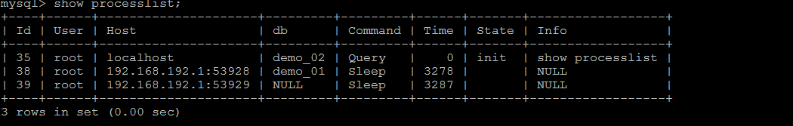
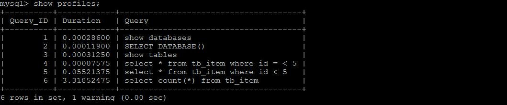

# 1. 查看SQL执行频率

MySQL 客户端连接成功后，通过 show [session|global] status 命令可以提供服务器状态信息。show [session|global] status 可以根据需要加上参数“session”或者“global”来显示 session 级（当前连接）的计结果和 global 级（自数据库上次启动至今）的统计结果。如果不写，默认使用参数是“session”。

下面的命令显示了当前 session 中所有统计参数的值：

```
show status like 'Com_______';
```

  

```
show status like 'Innodb_rows_%';
```


Com_xxx 表示每个 xxx 语句执行的次数，我们通常比较关心的是以下几个统计参数。

| 参数                 | 含义                                                         |
| :------------------- | ------------------------------------------------------------ |
| Com_select           | 执行 select 操作的次数，一次查询只累加 1。                   |
| Com_insert           | 执行 INSERT 操作的次数，对于批量插入的 INSERT 操作，只累加一次。 |
| Com_update           | 执行 UPDATE 操作的次数。                                     |
| Com_delete           | 执行 DELETE 操作的次数。                                     |
| Innodb_rows_read     | select 查询返回的行数。                                      |
| Innodb_rows_inserted | 执行 INSERT 操作插入的行数。                                 |
| Innodb_rows_updated  | 执行 UPDATE 操作更新的行数。                                 |
| Innodb_rows_deleted  | 执行 DELETE 操作删除的行数。                                 |
| Connections          | 试图连接 MySQL 服务器的次数。                                |
| Uptime               | 服务器工作时间。                                             |
| Slow_queries         | 慢查询的次数。                                               |

Com_***      :  这些参数对于所有存储引擎的表操作都会进行累计。

Innodb_*** :  这几个参数只是针对InnoDB 存储引擎的，累加的算法也略有不同。


# 2. 定位低效率执行SQL

可以通过以下两种方式定位执行效率较低的 SQL 语句。

- 慢查询日志 : 通过慢查询日志定位那些执行效率较低的 SQL 语句，用--log-slow-queries[=file_name]选项启动时，mysqld 写一个包含所有执行时间超过 long_query_time 秒的 SQL 语句的日志文件。具体可以查看本系列第五篇文章。
- show processlist  : 慢查询日志在查询结束以后才纪录，所以在应用反映执行效率出现问题的时候查询慢查询日志并不能定位问题，可以使用 `show processlist` 命令查看当前MySQL在进行的线程，包括线程的状态、是否锁表等，可以实时地查看 SQL 的执行情况，同时对一些锁表操作进行优化。

 


1） id列，用户登录mysql时，系统分配的"connection_id"，可以使用函数connection_id()查看

2） user列，显示当前用户。如果不是root，这个命令就只显示用户权限范围的sql语句

3） host列，显示这个语句是从哪个ip的哪个端口上发的，可以用来跟踪出现问题语句的用户

4） db列，显示这个进程目前连接的是哪个数据库

5） command列，显示当前连接的执行的命令，一般取值为休眠（sleep），查询（query），连接（connect）等

6） time列，显示这个状态持续的时间，单位是秒

7） state列，显示使用当前连接的sql语句的状态，很重要的列。state描述的是语句执行中的某一个状态。一个sql语句，以查询为例，可能需要经过copying to tmp table、sorting result、sending data等状态才可以完成

8） info列，显示这个sql语句，是判断问题语句的一个重要依据


# 3. Explain

使用 EXPLAIN 关键字可以模拟优化器执行 SQL 查询语句，从而知道MySQL 是如何处理你的 SQL 语句的。分析你的查询语句或是表结构的性能瓶颈。
用法： `Explain+SQL 语句;`

执行该语句后返回的信息内容表：


## 准备工作

```sql
CREATE TABLE t1(id INT(10) AUTO_INCREMENT,content VARCHAR(100) NULL , PRIMARY KEY (id));
CREATE TABLE t2(id INT(10) AUTO_INCREMENT,content VARCHAR(100) NULL , PRIMARY KEY (id));
CREATE TABLE t3(id INT(10) AUTO_INCREMENT,content VARCHAR(100) NULL , PRIMARY KEY (id));
CREATE TABLE t4(id INT(10) AUTO_INCREMENT,content VARCHAR(100) NULL , PRIMARY KEY (id));
INSERT INTO t1(content) VALUES(CONCAT('t1_',FLOOR(1+RAND()*1000)));
INSERT INTO t2(content) VALUES(CONCAT('t2_',FLOOR(1+RAND()*1000)));
INSERT INTO t3(content) VALUES(CONCAT('t3_',FLOOR(1+RAND()*1000)));
INSERT INTO t4(content) VALUES(CONCAT('t4_',FLOOR(1+RAND()*1000)));
```


## id

select 查询的序列号,包含一组数字，表示查询中执行 select 子句或操作表的顺序。

- id相同，执行顺序由上至下：


- id不同，如果是子查询，id会递增，id值越大，优先级越高，越先被执行


<span style='color:red'>**id 号每个号码，表示一趟独立的查询。一个 sql 的查询趟数越少越好。**</span>


## select_type

select_type 代表查询的类型，主要是用于区别普通查询、联合查询、子查询等的复杂查询。

|select_type 属性 |含义|
|---|---|
|SIMPLE| 简单的 `select` 查询,查询中不包含子查询或者 `UNION`，即单表查询 |
|PRIMARY |查询中若包含任何复杂的子部分，最外层查询则被标记为 `Primary`|
|DERIVED |在 `FROM` 列表中包含的子查询被标记为 DERIVED(衍生)MySQL会递归执行这些子查询, 把结果放在临时表里。|
|SUBQUERY|在`SELECT`或WHERE列表中包含了子查询|
|DEPEDENT SUBQUERY|在`SELECT`或WHERE列表中包含了子查询,子查询基于外层|
|UNCACHEABLE SUBQUERY| 无法使用缓存的子查询|
|UNION|若第二个`SELECT`出现在`UNION`之后，则被标记为`UNION`；若`UNION`包含在FROM子句的子查询中,外层`SELECT`将被标记为`DERIVED`|
|UNION RESULT|从`UNION`表获取结果的`SELECT`|

**simple**


**primary   derived**


## table

这个数据是基于哪张表的。


## 6.type

type 是查询的访问类型。是较为重要的一个指标，结果值从最好到最坏依次是：

`system > const > eq_ref > ref > fulltext > ref_or_null > index_merge > unique_subquery > index_subquery > range > index >ALL` ，一般来说，得保证查询至少达到 range 级别，最好能达到 ref。

### 6.1 system

表只有一行记录（等于系统表），这是 const 类型的特列，平时不会出现，这个也可以忽略不计

### 6.2 const

表示通过索引一次就找到了,const 用于比较 primary key 或者 unique 索引。因为只匹配一行数据，所以很快。如下：将主键置于 where 列表中，MySQL 就能将该查询转换为一个常量。


### 6.3 eq_ref

唯一性索引扫描，对于每个索引键，表中只有一条记录与之匹配。常见于主键或唯一索引扫描


### 6.4 ref

非唯一性索引扫描，返回匹配某个单独值的所有行.本质上也是一种索引访问，它返回所有匹配某个单独值的行，
然而，它可能会找到多个符合条件的行，所以他应该属于查找和扫描的混合体。

建立索引前：


建立索引后：


### 6.5 range

只检索给定范围的行,使用一个索引来选择行。key 列显示使用了哪个索引一般就是在你的 where 语句中出现了  `=, <>, >, >=, <, <=, IS NULL, <=>, BETWEEN, LIKE, or IN()` 等的查询这种范围扫描索引扫描比全表扫描要好，因为它只需要开始于索引的某一点，而结束语另一点，不用扫描全部索引。


### 6.6 index

出现index是sql使用了索引但是没有通过索引进行过滤，一般是使用了覆盖索引或者是利用索引进行了排序分组。


### 6.7 all

Full Table Scan，将遍历全表以找到匹配的行。


### 6.8 index_merge

在查询过程中需要多个索引组合使用，通常出现在有 or 的关键字的 sql 中。


### 6.9 ref_or_null

对于某个字段既需要关联条件，也需要 null 值的情况下。查询优化器会选择用 ref_or_null 连接查询。

### 6.10 index_subquery

利用索引来关联子查询，不再全表扫描。


## possible_keys

显示可能应用在这张表中的索引，一个或多个。查询涉及到的字段上若存在索引，则该索引将被列出， 但不一定被查询实际使用。


##  key

实际使用的索引。如果为NULL，则没有使用索引。


## key_len

表示索引中使用的字节数，可通过该列计算查询中使用的索引的长度。 key_len 字段能够帮你检查是否充分的
利用上了索引。ken_len 越长，说明索引使用的越充分。


# 4. show profile

Mysql从5.0.37版本开始增加了对 show profiles 和 show profile 语句的支持。show profiles 能够在做SQL优化时帮助我们了解时间都耗费到哪里去了。

查看 profile 是否开启：`show variables like '%profiling%'`

开启：可以执行 `set profiling=1` 

执行 show profiles 指令， 来查看SQL语句执行的耗时：

  

根据 Query_ID,可以进一步执行 `show profile cpu,block io for query Query_id` 来查看到该SQL执行过程中每个线程的状态和消耗的时间：


> Sending data: 表示MySQL线程开始访问数据行并把结果返回给客户端，而不仅仅是返回给客户端。由于在Sending data状态下，MySQL线程往往需要做大量的磁盘读取操作，所以经常是整各查询中耗时最长的状态。

MySQL支持进一步选择all、cpu、block io 、context switch、page faults等明细类型类查看MySQL在使用什么资源上耗费了过高的时间。例如，选择查看CPU的耗费时间  ：

 

| 字段       | 含义                           |
| ---------- | ------------------------------ |
| Status     | sql 语句执行的状态             |
| Duration   | sql 执行过程中每一个步骤的耗时 |
| CPU_user   | 当前用户占有的cpu              |
| CPU_system | 系统占有的cpu                  |


# 5. trace分析优化器执行计划

MySQL5.6提供了对SQL的跟踪trace, 通过trace文件能够进一步了解为什么优化器选择A计划, 而不是选择B计划。

打开trace ， 设置格式为 JSON，并设置trace最大能够使用的内存大小，避免解析过程中因为默认内存过小而不能够完整展示。

```sql
SET optimizer_trace="enabled=on",end_markers_in_json=on;
set optimizer_trace_max_mem_size=1000000;
```

执行SQL语句 ：

```sql
select * from tb_item where id < 4;
```

最后， 检查information_schema.optimizer_trace就可以知道MySQL是如何执行SQL的 ：

```sql
select * from information_schema.optimizer_trace\G;
```

