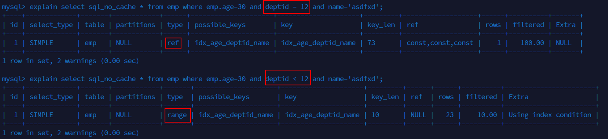

## 1. 批量数据脚本

为了得到足够的数据，我们需要脚本来帮我们制造数据。

### 1.1 设置参数

在执行创建函数之前，首先请保证 log_bin_trust_function_creators 参数为 1，即 on 开启状态。


当然，如上设置只存在于当前操作，想要永久生效，需要写入到配置文件中：
在[mysqld]中加上 log_bin_trust_function_creators=1

### 1.2 建表语句

```sql
CREATE TABLE `dept` (
    `id` INT(11) NOT NULL AUTO_INCREMENT,
    `deptName` VARCHAR(30) DEFAULT NULL,
    `address` VARCHAR(40) DEFAULT NULL,
    ceo INT NULL ,
    PRIMARY KEY (`id`)
) ENGINE=INNODB AUTO_INCREMENT=1 DEFAULT CHARSET=utf8;
CREATE TABLE `emp` (
    `id` INT(11) NOT NULL AUTO_INCREMENT,
    `empno` INT NOT NULL ,
    `name` VARCHAR(20) DEFAULT NULL,
    `age` INT(3) DEFAULT NULL,
    `deptId` INT(11) DEFAULT NULL,
    PRIMARY KEY (`id`)
    #CONSTRAINT `fk_dept_id` FOREIGN KEY (`deptId`) REFERENCES `t_dept` (`id`)
) ENGINE=INNODB AUTO_INCREMENT=1 DEFAULT CHARSET=utf8;
```


### 1.3 编写随机函数

**随机字符串**

```sql
DELIMITER $$
CREATE FUNCTION rand_string(n INT) RETURNS VARCHAR(255)
BEGIN
DECLARE chars_str VARCHAR(100) DEFAULT 'abcdefghijklmnopqrstuvwxyzABCDEFJHIJKLMNOPQRSTUVWXYZ';
DECLARE return_str VARCHAR(255) DEFAULT '';
DECLARE i INT DEFAULT 0;
WHILE i < n DO
SET return_str =CONCAT(return_str,SUBSTRING(chars_str,FLOOR(1+RAND()*52),1));
SET i = i + 1;
END WHILE;
RETURN return_str;
END $$
```

**随机部门编号**

```sql
DELIMITER $$
CREATE FUNCTION rand_num (from_num INT ,to_num INT) RETURNS INT(11)
BEGIN
DECLARE i INT DEFAULT 0;
SET i = FLOOR(from_num +RAND()*(to_num -from_num+1)) ;
RETURN i;
END$$
```


### 1.4创建存储过程

**1.4.1 创建往 emp 表中插入数据的存储过程**

```sql
DELIMITER $$
CREATE PROCEDURE insert_emp( START INT , max_num INT )
BEGIN
DECLARE i INT DEFAULT 0;
#set autocommit =0 把 autocommit 设置成 0
SET autocommit = 0;
REPEAT
SET i = i + 1;

INSERT INTO emp (empno, NAME ,age ,deptid ) VALUES ((START+i) ,rand_string(6) ,
rand_num(30,50),rand_num(1,10000));
UNTIL i = max_num
END REPEAT;
COMMIT;
END$$
#删除
#DELIMITER ;
#drop PROCEDURE insert_emp;
```


**1.4.2 创建往 dept 表中插入数据的存储过程**

```sql
#执行存储过程，往 dept 表添加随机数据
DELIMITER $$
CREATE PROCEDURE `insert_dept`( max_num INT )
BEGIN
DECLARE i INT DEFAULT 0;
SET autocommit = 0;
REPEAT
SET i = i + 1;
INSERT INTO dept ( deptname,address,ceo ) VALUES (rand_string(8),rand_string(10),rand_num(1,500000));
UNTIL i = max_num
END REPEAT;
COMMIT;
END$$
#删除
# DELIMITER ;
# drop PROCEDURE insert_dept;
```


### 调用存储过程

```sql
#执行存储过程，往 dept 表添加 1 万条数据
DELIMITER ;
CALL insert_dept(10000);
#执行存储过程，往 emp 表添加 50 万条数据
DELIMITER ;
CALL insert_emp(100000,500000);
```

### 1.6 批量删除某个表上的所有索引

**1.6.1 删除索引的存储过程**

```sql
DELIMITER $$
CREATE PROCEDURE `proc_drop_index`(dbname VARCHAR(200),tablename VARCHAR(200))
BEGIN
DECLARE done INT DEFAULT 0;
DECLARE ct INT DEFAULT 0;
DECLARE _index VARCHAR(200) DEFAULT '';
DECLARE _cur CURSOR FOR SELECT index_name FROM information_schema.STATISTICS WHERE
table_schema=dbname AND table_name=tablename AND seq_in_index=1 AND index_name <>'PRIMARY' ;
DECLARE CONTINUE HANDLER FOR NOT FOUND set done=2 ;
OPEN _cur;
FETCH _cur INTO _index;
WHILE _index<>'' DO
SET @str = CONCAT("drop index ",_index," on ",tablename );
PREPARE sql_str FROM @str ;
EXECUTE sql_str;
DEALLOCATE PREPARE sql_str;
SET _index='';
FETCH _cur INTO _index;
END WHILE;
CLOSE _cur;
END$$
```

**1.6.2 执行存储过程**
调用：CALL proc_drop_index("dbname","tablename");


## 2.结构优化

### 2.1全值匹配

建立索引：

```sql
CREATE INDEX idx_age_deptid_name ON emp(age,deptid,NAME); #记住顺序！！！
```

然后依次执行：


**查询的字段按照顺序在索引中都可以匹配到！**

当然，SQL 中查询字段的顺序，跟使用索引中字段的顺序不一样也没有关系。优化器会在不影响 SQL 执行结果的前提下自动优化：


### 2.2最左前缀法则


查询字段与索引字段顺序的不同会导致，索引无法充分使用，甚至索引失效！
原因：使用复合索引，需要遵循最佳左前缀法则，即如果索引了多列，要遵守最左前缀法则。指的是查询从索引的最左前列开始并且不跳过索引中的列。
结论 ： 过滤条件要使用索引必须按照索引建立时的顺序 ， 依次满足 ， 一旦跳过某个字段 ， 索引后面的字段都无法被使用。


### 2.3不要在索引列上做任何计算

不在索引列上做任何操作（计算、函数、自动或手动类型转换），会导致索引失效而转向全表扫描。

**2.3.1 在查询列上使用了函数**


**2.3.2 在查询列上做了转换**


> 完成后，删除该索引


### 2.4  索引列上不能有范围查询




### 2.5尽量使用覆盖索引


覆盖索引（covering index）指一个查询语句的执行只用从索引中就能够取得，不必从数据表中读取。

**即查询列和索引列一致，不要写 select ***

如果语句是 select * from T where k=5，即普通索引查询方式，则需要先搜索 k 索引树，ID 的值为 500，再到 ID 索引树搜索一次。这个过程称**回表**。


### 2.6 使用不等于(!= 或者<>)的时候


> mysql 在使用不等于(!= 或者<>)时，有时会无法使用索引会导致全表扫描。

范围列可以用到索引（必须是最左前缀），但是范围列后面的列无法用到索引。同时，索引最多用于一个范围列，因此如果查询条件中有两个范围列则无法全用到索引。

### 2.7  字段的 is not null 和 和 is null


> 当字段允许为 Null 的条件下， is not null 用不到索引，is null 可以用到索引。


### 2.8 like 的前后模糊匹配


> 前缀不能出现模糊匹配！


### 2.9 减少使用 or

对于包含OR的查询子句，如果要利用索引，则OR之间的每个条件列都必须用到索引 ， 而且不能使用到复合索引； 如果没有索引，则应该考虑增加索引。


> 使用 union all 或者 union 来替代


## 3 关联查询优化

### 3.1 建表

```sql
CREATE TABLE IF NOT EXISTS `class` (
`id` INT(10) UNSIGNED NOT NULL AUTO_INCREMENT,
`card` INT(10) UNSIGNED NOT NULL,
PRIMARY KEY (`id`)
);
CREATE TABLE IF NOT EXISTS `book` (
   `bookid` INT(10) UNSIGNED NOT NULL AUTO_INCREMENT,
   `card` INT(10) UNSIGNED NOT NULL,
   	PRIMARY KEY (`bookid`)
);

# 执行20次以下两条sql
INSERT INTO class(card) VALUES(FLOOR(1 + (RAND() * 20)));
INSERT INTO book(card) VALUES(FLOOR(1 + (RAND() * 20)));
```


### 3.2 left join


1. 在 class表上添加索引


2. 在 book表上添加索引：


> 1. 在优化关联查询时，只有在被驱动表上建立索引才有效！
> 2. left join 时，左侧的为驱动表，右侧为被驱动表


### 3.3 inner join


> 两个查询字段调换顺序，发现结果也是一样的;
>
> inner join 时，mysql 会自己帮你把小结果集的表选为驱动表。
>
> straight_join: 效果和 inner join 一样，但是会强制将左侧作为驱动表！


## 子查询优化

Mysql4.1版本之后，开始支持SQL的子查询。这个技术可以使用SELECT语句来创建一个单列的查询结果，然后把这个结果作为过滤条件用在另一个查询中。使用子查询可以一次性的完成很多逻辑上需要多个步骤才能完成的SQL操作，同时也可以避免事务或者表锁死，并且写起来也很容易。但是，有些情况下，子查询是可以被更高效的连接（JOIN）替代。


## 4. SQL 优化

### 优化insert语句

当进行数据的insert操作的时候，可以考虑采用以下几种优化方案。

- 如果需要同时对一张表插入很多行数据时，应该尽量使用多个值表的insert语句，这种方式将大大的缩减客户端与数据库之间的连接、关闭等消耗。使得效率比分开执行的单个insert语句快。
- 在事务中进行数据插入。
- 数据有序插入


### 优化order by语句


### 优化group by 语句

由于GROUP BY 实际上也同样会进行排序操作，而且与ORDER BY 相比，GROUP BY 主要只是多了排序之后的分组操作。当然，如果在分组的时候还使用了其他的一些聚合函数，那么还需要一些聚合函数的计算。所以，在GROUP BY 的实现过程中，与 ORDER BY 一样也可以利用到索引。
如果查询包含 group by 但是用户想要避免排序结果的消耗， 则可以执行order by null 禁止排序。


### 使用SQL提示

SQL提示，是优化数据库的一个重要手段，简单来说，就是在SQL语句中加入一些人为的提示来达到优化操作的目
的。

#### USE INDEX

在查询语句中表名的后面，添加 use index 来提供希望MySQL去参考的索引列表，就可以让MySQL不再考虑其他
可用的索引。

####  IGNORE INDEX

如果用户只是单纯的想让MySQL忽略一个或者多个索引，则可以使用 ignore index 作为 hint 。

#### FORCE INDEX

为强制MySQL使用一个特定的索引，可在查询中使用 force index 作为hint 。FORCE INDEX
为强制MySQL使用一个特定的索引，可在查询中使用 force index 作为hint 。