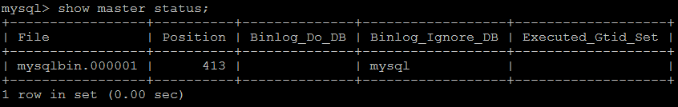

复制是指将主数据库的DDL 和 DML 操作通过二进制日志传到从库服务器中，然后在从库上对这些日志重新执行（也叫重做），从而使得从库和主库的数据保持同步。

MySQL支持一台主库同时向多台从库进行复制， 从库同时也可以作为其他从服务器的主库，实现链状复制。

## 1. 复制基本原理流程

MySQL 的主从复制原理如下。


1. 主：binlog线程——记录下所有改变了数据库数据的语句，放进master上的binlog中；
2. 从：io线程——在使用start slave 之后，负责从master上拉取 binlog 内容，放进自己的中继日志 relay log中；
3. 从：sql执行线程——执行relay log中的语句；

## 2. 复制优势

MySQL 复制的有点主要包含以下三个方面：

- 主库出现问题，可以快速切换到从库提供服务。
- 可以在从库上执行查询操作，从主库中更新，实现读写分离，降低主库的访问压力。
- 可以在从库中执行备份，以避免备份期间影响主库的服务。

## 3. MySQL复制的线程有几个及之间的关联

MySQL 的复制是基于如下 3 个线程的交互（ 多线程复制里面应该是 4 类线程）：

1. Master 上面的 binlog dump 线程，该线程负责将 master 的 binlog event 传到slave；
2. Slave 上面的 IO 线程，该线程负责接收 Master 传过来的 binlog，并写入 relay log；
3. Slave 上面的 SQL 线程，该线程负责读取 relay log 并执行；
4. 如果是多线程复制，无论是 5.6 库级别的假多线程还是 MariaDB 或者 5.7 的真正的多线程复制， SQL 线程只做 coordinator，只负责把 relay log 中的 binlog读出来然后交给 worker 线程， woker 线程负责具体 binlog event 的执行；

## 4. MySQL如何保证复制过程中数据一致性及减少数据同步延时

主要有以下几个方面：

1. 在 MySQL5.5 以及之前， slave 的 SQL 线程执行的 relay log 的位置只能保存在文件（ relay-log.info）里面，并且该文件默认每执行 10000 次事务做一次同步到磁盘， 这意味着 slave 意外 crash 重启时， SQL 线程执行到的位置和数据库的数据是不一致的，将导致复制报错，如果不重搭复制，则有可能会导致数据不一致。MySQL 5.6 引入参数 relay_log_info_repository，将该参数设置为 TABLE 时， MySQL 将 SQL 线程执行到的位置存到mysql.slave_relay_log_info 表，这样更新该表的位置和 SQL 线程执行的用户事务绑定成一个事务，这样 slave 意外宕机后， slave 通过 innodb 的崩溃恢复可以把 SQL 线程执行到的位置和用户事务恢复到一致性的状态。

2. MySQL 5.6 引入 GTID 复制，每个 GTID 对应的事务在每个实例上面最多执行一次， 这极大地提高了复制的数据一致性；

3. MySQL 5.5 引入半同步复制， 用户安装半同步复制插件并且开启参数后，设置超时时间，可保证在超时时间内如果 binlog 不传到 slave 上面，那么用户提交事务时不会返回，直到超时后切成异步复制，但是如果切成异步之前用户线程提交时在 master 上面等待的时候，事务已经提交，该事务对 master上面的其他 session 是可见的，如果这时 master 宕机，那么到 slave 上面该事务又不可见了，该问题直到 5.7 才解决；

4. MySQL 5.7 引入无损半同步复制，引入参 rpl_semi_sync_master_wait_point，该参数默认为 after_sync，指的是在切成半同步之前，事务不提交，而是接收到 slave 的 ACK 确认之后才提交该事务，从此，复制真正可以做到无损的了。

5. 可以再说一下 5.7 的无损复制情况下， master 意外宕机，重启后发现有 binlog没传到 slave 上面，这部分 binlog 怎么办？？？分 2 种情况讨论， 1 宕机时已经切成异步了， 2 是宕机时还没切成异步？？？这个怎么判断宕机时有没有切成异步呢？？？分别怎么处理？？？延时性： 5.5 是单线程复制， 5.6 是多库复制（对于单库或者单表的并发操作是没用的）， 5.7 是真正意义的多线程复制，它的原理是基于 group commit， 只要master 上面的事务是 group commit 的，那 slave 上面也可以通过多个 worker线程去并发执行。和 MairaDB10.0.0.5 引入多线程复制的原理基本一样。

# 搭建步骤

##### master

1） 在master 的配置文件（/usr/my.cnf）中，配置如下内容：

```properties
#mysql 服务ID,保证整个集群环境中唯一
server-id=1

#mysql binlog 日志的存储路径和文件名
log-bin=/var/lib/mysql/mysqlbin

#错误日志,默认已经开启
#log-err

#mysql的安装目录
#basedir

#mysql的临时目录
#tmpdir

#mysql的数据存放目录
#datadir

#是否只读,1 代表只读, 0 代表读写
read-only=0

#忽略的数据, 指不需要同步的数据库
binlog-ignore-db=mysql

#指定同步的数据库
#binlog-do-db=db01
```

2） 执行完毕之后，需要重启Mysql：

```sql
service mysql restart ；
```

3） 创建同步数据的账户，并且进行授权操作：

```sql
grant replication slave on *.* to 'itcast'@'192.168.192.131' identified by 'itcast';    

flush privileges;
```

4） 查看master状态：

```sql
show master status;
```

 

字段含义：

```
File : 从哪个日志文件开始推送日志文件 
Position ： 从哪个位置开始推送日志
Binlog_Ignore_DB : 指定不需要同步的数据库
```

##### 3.4.2 slave

1） 在 slave 端配置文件中，配置如下内容：

```properties
#mysql服务端ID,唯一
server-id=2

#指定binlog日志
log-bin=/var/lib/mysql/mysqlbin
```

2）  执行完毕之后，需要重启Mysql：

```
service mysql restart；
```

3） 执行如下指令 ：

```sql
change master to master_host= '192.168.192.130', master_user='itcast', master_password='itcast', master_log_file='mysqlbin.000001', master_log_pos=413;
```

指定当前从库对应的主库的IP地址，用户名，密码，从哪个日志文件开始的那个位置开始同步推送日志。

4） 开启同步操作

```
start slave;

show slave status;
```

 

5） 停止同步操作

```
stop slave;
```

##### 3.4.3 验证同步操作

1） 在主库中创建数据库，创建表，并插入数据 ：

```sql
create database db01;

user db01;

create table user(
    id int(11) not null auto_increment,
    name varchar(50) not null,
    sex varchar(1),
    primary key (id)
)engine=innodb default charset=utf8;

insert into user(id,name,sex) values(null,'Tom','1');
insert into user(id,name,sex) values(null,'Trigger','0');
insert into user(id,name,sex) values(null,'Dawn','1');
```

2） 在从库中查询数据，进行验证 ：

在从库中，可以查看到刚才创建的数据库：

 

在该数据库中，查询user表中的数据：

 
