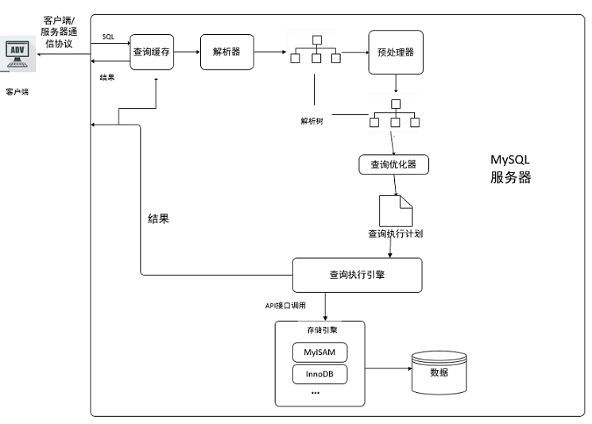

# 1. 应用优化

前面章节，我们介绍了很多数据库的优化措施。但是在实际生产环境中，由于数据库本身的性能局限，就必须要对前台的应用进行一些优化，来降低数据库的访问压力。

## 1.1 使用连接池

对于访问数据库来说，建立连接的代价是比较昂贵的，因为我们频繁的创建关闭连接，是比较耗费资源的，我们有必要建立 数据库连接池，以提高访问的性能。

## 1.2 减少对MySQL的访问

### 1.2.1 避免对数据进行重复检索

在编写应用代码时，需要能够理清对数据库的访问逻辑。能够一次连接就获取到结果的，就不用两次连接，这样可以大大减少对数据库无用的重复请求。

### 1.2.2 增加cache层

在应用中，我们可以在应用中增加 缓存 层来达到减轻数据库负担的目的。缓存层有很多种，也有很多实现方式，只要能达到降低数据库的负担又能满足应用需求就可以。
因此可以部分数据从数据库中抽取出来放到应用端以文本方式存储， 或者使用框(Mybatis, Hibernate)提供的一级缓存/二级缓存，或者使用redis数据库来缓存数据 。

## 1.3 负载均衡

负载均衡是应用中使用非常普遍的一种优化方法，它的机制就是利用某种均衡算法，将固定的负载量分布到不同的服务器上， 以此来降低单台服务器的负载，达到优化的效果。

### 1.3.1 利用MySQL复制分流查询

通过MySQL的主从复制，实现读写分离，使增删改操作走主节点，查询操作走从节点，从而而可以降低单台服务器的读写压力。

### 1.3.2 采用分布式数据库架构

分布式数据库架构适合大数据量、负载高的情况，它有良好的拓展性和高可用性。通过在多台服务器之间分布数据，可以实现在多台服务器之间的负载均衡，提高访问效率。


# 2. Mysql中查询缓存优化

## 2.1 概述

开启Mysql的查询缓存，当执行**完全相同**的SQL语句的时候，服务器就会直接从缓存中读取结果。当数据被修改，之前的缓存会失效，修改比较频繁的表不适合做查询缓存。

## 2.2 操作流程



1. 客户端发送一条查询给服务器；
2. 服务器先会检查查询缓存，如果命中了缓存，则立即返回存储在缓存中的结果。否则进入下一阶段；
3. 服务器端进行SQL解析、预处理，再由优化器生成对应的执行计划；
4. MySQL根据优化器生成的执行计划，调用存储引擎的API来执行查询；
5. 将结果返回给客户端。

## 2.3 查询缓存配置

1. 查看当前的MySQL数据库是否支持查询缓存：

   ```SQL
   SHOW VARIABLES LIKE 'have_query_cache';	
   ```

    

2. 查看当前MySQL是否开启了查询缓存 ：

   ```SQL
   SHOW VARIABLES LIKE 'query_cache_type';
   ```

    

3. 查看查询缓存的占用大小 ：

   ```SQL
   SHOW VARIABLES LIKE 'query_cache_size';
   ```

     	

4. 查看查询缓存的状态变量：

   ```SQL
   SHOW STATUS LIKE 'Qcache%';
   ```

    

   各个变量的含义如下：

   | 参数                    | 含义                                                         |
   | ----------------------- | ------------------------------------------------------------ |
   | Qcache_free_blocks      | 查询缓存中的可用内存块数                                     |
   | Qcache_free_memory      | 查询缓存的可用内存量                                         |
   | Qcache_hits             | 查询缓存命中数                                               |
   | Qcache_inserts          | 添加到查询缓存的查询数                                       |
   | Qcache_lowmen_prunes    | 由于内存不足而从查询缓存中删除的查询数                       |
   | Qcache_not_cached       | 非缓存查询的数量（由于 query_cache_type 设置而无法缓存或未缓存） |
   | Qcache_queries_in_cache | 查询缓存中注册的查询数                                       |
   | Qcache_total_blocks     | 查询缓存中的块总数                                           |


## 2.4 开启查询缓存

MySQL的查询缓存默认是关闭的，需要手动配置参数 query_cache_type ， 来开启查询缓存。query_cache_type 该参数的可取值有三个 ：

| 值          | 含义                                                         |
| ----------- | ------------------------------------------------------------ |
| OFF 或 0    | 查询缓存功能关闭                                             |
| ON 或 1     | 查询缓存功能打开，SELECT的结果符合缓存条件即会缓存，否则，不予缓存，显式指定 SQL_NO_CACHE，不予缓存 |
| DEMAND 或 2 | 查询缓存功能按需进行，显式指定 SQL_CACHE 的SELECT语句才会缓存；其它均不予缓存 |

在 MySQL 配置文件中，增加以下配置 ： 


配置完毕之后，重启服务既可生效 ；


## 2.5 查询缓存SELECT选项

可以在SELECT语句中指定两个与查询缓存相关的选项 ：

SQL_CACHE : 如果查询结果是可缓存的，并且 query_cache_type 系统变量的值为ON或 DEMAND ，则缓存查询结果 。

SQL_NO_CACHE : 服务器不使用查询缓存。它既不检查查询缓存，也不检查结果是否已缓存，也不缓存查询结果。


例子：

```SQL
SELECT SQL_CACHE id, name FROM customer;
SELECT SQL_NO_CACHE id, name FROM customer;
```

​	

## 2.6 查询缓存失效的情况

1） SQL 语句不一致的情况， 要想命中查询缓存，查询的SQL语句必须一致。

```SQL
SQL1 : select count(*) from tb_item;
SQL2 : Select count(*) from tb_item;
```

2） 当查询语句中有一些不确定的时，则不会缓存。如 ： now() , current_date() , curdate() , curtime() , rand() , uuid() , user() , database() 。

```SQL
SQL1 : select * from tb_item where updatetime < now() limit 1;
SQL2 : select user();
SQL3 : select database();
```

3） 不使用任何表查询语句。

```SQL
select 'A';
```

4）  查询 mysql， information_schema或  performance_schema 数据库中的表时，不会走查询缓存。

```SQL
select * from information_schema.engines;
```

5） 在存储的函数，触发器或事件的主体内执行的查询。

6） 如果表更改，则使用该表的所有高速缓存查询都将变为无效并从高速缓存中删除。这包括使用`MERGE`映射到已更改表的表的查询。一个表可以被许多类型的语句，如被改变 INSERT， UPDATE， DELETE， TRUNCATE TABLE， ALTER TABLE， DROP TABLE，或 DROP DATABASE 。


# 3. Mysql内存管理及优化

#### 3.1 内存优化原则

1） 将尽量多的内存分配给MySQL做缓存，但要给操作系统和其他程序预留足够内存。

2） MyISAM 存储引擎的数据文件读取依赖于操作系统自身的IO缓存，因此，如果有MyISAM表，就要预留更多的内存给操作系统做IO缓存。

3） 排序区、连接区等缓存是分配给每个数据库会话（session）专用的，其默认值的设置要根据最大连接数合理分配，如果设置太大，不但浪费资源，而且在并发连接较高时会导致物理内存耗尽。


#### 3.2 MyISAM 内存优化

myisam存储引擎使用 key_buffer 缓存索引块，加速myisam索引的读写速度。对于myisam表的数据块，mysql没有特别的缓存机制，完全依赖于操作系统的IO缓存。


##### key_buffer_size

key_buffer_size决定MyISAM索引块缓存区的大小，直接影响到MyISAM表的存取效率。可以在MySQL参数文件中设置key_buffer_size的值，对于一般MyISAM数据库，建议至少将1/4可用内存分配给key_buffer_size。

在/usr/my.cnf 中做如下配置：

```
key_buffer_size=512M
```


##### read_buffer_size

如果需要经常顺序扫描myisam表，可以通过增大read_buffer_size的值来改善性能。但需要注意的是read_buffer_size是每个session独占的，如果默认值设置太大，就会造成内存浪费。


##### read_rnd_buffer_size

对于需要做排序的myisam表的查询，如带有order by子句的sql，适当增加 read_rnd_buffer_size 的值，可以改善此类的sql性能。但需要注意的是 read_rnd_buffer_size 是每个session独占的，如果默认值设置太大，就会造成内存浪费。


#### 3.3 InnoDB 内存优化

innodb用一块内存区做IO缓存池，该缓存池不仅用来缓存innodb的索引块，而且也用来缓存innodb的数据块。


##### innodb_buffer_pool_size

该变量决定了 innodb 存储引擎表数据和索引数据的最大缓存区大小。在保证操作系统及其他程序有足够内存可用的情况下，innodb_buffer_pool_size 的值越大，缓存命中率越高，访问InnoDB表需要的磁盘I/O 就越少，性能也就越高。

```
innodb_buffer_pool_size=512M
```


##### innodb_log_buffer_size

决定了innodb重做日志缓存的大小，对于可能产生大量更新记录的大事务，增加innodb_log_buffer_size的大小，可以避免innodb在事务提交前就执行不必要的日志写入磁盘操作。

```
innodb_log_buffer_size=10M
```


# 4. Mysql并发参数调整

从实现上来说，MySQL Server 是多线程结构，包括后台线程和客户服务线程。多线程可以有效利用服务器资源，提高数据库的并发性能。在Mysql中，控制并发连接和线程的主要参数包括 max_connections、back_log、thread_cache_size、table_open_cahce。

#### 4.1 max_connections

采用max_connections 控制允许连接到MySQL数据库的最大数量，默认值是 151。如果状态变量 connection_errors_max_connections 不为零，并且一直增长，则说明不断有连接请求因数据库连接数已达到允许最大值而失败，这是可以考虑增大max_connections 的值。

Mysql 最大可支持的连接数，取决于很多因素，包括给定操作系统平台的线程库的质量、内存大小、每个连接的负荷、CPU的处理速度，期望的响应时间等。在Linux 平台下，性能好的服务器，支持 500-1000 个连接不是难事，需要根据服务器性能进行评估设定。


#### 4.2 back_log

back_log 参数控制MySQL监听TCP端口时设置的积压请求栈大小。如果MySql的连接数达到max_connections时，新来的请求将会被存在堆栈中，以等待某一连接释放资源，该堆栈的数量即back_log，如果等待连接的数量超过back_log，将不被授予连接资源，将会报错。5.6.6 版本之前默认值为 50 ， 之后的版本默认为 50 + （max_connections / 5）， 但最大不超过900。

如果需要数据库在较短的时间内处理大量连接请求， 可以考虑适当增大back_log 的值。


#### 4.3 table_open_cache

该参数用来控制所有SQL语句执行线程可打开表缓存的数量， 而在执行SQL语句时，每一个SQL执行线程至少要打开 1 个表缓存。该参数的值应该根据设置的最大连接数 max_connections 以及每个连接执行关联查询中涉及的表的最大数量来设定 ：

​	max_connections x N ；


#### 4.4 thread_cache_size

为了加快连接数据库的速度，MySQL 会缓存一定数量的客户服务线程以备重用，通过参数 thread_cache_size 可控制 MySQL 缓存客户服务线程的数量。


#### 4.5 innodb_lock_wait_timeout

该参数是用来设置InnoDB 事务等待行锁的时间，默认值是50ms ， 可以根据需要进行动态设置。对于需要快速反馈的业务系统来说，可以将行锁的等待时间调小，以避免事务长时间挂起； 对于后台运行的批量处理程序来说， 可以将行锁的等待时间调大， 以避免发生大的回滚操作。


# 5. Mysql锁问题

#### 5.1 锁概述

锁是计算机协调多个进程或线程并发访问某一资源的机制（避免争抢）。

在数据库中，除传统的计算资源（如 CPU、RAM、I/O 等）的争用以外，数据也是一种供许多用户共享的资源。如何保证数据并发访问的一致性、有效性是所有数据库必须解决的一个问题，锁冲突也是影响数据库并发访问性能的一个重要因素。从这个角度来说，锁对数据库而言显得尤其重要，也更加复杂。


#### 5.2 锁分类

从对数据操作的粒度分 ： 

1） 表锁：操作时，会锁定整个表。

2） 行锁：操作时，会锁定当前操作行。

从对数据操作的类型分：

1） 读锁（共享锁）：针对同一份数据，多个读操作可以同时进行而不会互相影响。

2） 写锁（排它锁）：当前操作没有完成之前，它会阻断其他写锁和读锁。


#### 5.3 Mysql 锁

相对其他数据库而言，MySQL的锁机制比较简单，其最显著的特点是不同的存储引擎支持不同的锁机制。下表中罗列出了各存储引擎对锁的支持情况：

| 存储引擎 | 表级锁 | 行级锁 | 页面锁 |
| -------- | ------ | ------ | ------ |
| MyISAM   | 支持   | 不支持 | 不支持 |
| InnoDB   | 支持   | 支持   | 不支持 |
| MEMORY   | 支持   | 不支持 | 不支持 |
| BDB      | 支持   | 不支持 | 支持   |

MySQL这3种锁的特性可大致归纳如下 ：

| 锁类型 | 特点                                                         |
| ------ | ------------------------------------------------------------ |
| 表级锁 | 偏向MyISAM 存储引擎，开销小，加锁快；不会出现死锁；锁定粒度大，发生锁冲突的概率最高,并发度最低。 |
| 行级锁 | 偏向InnoDB 存储引擎，开销大，加锁慢；会出现死锁；锁定粒度最小，发生锁冲突的概率最低,并发度也最高。 |
| 页面锁 | 开销和加锁时间界于表锁和行锁之间；会出现死锁；锁定粒度界于表锁和行锁之间，并发度一般。 |

从上述特点可见，很难笼统地说哪种锁更好，只能就具体应用的特点来说哪种锁更合适！仅从锁的角度来说：表级锁更适合于以查询为主，只有少量按索引条件更新数据的应用，如Web 应用；而行级锁则更适合于有大量按索引条件并发更新少量不同数据，同时又有并查询的应用，如一些在线事务处理（OLTP）系统。


#### 锁的算法

到目前为止已经对 InnoDB 中锁的粒度有一定的了解，也清楚了在对数据库进行读写时会获取不同的锁，在这一小节将介绍锁是如何添加到对应的数据行上的，我们会分别介绍三种锁的算法：Record Lock、Gap Lock 和 Next-Key Lock。

Record Lock

记录锁（Record Lock）是加到**索引记录**上的锁，假设我们存在下面的一张表 `users`：

```sql
 CREATE TABLE users(    
     id INT NOT NULL AUTO_INCREMENT,
     last_name VARCHAR(255) NOT NULL,
     first_name VARCHAR(255),
     age INT,
     PRIMARY KEY(id),
     KEY(last_name),
     KEY(age)
 );
```

如果我们使用 `id` 或者 `last_name` 作为 SQL 中 `WHERE` 语句的过滤条件，那么 InnoDB 就可以通过索引建立的 B+ 树找到行记录并添加索引，但是如果使用 `first_name` 作为过滤条件时，由于 InnoDB 不知道待修改的记录具体存放的位置，也无法对将要修改哪条记录提前做出判断就会锁定整个表。

Gap Lock

记录锁是在存储引擎中最为常见的锁，除了记录锁之外，InnoDB 中还存在间隙锁（Gap Lock），间隙锁是对索引记录中的一段连续区域的锁；当使用类似 `SELECT * FROM users WHERE id BETWEEN 10 AND 20 FOR UPDATE;` 的 SQL 语句时，就会阻止其他事务向表中插入 `id = 15` 的记录，因为整个范围都被间隙锁锁定了。

> 间隙锁是存储引擎对于性能和并发做出的权衡，并且只用于某些事务隔离级别。

虽然间隙锁中也分为共享锁和互斥锁，不过它们之间并不是互斥的，也就是不同的事务可以同时持有一段相同范围的共享锁和互斥锁，它唯一阻止的就是**其他事务向这个范围中添加新的记录**。

Next-Key Lock

Next-Key 锁相比前两者就稍微有一些复杂，它是记录锁和记录前的间隙锁的结合，在 `users` 表中有以下记录：

```
 +------|-------------|--------------|-------+
 |   id | last_name   | first_name   |   age |
 |------|-------------|--------------|-------|
 |    4 | stark       | tony         |    21 |
 |    1 | tom         | hiddleston   |    30 |
 |    3 | morgan      | freeman      |    40 |
 |    5 | jeff        | dean         |    50 |
 |    2 | donald      | trump        |    80 |
 +------|-------------|--------------|-------+
```

如果使用 Next-Key 锁，那么 Next-Key 锁就可以在需要的时候锁定以下的范围：

```
 (-∞, 21](21, 30](30, 40](40, 50](50, 80](80, ∞)
```

> 既然叫 Next-Key 锁，锁定的应该是当前值和后面的范围，但是实际上却不是，Next-Key 锁锁定的是当前值和前面的范围。

当我们更新一条记录，比如 `SELECT * FROM users WHERE age = 30 FOR UPDATE;`，InnoDB 不仅会在范围 `(21, 30]` 上加 Next-Key 锁，还会在这条记录后面的范围 `(30, 40]` 加间隙锁，所以插入 `(21, 40]` 范围内的记录都会被锁定。

Next-Key 锁的作用其实是为了解决幻读的问题。


#### 5.2 MyISAM 表锁

MyISAM 存储引擎只支持表锁，这也是MySQL开始几个版本中唯一支持的锁类型。


##### 5.2.1 如何加表锁

MyISAM 在执行查询语句（SELECT）前，会自动给涉及的所有表加读锁，在执行更新操作（UPDATE、DELETE、INSERT 等）前，会自动给涉及的表加写锁，这个过程并不需要用户干预，因此，用户一般不需要直接用 LOCK TABLE 命令给 MyISAM 表显式加锁。

显示加表锁语法：

```SQL
加读锁 ： lock table table_name read;

加写锁 ： lock table table_name write；
```


##### 5.2.2 读锁案例 

准备环境

```SQL
create database demo_03 default charset=utf8mb4;

use demo_03;

CREATE TABLE `tb_book` (
  `id` INT(11) auto_increment,
  `name` VARCHAR(50) DEFAULT NULL,
  `publish_time` DATE DEFAULT NULL,
  `status` CHAR(1) DEFAULT NULL,
  PRIMARY KEY (`id`)
) ENGINE=myisam DEFAULT CHARSET=utf8 ;

INSERT INTO tb_book (id, name, publish_time, status) VALUES(NULL,'java编程思想','2088-08-01','1');
INSERT INTO tb_book (id, name, publish_time, status) VALUES(NULL,'solr编程思想','2088-08-08','0');


CREATE TABLE `tb_user` (
  `id` INT(11) auto_increment,
  `name` VARCHAR(50) DEFAULT NULL,
  PRIMARY KEY (`id`)
) ENGINE=myisam DEFAULT CHARSET=utf8 ;

INSERT INTO tb_user (id, name) VALUES(NULL,'令狐冲');
INSERT INTO tb_user (id, name) VALUES(NULL,'田伯光');

```


客户端 一 ：

1）获得tb_book 表的读锁 

```
lock table tb_book read;
```

2） 执行查询操作

```
select * from tb_book;
```

 

可以正常执行 ， 查询出数据.


客户端 二 ：

3） 执行查询操作

```
select * from tb_book;
```

 


客户端 一 ：

4）查询未锁定的表

```
select name from tb_seller;
```

 


客户端 二 ：

5）查询未锁定的表

```
select name from tb_seller;
```

 

可以正常查询出未锁定的表；


客户端 一 ：

6） 执行插入操作 

```
insert into tb_book values(null,'Mysql高级','2088-01-01','1');
```

 

执行插入， 直接报错 ， 由于当前tb_book 获得的是 读锁， 不能执行更新操作。


客户端 二 ：

7） 执行插入操作 

```
insert into tb_book values(null,'Mysql高级','2088-01-01','1');
```

 

当在客户端一中释放锁指令 unlock tables  后 ， 客户端二中的 inesrt 语句 ， 立即执行 。


##### 5.2.3 写锁案例

客户端 一 :

1）获得tb_book 表的写锁 

```
lock table tb_book write ;
```

2）执行查询操作

```
select * from tb_book ;
```

 

查询操作执行成功；

3）执行更新操作

```
update tb_book set name = 'java编程思想（第二版）' where id = 1;
```

 

更新操作执行成功 ；


客户端 二 :

4）执行查询操作

```
select * from tb_book ;
```

 


当在客户端一中释放锁指令 unlock tables  后 ， 客户端二中的 select 语句 ， 立即执行 ；

 


##### 5.2.4 结论

锁模式的相互兼容性如表中所示：

 

由上表可见： 

​	1） 对MyISAM 表的读操作，不会阻塞其他用户对同一表的读请求，但会阻塞对同一表的写请求；

​	2） 对MyISAM 表的写操作，则会阻塞其他用户对同一表的读和写操作；

​	简而言之，就是读锁会阻塞写，但是不会阻塞读。而写锁，则既会阻塞读，又会阻塞写。


此外，MyISAM 的读写锁调度是写优先，这也是MyISAM不适合做写为主的表的存储引擎的原因。因为写锁后，其他线程不能做任何操作，大量的更新会使查询很难得到锁，从而造成永远阻塞。


##### 5.2.5 查看锁的争用情况

``` 
show open tables；
```

 

In_user : 表当前被查询使用的次数。如果该数为零，则表是打开的，但是当前没有被使用。

Name_locked：表名称是否被锁定。名称锁定用于取消表或对表进行重命名等操作。


```
show status like 'Table_locks%';
```

 

Table_locks_immediate ： 指的是能够立即获得表级锁的次数，每立即获取锁，值加1。

Table_locks_waited ： 指的是不能立即获取表级锁而需要等待的次数，每等待一次，该值加1，此值高说明存在着较为严重的表级锁争用情况。


#### 5.3 InnoDB 行锁

##### 5.3.1 行锁介绍

行锁特点 ：偏向InnoDB 存储引擎，开销大，加锁慢；会出现死锁；锁定粒度最小，发生锁冲突的概率最低,并发度也最高。

InnoDB 与 MyISAM 的最大不同有两点：一是支持事务；二是 采用了行级锁。


##### 5.3.2 背景知识

Mysql 的数据库的默认隔离级别为 Repeatable read ， 查看方式：

```
show variables like 'tx_isolation';
```

  


##### 5.3.3 InnoDB 的行锁模式

InnoDB  实现了以下两种类型的行锁。

- 共享锁（S）：又称为读锁，简称S锁，共享锁就是多个事务对于同一数据可以共享一把锁，都能访问到数据，但是只能读不能修改。
- 排他锁（X）：又称为写锁，简称X锁，排他锁就是不能与其他锁并存，如一个事务获取了一个数据行的排他锁，其他事务就不能再获取该行的其他锁，包括共享锁和排他锁，但是获取排他锁的事务是可以对数据就行读取和修改。

对于UPDATE、DELETE和INSERT语句，InnoDB会自动给涉及数据集加排他锁（X)；

对于普通SELECT语句，InnoDB不会加任何锁；


可以通过以下语句显示给记录集加共享锁或排他锁 。

```
共享锁（S）：SELECT * FROM table_name WHERE ... LOCK IN SHARE MODE

排他锁（X) ：SELECT * FROM table_name WHERE ... FOR UPDATE
```


##### 5.3.6 无索引行锁升级为表锁

如果不通过索引条件检索数据，那么InnoDB将对表中的所有记录加锁，实际效果跟表锁一样。


##### 5.3.7 间隙锁危害

当我们用范围条件，而不是使用相等条件检索数据，并请求共享或排他锁时，InnoDB会给符合条件的已有数据进行加锁； 对于键值在条件范围内但并不存在的记录，叫做 "间隙（GAP）" ， InnoDB也会对这个 "间隙" 加锁。


##### 5.3.8 InnoDB 行锁争用情况

```sql
show  status like 'innodb_row_lock%';
```


```
Innodb_row_lock_current_waits: 当前正在等待锁定的数量

Innodb_row_lock_time: 从系统启动到现在锁定总时间长度

Innodb_row_lock_time_avg:每次等待所花平均时长

Innodb_row_lock_time_max:从系统启动到现在等待最长的一次所花的时间

Innodb_row_lock_waits: 系统启动后到现在总共等待的次数


当等待的次数很高，而且每次等待的时长也不小的时候，我们就需要分析系统中为什么会有如此多的等待，然后根据分析结果着手制定优化计划。

```


##### 5.3.9 总结

InnoDB存储引擎由于实现了行级锁定，虽然在锁定机制的实现方面带来了性能损耗可能比表锁会更高一些，但是在整体并发处理能力方面要远远由于MyISAM的表锁的。当系统并发量较高的时候，InnoDB的整体性能和MyISAM相比就会有比较明显的优势。

但是，InnoDB的行级锁同样也有其脆弱的一面，当我们使用不当的时候，可能会让InnoDB的整体性能表现不仅不能比MyISAM高，甚至可能会更差。


优化建议：

- 尽可能让所有数据检索都能通过索引来完成，避免无索引行锁升级为表锁。
- 合理设计索引，尽量缩小锁的范围
- 尽可能减少索引条件，及索引范围，避免间隙锁
- 尽量控制事务大小，减少锁定资源量和时间长度
- 尽可使用低级别事务隔离（但是需要业务层面满足需求）