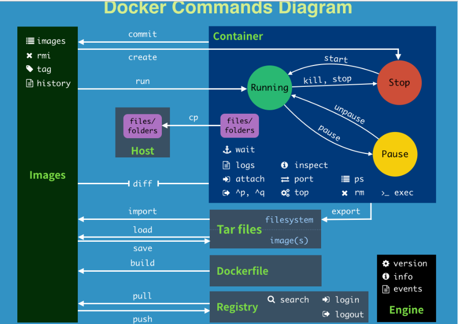

## 帮助命令

docker version

docker info

docker —help


## 镜像命令

### docker images

列出本地主机上的镜像

OPTIONS：

- -a：列出本地所有的镜像
- -q：只显示镜像ID
- --digests：显示镜像的摘要
- --no-trunc：显示完整的镜像信息


### docker search

搜索docker hub中的镜像

OPTIONS：

- --no-trunc：显示完整的镜像
- -f=stars=xxx：列出收藏数不小于指定值的镜像
- --automated：只列出 automated build 类型的镜像


### docker pull

下载镜像

docker pull 镜像名:[tag]


### docker rmi

移除一个或多个镜像


## 容器命令

### 新建并启动容器


OPTIONS：

- --name="容器新名字": 为容器指定一个名称；
- -d: 后台运行容器，并返回容器ID，也即启动守护式容器；
- -i：以交互模式运行容器，通常与 -t 同时使用；
- -t：为容器重新分配一个伪输入终端，通常与 -i 同时使用；
- -P: 随机端口映射；
- -p: 指定端口映射，有以下四种格式
  - ip:hostPort:containerPort
  - ip::containerPort
  - hostPort:containerPort
  - containerPort

#### 启动交互式容器


### 列出正在运行的容器


OPTIONS说明（常用）：

- -a :列出当前所有正在运行的容器+历史上运行过的
- -l :显示最近创建的容器。
- -n：显示最近n个创建的容器。
- -q :静默模式，只显示容器编号。
- --no-trunc :不截断输出。


### 退出容器

**exit**

**Ctrl+P+Q**


### 启动容器

docker start 容器ID或者容器名


### 重启容器

docker restart 容器ID或者容器名


### 停止容器

docker stop 容器ID或者容器名


### 强制停止容器

docker kill 容器ID或者容器名


### 删除已停止的容器

docker rm 容器ID

### 启动守护式容器

```bash
#使用镜像centos:latest以后台模式启动一个容器
docker run -d centos
```

问题：然后 docker ps -a 进行查看, 会发现容器已经退出。

很重要的要说明的一点: Docker容器后台运行,就必须有一个前台进程.
容器运行的命令如果不是那些一直挂起的命令（比如运行top，tail），就是会自动退出的。

这个是docker的机制问题,比如你的web容器,我们以nginx为例，正常情况下,我们配置启动服务只需要启动响应的service即可。例如
service nginx start
但是,这样做,nginx为后台进程模式运行,就导致docker前台没有运行的应用,
这样的容器后台启动后,会立即自杀因为他觉得他没事可做了.
所以，最佳的解决方案是,将你要运行的程序以前台进程的形式运行


### 查看容器日志

docker logs -f -t --tail 容器ID

> -t 是加入时间戳
>
> -f 跟随最新的日志打印
>
> --tail 数字 显示最后多少条


### 查看容器内运行的进程

docker top 容器ID


### 查看容器内部细节

docker inspect 容器ID


### 进入正在运行的容器并以命令行交互

docker exec -it 容器ID bashShell


### 重新进入容器

docker attach 容器ID


> 上面两种命令的区别：
>
> attach：直接进入容器启动命令的终端，不会启动新的进程
>
> exec：是在容器中打开新的终端，并且可以启动新的进程


### 从容器内拷贝文件到主机上

docker cp  容器ID:容器内路径 目的主机路径


