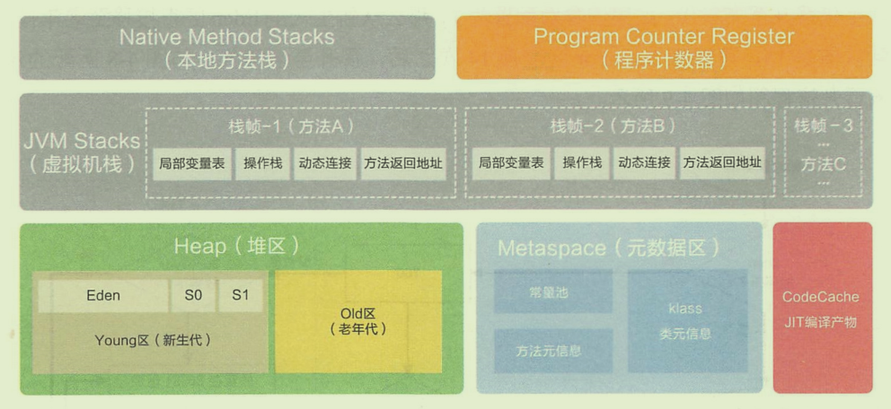
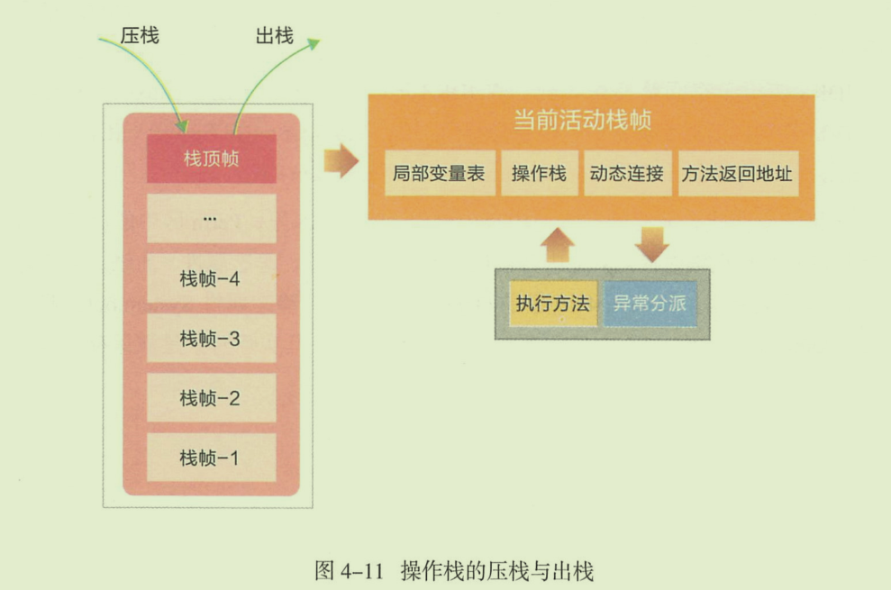
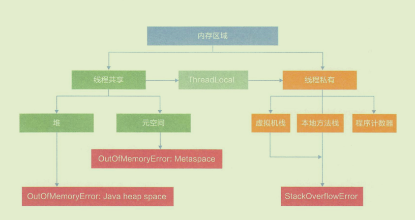

# 概览

JVM的经典内存布局如下：

# Program Counter Regsiter

程序计数器，指的是保存当前线程正在执行的方法（线程私有）。如果这个方法是 Java 方法，那么 程序计数器就保存 Java 虚拟机正在执行的字节码指令地址。如果是 native 方法，那么 程序计数器保存的值是 `undefined`。

任意时刻，一条 Java 虚拟机线程只会执行一个方法的代码，而这个被线程执行的方法称为该线程的当前方法，其地址被存在 PC 寄存器中。

#### 使用PC寄存器存储字节码指令地址有什么用呢？/ 为什么使用PC寄存器识录当前线程的执行地址呢？

因为CPU需要不停的切换各个线程，这时候切换回来以就得知道接着从哪开始继续执行。

JVM的字节码解释器就需要通过改变PC寄存器的值来明确下一条应该执行什么样的字节码指令。

#### PC寄存器为什么会被设定为线程私有？

我们都知道CPU会不停地做仼务切换，众多线程在并发执行过程中，任何一个确定的时刻，一个处理器或者多核处理器中的一个内核，只会执行某个线程中的一条指令。这样必然导致经常中断或复，如何保证分毫无差呢？为了能够准确地记录各个线程正在执行的当前字节码指令地址，最好的办法自然是为每一个线程都分配一个PC寄存器，这样一来各个线程之间便可以进行独立计算，从而不会出现相互干扰的情况。
由于cPU时间片轮限制，

# JVM Stack

Java 虚拟机栈，这个栈与线程同时创建，是线程私有的，用来存储栈帧，即存储局部变量与一些过程结果的地方。

栈帧存储的数据包括：局部变量表、操作数栈，动态连接，方法返回地址。

### 局部变量表（ local variables）

局部变量表也被称之为局部变量数组或本地变量表，定义为一个数字数组，主要用于存储方法参数和定义在方法体内的局部变量这些数据类型包括各类基本数据类型、对象引用（ reference），以及returnAddress类型。

由于局部变量表是建立在线程的栈上，是线程的私有数据，因此不存在数据安全问题。局部变量表所需的容量大小是在编译期确定下来的，并保存在方法的code属性的 maximum local variables数据项中。在方法运行期间是不会改变局部变量表的大小的。

局部变量表中，最基本的存储单元是 Slot（变量槽）

#### 关于Slot的理解

参数值的存放总是在局部变量数组的 index 0开始，到数组长度 -1的索引结束;

局部变量表中存放编译期可知的各种基本数据类型（8种），引用类型reference）， returnAddress类型的变量。

在局部变量表里，32位以内的类型只占用一个s1ot（包括returnAddress类型），64位的类型（long和 double）占用两个slot；byte、 short、char在存储前被转换为int, boolean也被转换为int，0表示false，非0表示true。long和double则占据两个Slot。

JVM会为局部变量表中的每一个 slot 都分配一个访问索引，通过这个素引即可成功访问到局部变量表中指定的局部变量值；

当一个实例方法被调用的时候，它的方法参数和方法体内部定义的局部变量将会按照顺序被复制到局部变量表中的每一个 Slot 上；

如果需要访问局部变量表中一个64bit的局部变量值时，只需要使用前一个索引即可。

如果当前帧是由构造方法或者实例方法创建的，那么该对象引用this将会存放在 index为0的 slot 处，其余的参数按照参数表顺序继续排列

### 操作数栈

主要用于保存计算过程的中间结果，同时作为计算过程中变量临时的存储空间。

操作数栈就是JVM执行引擎的一个工作区，当一个方法刚开始执行的时候，一个新的栈也会随之被创建出来，这个方法的操作数栈是空的。

每一个操作数栈都会拥有一个明确的栈深度用于存储数值，其所需的最大深度在编译期就定义好了，保存在方法的code属性中，为 max_stack的值.

栈中的任何一个元素都可以是任意的Java数据类型。

- 32bit的类型占用一个栈单位深度

- 64bit的类型占用两个栈单位深度

操作数栈并非采用访问索引的方式来进行数据访问的，而是只能通过标准的入栈（push）和出栈（pop）操作来完成一次数据访问。

#### 栈顶缓存技术

前面提过，基于栈式架构的虚拟机所使用的零地址指令更加紧凑，但完成一项操作的时候必然需要使用更多的入栈和出栈指令，这同时也就意味着将需要更多的指令分派（ instruction dispatch）次数和内存读/写次数。

由于操作数是存储在内存中的，因此频繁地执行内存读/写操作必然会影响执行速度。为了解决这个问题， Hotspot JVM的设计者们提出了栈顶缓存（ToS,Top-of- Stack Cashing）技术，将栈顶元素全部缓存在物理CPU的寄存器，以此降低对内存的读/写次数，提升执行引擎的执行效率。

### 动态连接

每一个栈帧内部都包含一个指向运行时常量池中该栈帧所属方法的引用，包含这个引用的目的就是为了支持当前方法的代码能够实现动态链接（ Dynamic Linking）。比如：invokedynamic指令。

在Java源文件被编译到字节码文件中时，所有的变量和方法引用都作为符号引用（ Symbolic Reference）保存在 class文件的常量池里。比如：描述一个方法调用了另外的其他方法时，就是通过常量池中指向方法的符号引用来表示的，那么动态链接的作用就是为了将这些符号引用转换为调用方法的直接引用。

### 方法返回地址（ return address）

存放调用该方法的pc寄存器的值。

一个方法的结束，有两种方式：

- 正常执行完成

- 出现未处理的异常，非正常退出

无论通过哪种方式退出，在方法退出后都返回到该方法被调用的位置。方法正常退出时，调用者的pc计数器的值作为返回地址，即调用该方法的指令的下一条指令的地址。而通过异常退出的，返回地址是要通过异常表来确定，栈帧中一般不会保存这部分信息。

本质上，方法的退出就是当前栈帧出栈的过程。此时，需要恢复上层方法的局部变量表、操作数栈、将返回值压入调用者栈帧的操作数栈、设置PC寄存器值等，让调用者方法继续执行下去。

正常完成出口和异常完成出口的区别在于：通过异常完成出口退出的不会给他的上层调用者产生任何的返回值。

# Native Method Stacks

当Java 虚拟机使用其他语言（例如 C 语言）来实现指令集解释器时，也会使用到本地方法栈。如果 Java 虚拟机不支持 natvie 方法，并且自己也不依赖传统栈的话，可以无需支持本地方法栈。

当某个线程调用一个本地方法时，它就进入了一个全新的并且不再受虚拟机限制的世界。它和虚拟机拥有同样的权限。

本地方法可以通过本地方法接口来访问虚拟机内部的运行时数据区。它甚至可以直接使用本地处理器中的寄存器直接从本地内存的堆中分配任意数量的内存。
并不是所有的 JVM 都支持本地方法。因为Java虚拟机规范并没有确要求木地方法栈的使用语言、具体实现方式、数据结构等。如果JVM产品不打算支持 native方法，也可以无需实现本地方法栈。

在 Hotspot JVM中，直接将本地方法栈和虚拟机栈合二为一。

# 2.Heap

Heap是OOM的主要发源地，存储着几乎所有的==实例对象==，它由GC自动回收，堆区由各子线程共享使用。

堆根据对象存活时间的不同，Java 堆还被分为年轻代、老年代两个区域，年轻代还被进一步划分为 Eden区（80%）、Survivor 0（10%）、Survivor 1 区（10%）。

对象产生之初在新生区，步入“暮年”时，进入老年区，新生代无法容纳的超大对象也进入老年代。绝大部分的对象在 Eden 区生成，当 Eden区装满，会触发 Young Garbage Collection（YGC）。这时，有被引用的对象被清除，依旧存活的对象被移送到 Survivor 区。Survivor分为 S1，S2两块内存空间，每次YGC时，将存活的对象复制到未使用的那块空间，将正在使用的空间完全清除，交换两个空间的使用状态。YGC移交的对象大于Survivor的上限时，直接移交给老年代。如果老年代也无法装下，则触发 Full Garbage Collection，如果依旧无法装下，则抛出OOM。

每个对象都有一个计数器，每次YGC都会加一。`XX:MaxTenuringThresHold`参数能配置计数器到达某个阈值（默认15）时，对象从新生代晋升为老年代。

# 3.MetaSpace（元空间）

JDK1.7及之前为PermGen区，译为永久代。

元空间是方法区的在HotSpot jvm 中的实现，方法区主要用于存储类的信息、常量池、方法数据、方法代码等。方法区逻辑上属于堆的一部分，但是为了与堆进行区分，通常又叫“非堆”。

元空间的本质和永久代类似，都是对JVM规范中方法区的实现。不过元空间与永久代之间最大的区别在于：元空间并不在虚拟机中，而是使用本地内存

根据 [JEP 122: Remove the Permanent Generation](http://openjdk.java.net/jeps/122)，移除永久代是因为这是 JRockit 和 Hotspot 聚合工作的一部分。JRockit 用户不需要配置永久生成(因为JRockit没有永久代)，并且习惯于不配置永久代。

元空间的在本地内存中分配。在JDK8中，Perm的字符串常量移至堆内存，其他信息包括类元信息，字段，静态属性，方法，常量等被移至元空间。

# 方法区

Java 虚拟机规范中定义方法区是堆的一个逻辑部分。方法区存放以下信息：

- 已经被虚拟机加载的类信息
- 常量
- 静态变量
- 即时编译器编译后的代码

### 方法区的特点

- 线程共享。 方法区是堆的一个逻辑部分，因此和堆一样，都是线程共享的。整个虚拟机中只有一个方法区。
- 永久代。 方法区中的信息一般需要长期存在，而且它又是堆的逻辑分区，因此用堆的划分方法，把方法区称为“永久代”。
- 内存回收效率低。 方法区中的信息一般需要长期存在，回收一遍之后可能只有少量信息无效。主要回收目标是：对常量池的回收；对类型的卸载。
- Java 虚拟机规范对方法区的要求比较宽松。 和堆一样，允许固定大小，也允许动态扩展，还允许不实现垃圾回收。

### 运行时常量池

方法区中存放：类信息、常量、静态变量、即时编译器编译后的代码。常量就存放在运行时常量池中。

当类被 Java 虚拟机加载后， .class 文件中的常量就存放在方法区的运行时常量池中。而且在运行期间，可以向常量池中添加新的常量。如 String 类的 intern() 方法就能在运行期间向常量池中添加字符串常量。

## 8.总结

# :link:参考

> https://github.com/h2pl/Java-Tutorial/blob/master/docs/java/jvm/
> 
> https://www.bilibili.com/video/av83622425
> 
> 《码出高效：Java开发手册》
