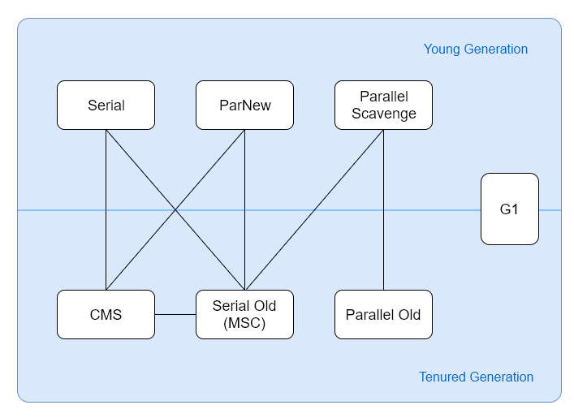

# 判定对象是否存活

## 引用计数法

在对象头维护着一个 counter 计数器，对象被引用一次则计数器 +1；若引用失效则计数器 -1。当计数器为 0 时，就认为该对象无效了。

引用计数算法的实现简单，判定效率也很高，在大部分情况下它都是一个不错的算法。但是主流的 Java 虚拟机里没有选用引用计数算法来管理内存，主要是因为它很难解决对象之间循环引用的问题。

## 可达性分析

Java 虚拟机判断垃圾对象使用的是：GC Root Tracing 算法。其大概的过程是这样：从 GC Root 出发，所有可达的对象都是存活的对象，而所有不可达的对象都是垃圾。

可以看到这里最重要的就是 GC Root Set 这个集合了，其实 GC Root 就是一组活跃引用的集合。但是这个集合又与一般的对象集合不太一样，这些集合是经过特意筛选出来的，通常包括：

- 所有当前被加载的 Java 类，Java 类的引用类型静态变量
- Java类的运行时常量池里的引用类型常量
- VM的一些静态数据结构里指向GC堆里的对象的引用
- 等等

简单地说，GC Root 就是经过精心挑选的一组活跃引用，这些引用是肯定存活的。那么通过这些引用延伸到的对象，自然也是存活的。

## Server/Client

1. 使用范围：只需要掌握Server模式即可，Client模式基本不会用。
2. 操作系统：

​    2.1 32位操作系统，不论硬件如何都默认使用Client的JVM模式。

​    2.2 32位操作系统，2G内存同时有2个CPU以上用Server模式，低于该配置还是Client模式。

​    2.3 64为only server模式

# 垃圾回收算法

垃圾回收算法简单地说有三种算法：标记清除算法、复制算法、标记压缩算法。

## 标记-清除算法

从名字可以看到其分为两个阶段：标记阶段和清除阶段。

一种可行的实现方式是，在**标记阶段**，标记所有由 GC Root 出发的可达对象。此时，所有未被标记的对象就是垃圾对象。之后在**清除阶段**，清除所有未被标记的对象。

标记清除算法最大的问题就是**空间碎片问题**。如果空间碎片过多，则会导致内存空间的不连续。虽说大对象也可以分配在不连续的空间中，但是**效率要低**于连续的内存空间。

## 标记-压缩算法

标记压缩算法可以说是标记清除算法的优化版，其同样需要经历两个阶段，分别是：标记结算、压缩阶段。

在**标记阶段**，从 GC Root 引用集合出发去标记所有对象。在**压缩阶段**，其则是将所有存活的对象压缩在内存的一边，之后清理边界外的所有空间。

## 复制算法

复制算法的核心思想是将原有的内存空间分为两块，每次只使用一块。

在垃圾回收时，将正在使用的内存中的存活对象复制到未使用的内存块中。之后清除正在使用的内存块中的所有对象，之后交换两个内存块的角色，完成垃圾回收。

该算法的缺点是要将内存空间折半，极大地浪费了内存空间。

## 小结

对比一下这三种算法，可以发现他们都有各自的优点和缺点。

标记清除算法虽然会产生内存碎片，但是不需要移动太多对象，比较适合在存活对象比较多的情况。而复制算法虽然需要将内存空间折半，并且需要移动存活对象，但是其清理后不会有空间碎片，比较适合存活对象比较少的情况。而标记压缩算法，则是标记清除算法的优化版，减少了空间碎片。

- 新生代：复制算法
- 老年代：标记-清除算法、标记-整理算法

# 垃圾回收器总览

以上列出了作用于年轻代与年老代的垃圾回收器，两个回收器之间的连线表示他们可以搭配使用。

# 新生代垃圾回收器

## Serial回收器

主要**应用于YGC**，采用串行单线程方式完成GC，在GC时会触发 **Stop The World**，暂停整个应用程序的执行。

一般客户端应用所需内存较小，不会创建太多对象，而且堆内存不大，因此垃圾收集器回收时间短，即使在这段时间停止一切用户线程，也不会感觉明显卡顿。因此 Serial 垃圾收集器**适合客户端**使用。

由于 Serial 收集器只使用一条 GC 线程，避免了线程切换的开销，从而简单高效。 

## ParNew 回收器

ParNew 是 Serial 的多线程版本。由多条 GC 线程并行地进行垃圾清理。但清理过程依然需要 Stop The World。

ParNew 追求“**低停顿时间**”,与 Serial 唯一区别就是使用了多线程进行垃圾收集，在多 CPU 环境下性能比 Serial 会有一定程度的提升；但**线程切换需要额外的开销**，因此在单 CPU 环境中表现不如 Serial。适用于科学计算/大数据处理平台处理等弱交互场景。

## Parallel Scavenge 回收器

Parallel Scavenge 和 ParNew 一样，都是多线程、新生代垃圾收集器。但是两者有巨大的不同点：

- Parallel Scavenge：追求 CPU 吞吐量，能够在较短时间内完成指定任务，因此适合没有交互的后台计算。
- ParNew：追求降低用户停顿时间，适合交互式应用。

吞吐量 = 运行用户代码时间 / (运行用户代码时间 + 垃圾收集时间)

追求高吞吐量，可以通过减少 GC 执行实际工作的时间，然而，仅仅偶尔运行 GC 意味着每当 GC 运行时将有许多工作要做，因为在此期间积累在堆中的对象数量很高。单个 GC 需要花更多的时间来完成，从而导致更高的暂停时间。而考虑到低暂停时间，最好频繁运行 GC 以便更快速完成，反过来又导致吞吐量下降。

- 通过参数 -XX:GCTimeRadio 设置垃圾回收时间占总 CPU 时间的百分比。
- 通过参数 -XX:MaxGCPauseMillis 设置垃圾处理过程最久停顿时间。
- 通过命令 -XX:+UseAdaptiveSizePolicy 开启自适应策略。我们只要设置好堆的大小和 MaxGCPauseMillis 或 GCTimeRadio，收集器会自动调整新生代的大小、Eden 和 Survivor 的比例、对象进入老年代的年龄，以最大程度上接近我们设置的 MaxGCPauseMillis 或 GCTimeRadio。

# 老年代垃圾收集器

## Serial Old 垃圾收集器（单线程）

Serial Old 收集器是 Serial 的老年代版本，都是单线程收集器，只启用一条 GC 线程，都适合客户端应用。它们唯一的区别就是：Serial Old 工作在老年代，使用“标记-整理”算法；Serial 工作在新生代，使用“复制”算法。

## Parallel Old 垃圾收集器（多线程）

Parallel Old 收集器是 Parallel Scavenge 的老年代版本，使用多线程和标记-整理算法，配合 Parallel Scavenge 使用，追求 CPU 吞吐量。

## CMS收集器

CMS 回收器全称为 Concurrent Mark Sweep Collector，意为并发标记清除收集器，是一个使用多线程并行回收，以获取最短回收停顿时间为目标的垃圾回收器。

**工作步骤**

CMS 的主要工作步骤有：初始标记、并发标记、重新标记和并发清除。其中初始标记和重新标记是独占系统资源的（即仍然需要 stop the world），而其他阶段则可以和用户线程一起执行。

在整个 CMS 回收过程中，默认情况下会有预清理的操作，我们可以关闭开关 `-XX:-CMSPrecleaningEnabled` 不进行预清理。因为重新标记是独占 CPU 的，因此如果新生代 GC 发生之后，立刻出发一次新生代 GC，那么停顿时间就会很长。为了避免这种情况，预处理时会刻意等待一次新生代 GC 的发生，之后在进行预处理。

#### 优缺点

- 并发收集，低停顿

- 对CPU 资源非常敏感

- 无法处理浮动垃圾

- 产生大量内存碎片

**主要参数**

启动 CMS 回收器刻意使用参数：`-XX:+UseConcMarkSweepGC`，线程并发数量刻意通过 `-XX:ConcGCThreads` 或 `-XX:ParallelCMSThreads` 参数设定。

此外，我们还可以设置 `-XX:CMSInitiatingOccupancyFraction` 来指定老年代空间使用阈值。当老年代空间使用率达到这个阈值时，会执行一次 CMS 回收，而不像其他回收器一样等到内存不够用的时候才进行 GC。

之前说过标记清除算法的缺点是**会产生内存碎片**，因此 CMS 回收器会产生较多内存碎片。我们可以使用 `XX:+UseCMSCompactAtFullCollection` 参数让 CMS 在完成FullGC后，进行一次内存碎片整理。使用 `-XX:CMSFullGCsBeforeCompaction=n`参数设置进行多少次 FullGC回收后，进行一次内存压缩。

## G1 回收器

### 主要特点

- 并发与并行
- 分代收集
- 空间整理
- 可预测的停顿 

**工作步骤**

G1 收集器的收集过程主要有四个阶段：

- 新生代 GC
- 并发标记周期
- 混合收集
- 如果需要，可能进行 FullGC

新生代 GC 与其他垃圾收集器的类似，就是清空 Eden 区，将存活对象移动到 Survivor 区，部分年龄到了就移动到老年代。

并发标记周期则分为：初始标记、根区域扫描、并发标记、重新标记、独占清理、并发清理阶段。其中初始标记、重新标记、独占清理是独占式的，会引起停顿。并且初始标记会引发一次新生代 GC。在这个阶段，所有将要被回收的区域会被 G1 记录在一个称之为 Collection Set 的集合中。

混合回收阶段会首先针对 Collection Set 中的内存进行回收，因为这些垃圾比例较高。G1 回收器的名字 Garbage First 就是这个意思，垃圾优先处理的意思。在混合回收的时候，也会执行多次新生代 GC 和 混合 GC，从而来进行内存的回收。

必要时进行 Full GC。当在回收阶段遇到内存不足时，G1 会停止垃圾回收并进行一次 Full GC，从而腾出更多空间进行垃圾回收。

**相关参数**

打开 G1 收集器，我们可以使用参数：`-XX:+UseG1GC`。

设置目标最大停顿时间，可以使用参数：`-XX:MaxGCPauseMillis`。

设置 GC 工作线程数量，可以使用参数：`-XX:ParallelGCThreads`。

设置堆使用率触发并发标记周期的执行，可以使用参数：`-XX:InitiatingHeapOccupancyPercent`。

#### 如何选择GC

1. 单CPU或小内存，单机程序

​    **-XX:+UseSerialGC**

 2.多CPU，需要最大吞吐量，如后台计算型应用

​    **-XX:+UseParallelGC 或**

​    **-XX:+UseParallelOldGC**

 3.多CPU，追求低停顿时间，需要快速响应如互联网应用

​    **-XX:+UseConcMarkSweepGC**

​    **-XX:+ParNewGC**

## GC分类

### Minor GC

从年轻代空间回收内存被称为 Minor GC，有时候也称之为 Young GC。对于 Minor GC，你需要知道的一些点：

- 当 JVM 无法为一个新的对象分配空间时会触发 Minor GC，比如当 Eden 区满了。所以 Eden 区越小，越频繁执行 Minor GC。
- 当年轻代中的 Eden 区分配满的时候，年轻代中的部分对象会晋升到老年代，所以 Minor GC 后老年代的占用量通常会有所升高。
- 质疑常规的认知，所有的 Minor GC 都会触发 Stop-The-World，停止应用程序的线程。对于大部分应用程序，停顿导致的延迟都是可以忽略不计的，因为大部分 Eden 区中的对象都能被认为是垃圾，永远也不会被复制到 Survivor 区或者老年代空间。如果情况相反，即 Eden 区大部分新生对象不符合 GC 条件（即他们不被垃圾回收器收集），那么 Minor GC 执行时暂停的时间将会长很多（因为他们要JVM要将他们复制到 Survivor 区或老年代）。

### Major GC

从老年代空间回收内存被称为 Major GC，有时候也称之为 Old GC。

许多 Major GC 是由 Minor GC 触发的，所以很多情况下将这两种 GC 分离是不太可能的。

Minor GC 作用于年轻代，Major GC 作用于老年代。 分配对象内存时发现内存不够，触发 Minor GC。Minor GC 会将对象移到老年代中，如果此时老年代空间不够，那么触发 Major GC。因此才会说，许多 Major GC 是由 Minor GC 引起的。

### Full GC

Full GC 是清理整个堆空间 —— 包括年轻代、老年代和永久代（如果有的话）。因此 Full GC 可以说是 Minor GC 和 Major GC 的结合。

当准备要触发一次 Minor GC 时，如果发现年轻代的剩余空间比以往晋升的空间小，则不会触发 Minor GC 而是转为触发 Full GC。因为JVM此时认为：之前这么大空间的时候已经发生对象晋升了，那现在剩余空间更小了，那么很大概率上也会发生对象晋升。既然如此，那么我就直接帮你把事情给做了吧，直接来一次 Full GC，整理一下老年代和年轻代的空间。

另外，即在永久代分配空间但已经没有足够空间时，也会触发 Full GC。

##### Stop-The-World

Stop-The-World，中文一般翻译为全世界暂停，是指在进行垃圾回收时因为标记或清理的需要，必须让所有执行任务的线程停止执行任务，从而让垃圾回收线程回收垃圾的时间间隔。

在 Stop-The-World 这段时间里，所有非垃圾回收线程都无法工作，都暂停下来。只有等到垃圾回收线程工作完成才可以继续工作。可以看出，Stop-The-World 时间的长短将关系到应用程序的响应时间，因此在 GC 过程中，Stop-The-World 的时间是一个非常重要的指标。

[:arrow_left:](./3-JVM类加载机制.md)  
