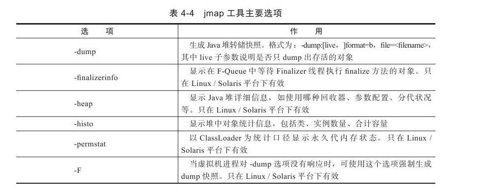
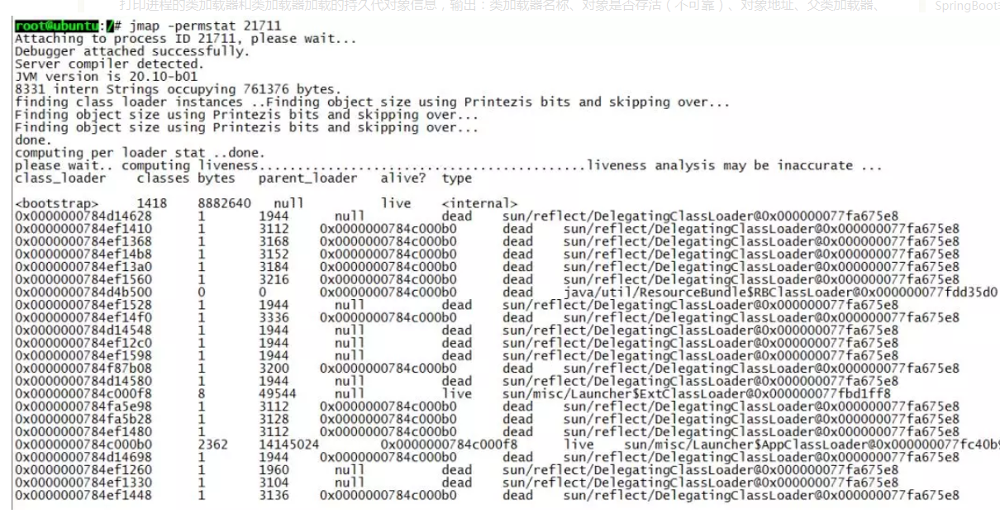
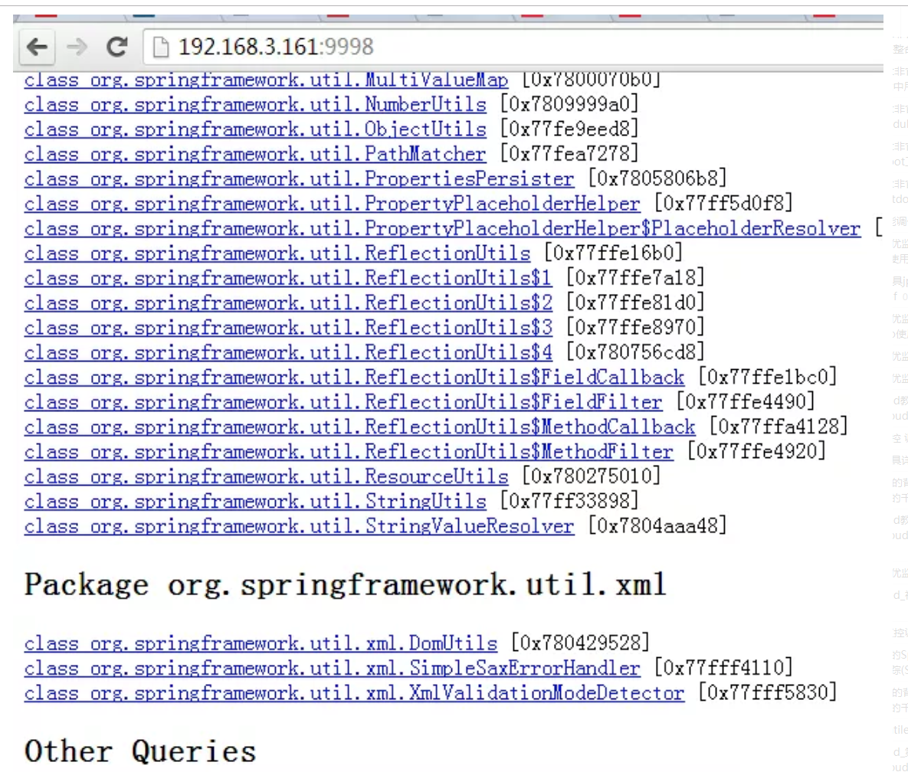

## 查看JVM默认值

```
-XX:+PrintFlagsInitial
-XX:+PrintFlagsFinal
-XX:+PrintCommandLneFalgs
```


#### JVM常用参数

- -Xms 初始内存大小，默认未物理内存的 1/64； 等价于 -XX:InitialHeapSize
- -Xmx 最大分配内存，默认为物理内存的1/4: 等价于 `-XX:MaxHeapSize`
- -Xss 单个线程栈大小，默认为 512~1024K， 等价于 `-XX:ThresholdStackSize`
- -Xmn 新生代大小
- -XX:MetaspaceSize 设置元空间的大小。元空间与永久代的最大区别在于，永久代在虚拟机中，而元空间在本地内存中。
- -XX:+PrintGCDetails 打印GC日志信息
- -XX:SurvivorRatio Eden与S1S2的比例
- -XX:NerRatio 新生代与老年代的比例
- -xx:MaxTenuringThreshold  设置进入老年代的时间，默认是15次(最大值)。


#### OOM

##### 1.java.lang.StackOverFlowError

```java
public class StackOverflowErrorDemo {
    public static void main(String[] args){
        stackOverflowError();
    }

    private static void stackOverflowError() {
        stackOverflowError();
    }
}
```


##### 2.java.lang.OutOfMemoryError: Java heap space

```java
public class JavaHeapSpaceDemo {
    public static void main(String[] args){
        String str = "hhh";

        while(true){
            str += str + new Random().nextInt(11111111)+new Random().nextInt(22222222);
            str.intern();
        }

    }
}
```


##### 3. java.lang.OutOfMemoryError: GC overhead limit exceeded

GC回收时间过长会抛出该异常；默认情况下, 如果GC花费的时间超过 **98%**, 并且GC回收的内存少于 **2%**


##### 4. java.lang.OutOfMenoryError: Direct buffer meory

导致原因：

写NIO程序经常使用ByteBuffer来读取或者写入数据，这是一种基于通道（Channel）与缓冲区（Buffer）的I/O方式，它可以使用Native函数库直接分配堆外内存，然后通过一个存储在Java堆里面的DirectByteBuffer对象作为这块内存的引用进行操作。这样能在一些场景中显著提高性能，因为避免了在java堆和Native堆中来回复制数据。


##### java.lang.OutOfMemoryError: Metaspace


##### java.lang.OutOfMemoryError: Unable to create new native thred

准确的讲该异常与对应的平台有关。

导致原因：

1. 应用创建了太对线程，一个应用进程创建多个线程，超过系统承载极限。
2. 服务器并不允许应用程序创建那么多线程，linux系统默认允许单个进程可以创建的线程数是1024个，如果应用创建超过这个数量，就会报java.lang.OutOfMemoryError:unable to create new native thread

解决办法：

1. 想办法降低应用程序创建线程的数量，分析应用是否真的需要创建那么多线程，如果不是，改代码将线程数降到最低。
2. 对于有的应用，确实需要创建多个线程，远超过linux系统默认的1024个线程的限制（ulimit -u 查看最大线程数量），可以通过修改linux服务器配置（vim /etc/security/limits.d/90-nproc.conf），扩大linux默认限制。


## jps(Java Virtual Machine Process Status Tool)

jps主要用来输出JVM中运行的进程状态信息。语法格式如下：

```
jps [options] [hostid]
```

如果不指定hostid就默认为当前主机或服务器。

命令行参数选项说明如下：

| 参数选项 | 说明|
|--|--|
|-q |不输出类名、Jar名和传入main方法的参数|
|-m |输出传入main方法的参数|
|-l |输出main类或Jar的全限名|
|-v |输出传入JVM的参数|

比如下面：

```
root@ubuntu:/# jps -m -l
2458 org.artifactory.standalone.main.Main /usr/local/artifactory-2.2.5/etc/jetty.xml
29920 com.sun.tools.hat.Main -port 9998 /tmp/dump.dat
3149 org.apache.catalina.startup.Bootstrap start
30972 sun.tools.jps.Jps -m -l
8247 org.apache.catalina.startup.Bootstrap start
25687 com.sun.tools.hat.Main -port 9999 dump.dat
21711 mrf-center.jar
```


## jstack

jstack主要用来查看某个Java进程内的线程堆栈信息。语法格式如下：

```bash
jstack [option] pid
jstack [option] executable core
jstack [option] [server-id@]remote-hostname-or-ip
```


命令行参数选项说明如下：

| 参数 | 说明 |
| ---- | ---- |
|-l |long listings，会打印出额外的锁信息，在发生死锁时可以用jstack -l pid来观察锁持有情况|
|-m |mixed mode，不仅会输出Java堆栈信息，还会输出C/C++堆栈信息（比如Native方法）|

jstack可以定位到线程堆栈，根据堆栈信息我们可以定位到具体代码，所以它在JVM性能调优中使用得非常多。


## jmap（Memory Map）和jhat（Java Heap Analysis Tool）

jmap用来查看堆内存使用状况，一般结合jhat使用。

jmap语法格式如下：

```
jmap [option] pid
jmap [option] executable core
jmap [option] [server-id@]remote-hostname-or-ip
```

如果运行在64位JVM上，可能需要指定-J-d64命令选项参数。

```
jmap -permstat pid
```



打印进程的类加载器和类加载器加载的持久代对象信息，输出：类加载器名称、对象是否存活（不可靠）、对象地址、父类加载器、已加载的类大小等信息，如下图：



使用jmap -heap pid查看进程堆内存使用情况，包括使用的GC算法、堆配置参数和各代中堆内存使用情况。比如下面的例子：

```
root@ubuntu:/# jmap -heap 21711
Attaching to process ID 21711, please wait...
Debugger attached successfully.
Server compiler detected.
JVM version is 20.10-b01

using thread-local object allocation.
Parallel GC with 4 thread(s)

Heap Configuration:
MinHeapFreeRatio = 40   
MaxHeapFreeRatio = 70   
MaxHeapSize      = 2067791872 (1972.0MB)
NewSize          = 1310720 (1.25MB)
MaxNewSize       = 17592186044415 MB
OldSize          = 5439488 (5.1875MB)
NewRatio         = 2   
SurvivorRatio    = 8   
PermSize         = 21757952 (20.75MB)
MaxPermSize      = 85983232 (82.0MB)

Heap Usage:
PS Young Generation
Eden Space:
   capacity = 6422528 (6.125MB)
   used     = 5445552 (5.1932830810546875MB)
   free     = 976976 (0.9317169189453125MB)
   84.78829520089286% used
From Space:
   capacity = 131072 (0.125MB)
   used     = 98304 (0.09375MB)
   free     = 32768 (0.03125MB)
   75.0% used
To Space:
   capacity = 131072 (0.125MB)
   used     = 0 (0.0MB)
   free     = 131072 (0.125MB)
   0.0% used
PS Old Generation
   capacity = 35258368 (33.625MB)
   used     = 4119544 (3.9287033081054688MB)
   free     = 31138824 (29.69629669189453MB)
   11.683876009235595% used
PS Perm Generation
   capacity = 52428800 (50.0MB)
   used     = 26075168 (24.867218017578125MB)
   free     = 26353632 (25.132781982421875MB)
   49.73443603515625% used
   ....

```

使用jmap -histo[:live] pid查看堆内存中的对象数目、大小统计直方图，如果带上live则只统计活对象，如下：

```
root@ubuntu:/# jmap -histo:live 21711 | more 
num     #instances         #bytes  class name----------------------------------------------
   1:         38445        5597736  <constMethodKlass>
   2:         38445        5237288  <methodKlass>
   3:          3500        3749504  <constantPoolKlass>
   4:         60858        3242600  <symbolKlass>
   5:          3500        2715264  <instanceKlassKlass>
   6:          2796        2131424  <constantPoolCacheKlass>
   7:          5543        1317400  [I
   8:         13714        1010768  [C
   9:          4752        1003344  [B
  10:          1225         639656  <methodDataKlass>
  11:         14194         454208  java.lang.String
  12:          3809         396136  java.lang.Class
  13:          4979         311952  [S
  14:          5598         287064  [[I
  15:          3028         266464  java.lang.reflect.Method
  16:           280         163520  <objArrayKlassKlass>
  17:          4355         139360  java.util.HashMap$Entry
  18:          1869         138568  [Ljava.util.HashMap$Entry;
  19:          2443          97720  java.util.LinkedHashMap$Entry
  20:          2072          82880  java.lang.ref.SoftReference
  21:          1807          71528  [Ljava.lang.Object;
  22:          2206          70592  java.lang.ref.WeakReference
  23:           934          52304  java.util.LinkedHashMap
  24:           871          48776  java.beans.MethodDescriptor
  25:          1442          46144  java.util.concurrent.ConcurrentHashMap$HashEntry
  26:           804          38592  java.util.HashMap
  27:           948          37920  java.util.concurrent.ConcurrentHashMap$Segment
  28:          1621          35696  [Ljava.lang.Class;
  29:          1313          34880  [Ljava.lang.String;
  30:          1396          33504  java.util.LinkedList$Entry
  31:           462          33264  java.lang.reflect.Field
  32:          1024          32768  java.util.Hashtable$Entry
  33:           948          31440  [Ljava.util.concurrent.ConcurrentHashMap$HashEntry;

```

class name是对象类型，说明如下：

```
B  byte
C  char
D  double
F  float
I  int
J  long
Z  boolean
[  数组，如[I表示int[]
[L+类名 其他对象
```

还有一个很常用的情况是：用jmap把进程内存使用情况dump到文件中，再用jhat分析查看。jmap进行dump命令格式如下：

```
jmap -dump:format=b,file=dumpFileName pid
```

我一样地对上面进程ID为21711进行Dump：

```
root@ubuntu:/# jmap -dump:format=b,file=/tmp/dump.dat 21711     
Dumping heap to /tmp/dump.dat ...
Heap dump file created
   dump出来的文件可以用MAT、VisualVM等工具查看，这里用jhat查看：

root@ubuntu:/# jhat -port 9998 /tmp/dump.dat
Reading from /tmp/dump.dat...
Dump file created Tue Jan 28 17:46:14 CST 2014Snapshot read, resolving...
Resolving 132207 objects...
Chasing references, expect 26 dots..........................
Eliminating duplicate references..........................
Snapshot resolved.
Started HTTP server on port 9998Server is ready.
```

注意如果Dump文件太大，可能需要加上-J-Xmx512m这种参数指定最大堆内存，即jhat -J-Xmx512m -port 9998 /tmp/dump.dat。然后就可以在浏览器中输入主机地址:9998查看了：




## jstat（JVM统计监测工具）

语法格式如下：

```
jstat [ generalOption | outputOptions vmid [interval[s|ms] [count]] ]
```

vmid是Java虚拟机ID，在Linux/Unix系统上一般就是进程ID。interval是采样时间间隔。count是采样数目。比如下面输出的是GC信息，采样时间间隔为250ms，采样数为4：

```
root@ubuntu:/# jstat -gc 21711 250 4 
S0C    S1C    S0U    S1U      EC       EU        OC         OU       PC     PU    YGC     YGCT    FGC    FGCT     GCT   
192.0  192.0   64.0   0.0    6144.0   1854.9   32000.0     4111.6   55296.0 25472.7    702    0.431   3      0.218    0.649
192.0  192.0   64.0   0.0    6144.0   1972.2   32000.0     4111.6   55296.0 25472.7    702    0.431   3      0.218    0.649
192.0  192.0   64.0   0.0    6144.0   1972.2   32000.0     4111.6   55296.0 25472.7    702    0.431   3      0.218    0.649
192.0  192.0   64.0   0.0    6144.0   2109.7   32000.0     4111.6   55296.0 25472.7    702    0.431   3      0.218    0.649
```

堆内存 = 年轻代 + 年老代 + 永久代 年轻代 = Eden区 + 两个Survivor区（From和To） 现在来解释各列含义：

```
S0C、S1C、S0U、S1U：Survivor 0/1区容量（Capacity）和使用量（Used）
EC、EU：Eden区容量和使用量
OC、OU：年老代容量和使用量
PC、PU：永久代容量和使用量
YGC、YGT：年轻代GC次数和GC耗时
FGC、FGCT：Full GC次数和Full GC耗时
GCT：GC总耗时
```


## hprof（Heap/CPU Profiling Tool）

hprof能够展现CPU使用率，统计堆内存使用情况。

语法格式如下：

```
java -agentlib:hprof[=options] ToBeProfiledClass
java -Xrunprof[:options] ToBeProfiledClass
javac -J-agentlib:hprof[=options] ToBeProfiledClass
```

完整的命令选项如下：

```
Option Name and Value  Description                    Default
---------------------  -----------                    -------
heap=dump|sites|all    heap profiling                 all
cpu=samples|times|old  CPU usage                      off
monitor=y|n            monitor contention             n
format=a|b             text(txt) or binary output     a
file=<file>            write data to file             java.hprof[.txt]
net=<host>:<port>      send data over a socket        off
depth=<size>           stack trace depth              4
interval=<ms>          sample interval in ms          10
cutoff=<value>         output cutoff point            0.0001
lineno=y|n             line number in traces?         y
thread=y|n             thread in traces?              n
doe=y|n                dump on exit?                  y
msa=y|n                Solaris micro state accounting n
force=y|n              force output to <file>         y
verbose=y|n            print messages about dumps     y
```

来几个官方指南上的实例。

CPU Usage Sampling Profiling(cpu=samples)的例子：

```
java -agentlib:hprof=cpu=samples,interval=20,depth=3 Hello
```

上面每隔20毫秒采样CPU消耗信息，堆栈深度为3，生成的profile文件名称是java.hprof.txt，在当前目录。

CPU Usage Times Profiling(cpu=times)的例子，它相对于CPU Usage Sampling Profile能够获得更加细粒度的CPU消耗信息，能够细到每个方法调用的开始和结束，它的实现使用了字节码注入技术（BCI）：

```
javac -J-agentlib:hprof=cpu=times Hello.java
```

Heap Allocation Profiling(heap=sites)的例子：

```
javac -J-agentlib:hprof=heap=sites Hello.java
```

Heap Dump(heap=dump)的例子，它比上面的Heap Allocation Profiling能生成更详细的Heap Dump信息：

```
javac -J-agentlib:hprof=heap=dump Hello.java
```

虽然在JVM启动参数中加入-Xrunprof:heap=sites参数可以生成CPU/Heap Profile文件，但对JVM性能影响非常大，不建议在线上服务器环境使用。

```

```