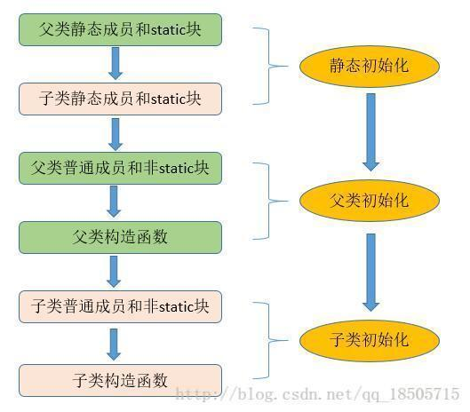

> 参考：
> 
> 《深入理解Java虚拟机》， 周志明
> 
> https://blog.csdn.net/justloveyou_/article/details/72466105

例如 : Person jack = new Person();

这句话到底做了什么事情呢 ？ 其实就是讲对象的初始化过程。

- 1、 new 用到了Person.class,所以会先找到Person.class文件，并加载到内存中(用到类中的内容类就会被加载)
- 2、执行该对象的static代码块(静态初始块)。(如果有的话，给Person.class类进行初始化)
- 3、在堆内存中开辟空间，分配内存地址
- 4、在堆内存中建立对象特有属性，并进行默认初始化
- 5、对属性进行显示初始化(声明成员属性并赋值)
- 6、执行普通初始块
- 7、执行构造函数
- 8、将内存地址赋值给栈内存中的jack变量

如下图：



# 一、类加载机制概述

　　我们知道，一个.java文件在编译后会形成相应的一个或多个Class文件（若一个类中含有内部类，则编译后会产生多个Class文件, Class文件是一组以8字节为基础单位的二进制流），但这些Class文件中描述的各种信息，最终都需要加载到虚拟机中之后才能被运行和使用。事实上，**虚拟机把描述类的数据从Class文件加载到内存，并对数据进行校验，转换解析和初始化，最终形成可以被虚拟机直接使用的Java类型的过程就是虚拟机的 类加载机制。**　　

　　与那些在编译时需要进行连接工作的语言不同，在Java语言里面，类型的加载和连接都是在程序运行期间完成，这样会在类加载时稍微增加一些性能开销，但是却能为Java应用程序提供高度的灵活性，Java中天生可以动态扩展的语言特性多态就是依赖运行期动态加载和动态链接这个特点实现的。例如，如果编写一个使用接口的应用程序，可以等到运行时再指定其实际的实现。这种组装应用程序的方式广泛应用于Java程序之中。

　　既然这样，那么，虚拟机什么时候才会加载Class文件并初始化类呢？（类加载和初始化时机）虚拟机如何加载一个Class文件呢？（Java类加载的方式：类加载器、双亲委派机制）虚拟机加载一个Class文件要经历那些具体的步骤呢？（类加载过程/步骤）

　　第一、三个问题就是本文要阐述的重点。特别地，Java类加载器和双亲委派机制等内容

# 二. 类加载的时机

　　Java类从被加载到虚拟机内存中开始，到卸载出内存为止，它的整个生命周期包括：加载（Loading）、验证（Verification）、准备(Preparation)、解析(Resolution)、初始化(Initialization)、使用(Using) 和 卸载(Unloading)七个阶段。其中准备、验证、解析3个部分统称为连接（Linking），如图所示：　　　

　　加载、验证、准备、初始化和卸载这5个阶段的顺序是确定的，类的加载过程必须按照这种顺序按部就班地开始，而解析阶段则不一定：它在某些情况下可以在初始化阶段之后再开始，这是为了支持Java语言的运行时绑定（也称为动态绑定或晚期绑定）。以下陈述的内容都已HotSpot为基准。特别需要注意的是，类的加载过程必须按照这种顺序按部就班地“开始”，而不是按部就班的“进行”或“完成”，因为这些阶段通常都是相互交叉地混合式进行的，也就是说通常会在一个阶段执行的过程中调用或激活另外一个阶段。

　　了解了Java类的生命周期以后，那么我们现在来回答第一个问题：虚拟机什么时候才会加载Class文件并初始化类呢？

## 1、类加载时机

　　什么情况下虚拟机需要开始加载一个类呢？虚拟机规范中并没有对此进行强制约束，这点可以交给虚拟机的具体实现来自由把握。

## 2、类初始化时机

　　那么，什么情况下虚拟机需要开始初始化一个类呢？这在虚拟机规范中是有严格规定的，虚拟机规范指明 有且只有 五种情况必须立即对类进行初始化（而这一过程自然发生在加载、验证、准备之后）：

1. 遇到 ==new、getstatic、putstatic或invokestatic==这四条字节码指令（注意，newarray指令触发的只是数组类型本身的初始化，而不会导致其相关类型的初始化，比如，new String[]只会直接触发String[]类的初始化，也就是触发对类[Ljava.lang.String的初始化，而直接不会触发String类的初始化）时，如果类没有进行过初始化，则需要先对其进行初始化。生成这四条指令的最常见的Java代码场景是：
- 使用new关键字实例化对象的时候；

- 读取或设置一个类的静态字段（被final修饰，已在编译器把结果放入常量池的静态字段除外）的时候；

- 调用一个类的静态方法的时候。

　　2.  使用java.lang.reflect包的方法对类进行反射调用的时候，如果类没有进行过初始化，则需要先触发其初始化。
        　　3.  当初始化一个类的时候，如果发现其父类还没有进行过初始化，则需要先触发其父类的初始化。
      　　4.  当虚拟机启动时，用户需要指定一个要执行的主类（包含main()方法的那个类），虚拟机会先初始化这个主类。
              　　5.  当使用jdk1.7动态语言支持时，如果一个java.lang.invoke.MethodHandle实例最后的解析结果REF_getstatic,REF_putstatic,REF_invokeStatic的方法句柄，并且这个方法句柄所对应的类没有进行初始化，则需要先出触发其初始化。

　　注意，对于这五种会触发类进行初始化的场景，虚拟机规范中使用了一个很强烈的限定语：“有且只有”，这五种场景中的行为称为对一个类进行 主动引用。除此之外，所有引用类的方式，都不会触发初始化，称为 被动引用。

　　特别需要指出的是，类的实例化与类的初始化是两个完全不同的概念：

类的实例化是指创建一个类的实例(对象)的过程；
类的初始化是指为类中各个类成员(被static修饰的成员变量)赋初始值的过程，是类生命周期中的一个阶段。

## 3、被动引用的几种经典场景

　　1)、通过子类引用父类的静态字段，不会导致子类初始化

```java
public class SSClass{
    static{
        System.out.println("SSClass");
    }
}  

public class SClass extends SSClass{
    static{
        System.out.println("SClass init!");
    }

    public static int value = 123;

    public SClass(){
        System.out.println("init SClass");
    }
}

public class SubClass extends SClass{
    static{
        System.out.println("SubClass init");
    }

    static int a;

    public SubClass(){
        System.out.println("init SubClass");
    }
}

public class NotInitialization{
    public static void main(String[] args){
        System.out.println(SubClass.value);
    }
}/* Output: 
        SSClass
        SClass init!
        123     
 *///:~
```

　　对于静态字段，只有直接定义这个字段的类才会被初始化，因此通过其子类来引用父类中定义的静态字段，只会触发父类的初始化而不会触发子类的初始化。在本例中，由于value字段是在类SClass中定义的，因此该类会被初始化；此外，在初始化类SClass时，虚拟机会发现其父类SSClass还未被初始化，因此虚拟机将先初始化父类SSClass，然后初始化子类SClass，而SubClass始终不会被初始化。

　　2)、通过数组定义来引用类，不会触发此类的初始化

```java
public class NotInitialization{
    public static void main(String[] args){
        SClass[] sca = new SClass[10];
    }
}
```

　　上述案例运行之后并没有任何输出，说明虚拟机并没有初始化类SClass。但是，这段代码触发了另外一个名为[Lcn.edu.tju.rico.SClass的类的初始化。从类名称我们可以看出，这个类代表了元素类型为SClass的一维数组，它是由虚拟机自动生成的，直接继承于Object的子类，创建动作由字节码指令newarray触发。

　　3)、**常量在编译阶段会存入调用类的常量池中**，本质上并没有直接引用到定义常量的类，因此不会触发定义常量的类的初始化

```java
public class ConstClass{
static{
    System.out.println("ConstClass init!");
}

public static  final String CONSTANT = "hello world";

}

public class NotInitialization{
    public static void main(String[] args){
        System.out.println(ConstClass.CONSTANT);
    }
}/* Output: 
        hello world
 *///:~
```

　　上述代码运行之后，只输出 “hello world”，这是因为虽然在Java源码中引用了ConstClass类中的常量CONSTANT，但是编译阶段将此常量的值“hello world”存储到了NotInitialization常量池中，对常量ConstClass.CONSTANT的引用实际都被转化为NotInitialization类对自身常量池的引用了。也就是说，实际上NotInitialization的Class文件之中并没有ConstClass类的符号引用入口，这两个类在编译为Class文件之后就不存在关系了。

# 三. 类加载过程

，我们在上文已经提到过一个类的生命周期包括加载（Loading）、验证（Verification）、准备(Preparation)、解析(Resolution)、初始化(Initialization)、使用(Using) 和 卸载(Unloading)七个阶段。现在我们一一学习一下JVM在加载、验证、准备、解析和初始化五个阶段是如何对每个类进行操作的。

## 1、加载（Loading）

　　在加载阶段（可以参考java.lang.ClassLoader的loadClass()方法），虚拟机需要完成以下三件事情：

　　(1) 通过一个类的全限定名来获取定义此类的二进制字节流（并没有指明要从一个Class文件中获取，可以从其他渠道，譬如：网络、动态生成、数据库等）；

　　(2) 将这个字节流所代表的静态存储结构转化为方法区的运行时数据结构；

　　(3) 在内存中(对于HotSpot虚拟就而言就是方法区)生成一个代表这个类的java.lang.Class对象，作为方法区这个类的各种数据的访问入口；

　　加载阶段和连接阶段（Linking）的部分内容（如一部分字节码文件格式验证动作）是交叉进行的，加载阶段尚未完成，连接阶段可能已经开始，但这些夹在加载阶段之中进行的动作，仍然属于连接阶段的内容，这两个阶段的开始时间仍然保持着固定的先后顺序。

　　特别地，第一件事情(通过一个类的全限定名来获取定义此类的二进制字节流)是由类加载器完成的，具体涉及JVM预定义的类加载器、双亲委派模型等内容，详情请参见我的转载博文《深入理解Java类加载器(一)：Java类加载原理解析》中的说明，此不赘述。

## 2、验证（Verification）

　　验证是连接阶段的第一步，这一阶段的目的是为了确保Class文件的字节流中包含的信息符合当前虚拟机的要求，并且不会危害虚拟机自身的安全。 验证阶段大致会完成4个阶段的检验动作：

文件格式验证：验证字节流是否符合Class文件格式的规范(例如，是否以魔术0xCAFEBABE开头、主次版本号是否在当前虚拟机的处理范围之内、常量池中的常量是否有不被支持的类型)

元数据验证：对字节码描述的信息进行语义分析，以保证其描述的信息符合Java语言规范的要求(例如：这个类是否有父类，除了java.lang.Object之外)；

字节码验证：通过数据流和控制流分析，确定程序语义是合法的、符合逻辑的;

符号引用验证：确保解析动作能正确执行。

　　验证阶段是非常重要的，但不是必须的，它对程序运行期没有影响。如果所引用的类经过反复验证，那么可以考虑采用-Xverifynone参数来关闭大部分的类验证措施，以缩短虚拟机类加载的时间。

## 3、准备(Preparation)

　　准备阶段是正式为类变量(static 成员变量)分配内存并设置类变量初始值（零值）的阶段，这些变量所使用的内存都将在方法区中进行分配。这时候进行内存分配的仅包括类变量，而不包括实例变量，实例变量将会在对象实例化时随着对象一起分配在堆中。其次，这里所说的初始值“通常情况”下是数据类型的零值，假设一个类变量的定义为：

```java
public static int value = 123;
```

那么，变量value在准备阶段过后的值为0而不是123。因为这时候尚未开始执行任何java方法，而把value赋值为123的putstatic指令是程序被编译后，存放于类构造器方法\<clinit>()之中，所以把value赋值为123的动作将在初始化阶段才会执行。至于“特殊情况”是指：当类字段的字段属性是ConstantValue时，会在准备阶段初始化为指定的值，所以标注为final之后，value的值在准备阶段初始化为123而非0。

## 4、解析(Resolution)

　　解析阶段是虚拟机将常量池内的符号引用替换为直接引用的过程。解析动作主要针对类或接口、字段、类方法、接口方法、方法类型、方法句柄和调用点限定符7类符号引用进行。

- 符号引用
- 直接引用

## 5、初始化(Initialization)

　　类初始化阶段是类加载过程的最后一步。在前面的类加载过程中，除了在加载阶段用户应用程序可以通过自定义类加载器参与之外，其余动作完全由虚拟机主导和控制。到了初始化阶段，才真正开始执行类中定义的java程序代码(字节码)。

　　在准备阶段，变量已经赋过一次系统要求的初始值(零值)；而在初始化阶段，则根据程序猿通过程序制定的主观计划去初始化类变量和其他资源，或者更直接地说：**初始化阶段是执行类构造器\<clinit>()方法的过程**。\<clinit>()方法是由编译器自动收集类中的所有类变量的赋值动作和静态语句块static{}中的语句合并产生的，编译器收集的顺序是由语句在源文件中出现的顺序所决定的，静态语句块只能访问到定义在静态语句块之前的变量，定义在它之后的变量，在前面的静态语句块可以赋值，但是不能访问。如下：

```java
public class Test{
    static{
        i=0;
        System.out.println(i);//Error：Cannot reference a field before it is defined（非法向前应用）
    }
    static int i=1;
}
```

　　那么注释报错的那行代码，改成下面情形，程序就可以编译通过并可以正常运行了。

```java
public class Test{
    static{
        i=0;
        //System.out.println(i);
    }
static int i=1;

public static void main(String args[]){
    System.out.println(i);
}
}/* Output: 
        1
 *///:~
```

　　类构造器<clinit>()与实例构造器<init>()不同，它不需要程序员进行显式调用，虚拟机会保证在子类类构造器<clinit>()执行之前，父类的类构造<clinit>()执行完毕。由于父类的构造器<clinit>()先执行，也就意味着父类中定义的静态语句块/静态变量的初始化要优先于子类的静态语句块/静态变量的初始化执行。特别地，类构造器<clinit>()对于类或者接口来说并不是必需的，如果一个类中没有静态语句块，也没有对类变量的赋值操作，那么编译器可以不为这个类生产类构造器<clinit>()。

　　虚拟机会保证一个类的类构造器<clinit>()在多线程环境中被正确的加锁、同步，如果多个线程同时去初始化一个类，那么只会有一个线程去执行这个类的类构造器<clinit>()，其他线程都需要阻塞等待，直到活动线程执行<clinit>()方法完毕。特别需要注意的是，在这种情形下，其他线程虽然会被阻塞，但如果执行<clinit>()方法的那条线程退出后，其他线程在唤醒之后不会再次进入/执行<clinit>()方法，因为 在同一个类加载器下，一个类型只会被初始化一次。如果在一个类的<clinit>()方法中有耗时很长的操作，就可能造成多个线程阻塞，在实际应用中这种阻塞往往是隐藏的，如下所示：

```java
public class DealLoopTest {
    static{
        System.out.println("DealLoopTest...");
    }
    static class DeadLoopClass {
        static {
            if (true) {
                System.out.println(Thread.currentThread()
                        + "init DeadLoopClass");
                while (true) {      // 模拟耗时很长的操作
                }
            }
        }
    }

    public static void main(String[] args) {
        Runnable script = new Runnable() {   // 匿名内部类
            public void run() {
                System.out.println(Thread.currentThread() + " start");
                DeadLoopClass dlc = new DeadLoopClass();
                System.out.println(Thread.currentThread() + " run over");
            }
        };

        Thread thread1 = new Thread(script);
        Thread thread2 = new Thread(script);
        thread1.start();
        thread2.start();
    }
}/* Output: 
        DealLoopTest...
        Thread[Thread-1,5,main] start
        Thread[Thread-0,5,main] start
        Thread[Thread-1,5,main]init DeadLoopClass
 *///:~
```

　　如上述代码所示，在初始化DeadLoopClass类时，线程Thread-1得到执行并在执行这个类的类构造器<clinit>() 时，由于该方法包含一个死循环，因此久久不能退出。

### 类初始化过程

①一个类要创建实例需要先加载并初始化该类

main方法所在的类需要先加载和初始化

②一个子类要初始化需要先初始化父类

③一个类初始化就是执行<clinit>()方法

<clinit>()方法由静态类变量显示赋值代码和静态代码块组成

类变量显示赋值代码和静态代码块代码从上到下顺序执行

<clinit>()方法只执行一次

### 实例初始化过程

①实例初始化就是执行<init>()方法

<init>()方法可能重载有多个，有几个构造器就有几个<init>方法

<init>()方法由非静态实例变量显示赋值代码和非静态代码块、对应构造器代码组成

非静态实例变量显示赋值代码和非静态代码块代码从上到下顺序执行，而对应构造器的代码最后执行

每次创建实例对象，调用对应构造器，执行的就是对应的<init>方法

<init>方法的首行是super()或super(实参列表)，即对应父类的<init>方法

# 四、类加载器

​        类加载器负责加载所有的类，其为所有被载入内存中的类生成一个java.lang.Class实例对象。一旦一个类被加载如JVM中，同一个类就不会被再次载入了。正如一个对象有一个唯一的标识一样，一个载入JVM的类也有一个唯一的标识。在Java中，一个类用其全限定类名（包括包名和类名）作为标识；但在JVM中，一个类用其全限定类名和其类加载器作为其唯一标识。

   JVM预定义有三种类加载器，当一个 JVM启动的时候，Java开始使用如下三种类加载器：

1) 启动类加载器（bootstrap class loader）:它用来加载 Java 的核心类，是用原生代码来实现的，并不继承自 java.lang.ClassLoader（负责加载$JAVA_HOME中jre/lib/rt.jar里所有的class，由C++实现，不是ClassLoader子类）。由于引导类加载器涉及到虚拟机本地实现细节，开发者无法直接获取到启动类加载器的引用，所以不允许直接通过引用进行操作。
   
   2)扩展类加载器（extensions class loader）：它负责加载JRE的扩展目录，lib/ext或者由java.ext.dirs系统属性指定的目录中的JAR包的类。由Java语言实现，父类加载器为启动类加载器，打印出来是null。
   
   3)应用类加载器（application class loader）：它负责在JVM启动时加载来自Java命令的-classpath选项、java.class.path系统属性，或者CLASSPATH换将变量所指定的JAR包和类路径。程序可以通过ClassLoader的静态方法getSystemClassLoader()来获取系统类加载器。如果没有特别指定，则用户自定义的类加载器都以此类加载器作为父加载器。由Java语言实现，父类加载器为ExtClassLoader。

## 双亲委派模型


### 双亲委派机制工作过程：

如果一个类加载器收到了类加载器的请求，它首先不会自己去尝试加载这个类，而是把这个请求委派给父加载器去完成，每个层次的类加载器都是如此，因此所有的加载请求最终都会传送到Bootstrap类加载器(启动类加载器)中。只有父类加载反馈自己无法加载这个请求(它的搜索范围中没有找到所需的类)时，子加载器才会尝试自己去加载。

### 双亲委派模型的优点：

java类随着它的加载器一起具备了一种带有优先级的层次关系.

例如类java.lang.Object,它存放在rt.jart之中，无论哪一个类加载器都要加载这个类，最终都是双亲委派模型最顶端的Bootstrap类加载器去加载。因此Object类在程序的各种类加载器环境中都是同一个类，相反，如果没有使用双亲委派模型，由各个类加载器自行去加载的话，如果用户编写了一个称为“java.lang.Object”的类，并存放在程序的ClassPath中，那系统中将会出现多个不同的Object类，java类型体系中最基础的行为也就无法保证，应用程序也将会一片混乱。

### 为什么要自定义类加载器？

- 隔离加载类
- 修改类加载的方式
- 扩展加载源
- 防止源码泄漏
