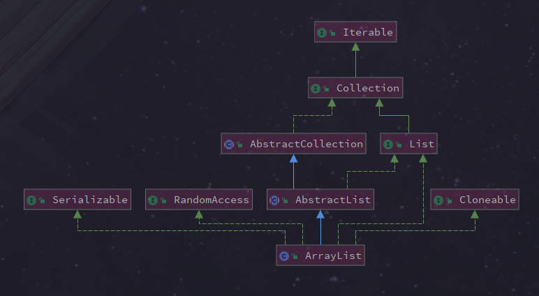

# ArrayList

## 继承体系

```java
public class ArrayList<E> extends AbstractList<E>
        implements List<E>, RandomAccess, Cloneable, java.io.Serializable{
...
}
```

ArrayList 继承了 AbstractList，实现了 List。它是一个数组队列，提供了相关的添加、删除、修改、遍历等功能。

ArrayList 实现了 RandmoAccess 接口，即提供了随机访问功能。RandmoAccess 是 java 中用来被 List 实现，为 List 提供快速访问功能的。在 ArrayList 中，我们即可以通过元素的序号快速获取元素对象；这就是快速随机访问。

ArrayList 实现了 Cloneable 接口，即覆盖了函数 clone()，能被克隆。 ArrayList 实现 java.io.Serializable 接口，这意味着 ArrayList 支持序列化，能通过序列化去传输。



## 源码解读

### 底层实现：数组

```java
    /**
     * 默认的初始化大小
     */
    private static final int DEFAULT_CAPACITY = 10;

    /**
     * 空数组，对象实例的容量为0时使用，具体使用看构造函数
     */
    private static final Object[] EMPTY_ELEMENTDATA = {};

    /**
     * 空数组，对象实例为空时使用，具体使用看构造函数
     */
    private static final Object[] DEFAULTCAPACITY_EMPTY_ELEMENTDATA = {};

    /**
     * 存储元素数据的数组
     */
    transient Object[] elementData; 

    /**
     * ArrayList 中元素个数
     */
    private int size;
```

### 构造方法

```java
/**
 * 如果 initialCapacity 大于 0，初始化 elementData 为该大小
 * 如果等于 0，elementData 为 EMPTY_ELEMENTDATA；小于 0，抛出异常
 */
public ArrayList(int initialCapacity) {
    if (initialCapacity > 0) {
        this.elementData = new Object[initialCapacity];
    } else if (initialCapacity == 0) {
        this.elementData = EMPTY_ELEMENTDATA;
    } else {
        throw new IllegalArgumentException("Illegal Capacity: "+
                                           initialCapacity);
    }
}

/**
 * 构造一个空数组，在第一次 add 时，初始化容量变为 10
 */
public ArrayList() {
    this.elementData = DEFAULTCAPACITY_EMPTY_ELEMENTDATA;
}

/**
 * 使用传入的集合的元素进行初始化
 */
public ArrayList(Collection<? extends E> c) {
    elementData = c.toArray();
    if ((size = elementData.length) != 0) {
        // c.toArray 返回的类型如果不是 Object[]
        if (elementData.getClass() != Object[].class)
            elementData = Arrays.copyOf(elementData, size, Object[].class);
    } else {
        // replace with empty array.
        this.elementData = EMPTY_ELEMENTDATA;
    }
}
```

### 增

```java
    /**
     * 添加元素到数组末尾
     */    
    public boolean add(E e) {
        // 检查是否需要扩容
        ensureCapacityInternal(size + 1);
        elementData[size++] = e;
        return true;
    }

    /**
     * 添加元素 element 到指定的位置 index
     */
    public void add(int index, E element) {
        // 检查 index 不越界
        rangeCheckForAdd(index);
        // 检查是否需要扩容
        ensureCapacityInternal(size + 1); 
        /** elementData:源数组;index:源数组中的起始位置;elementData：目标数组；index + 1：目标数组中的起始位置； size - index：要复制的数组元素的数量；也就是将源数组index开始的元素往后移一位 */
        System.arraycopy(elementData, index, elementData, index + 1,
                         size - index);
        elementData[index] = element;
        size++;
    }
```

### 扩容核心方法：

```java
/**
 * 可以通过扩容，保证能装下元素
 */
public void ensureCapacity(int minCapacity) {
    int minExpand = (elementData != DEFAULTCAPACITY_EMPTY_ELEMENTDATA)
        ? 0
        : DEFAULT_CAPACITY;

    if (minCapacity > minExpand) {
        ensureExplicitCapacity(minCapacity);
    }
}

private void ensureCapacityInternal(int minCapacity) {
    if (elementData == DEFAULTCAPACITY_EMPTY_ELEMENTDATA) {
        minCapacity = Math.max(DEFAULT_CAPACITY, minCapacity);
    }

    ensureExplicitCapacity(minCapacity);
}

private void ensureExplicitCapacity(int minCapacity) {
    modCount++;

    if (minCapacity - elementData.length > 0)
        grow(minCapacity);
}

/**
  * 数组最大大小
  */
private static final int MAX_ARRAY_SIZE = Integer.MAX_VALUE - 8;

/** 
     * 扩容方法
     */
private void grow(int minCapacity) {
    // 旧容量
    int oldCapacity = elementData.length;
    // 新容量为旧容量的 1.5 倍
    int newCapacity = oldCapacity + (oldCapacity >> 1);
    // 如果新容量不满足最小容量
    if (newCapacity - minCapacity < 0)
        newCapacity = minCapacity;
    // 如果新容量大于 MAX_ARRAY_SIZE, 则 newCapacity 为 Integer.MAX_VALUE，否则为 MAX_ARRAY_SIZE
    if (newCapacity - MAX_ARRAY_SIZE > 0)
        newCapacity = hugeCapacity(minCapacity);
    // 用新容量拷贝出来数组
    elementData = Arrays.copyOf(elementData, newCapacity);
}

private static int hugeCapacity(int minCapacity) {
    if (minCapacity < 0) // overflow
        throw new OutOfMemoryError();
    return (minCapacity > MAX_ARRAY_SIZE) ?
        Integer.MAX_VALUE :
    MAX_ARRAY_SIZE;
}
```

### 改

```java
public E set(int index, E element) {
    rangeCheck(index);

    E oldValue = elementData(index);
    elementData[index] = element;
    return oldValue;
}

private void rangeCheck(int index) {
    // 简单地检查下标
    if (index >= size)
        throw new IndexOutOfBoundsException(outOfBoundsMsg(index));
}
```

首先调用 `rangeCheck(index)` 判断 `index` 是否超出了数组范围，然后取出 `index` 位置的值并将 `element` 放在该位置，最后，返回 `oldValue`。

### 删

```java
public E remove(int index) {
    rangeCheck(index);

    modCount++;
    E oldValue = elementData(index);

    int numMoved = size - index - 1;
    // 如果目标元素不是最后一位
    if (numMoved > 0)
        System.arraycopy(elementData, index+1, elementData, index, numMoved);

    elementData[--size] = null; // 如果不手动赋null值，除非对应的位置被其他元素覆盖，否则原来的对象就一直不会被回收。
    return oldValue;
}

public boolean remove(Object o) {
    if (o == null) {
        // 遍历数组
        for (int index = 0; index < size; index++)
            if (elementData[index] == null) {
                fastRemove(index);
                return true;
            }
    } else {
        // 遍历数组
        for (int index = 0; index < size; index++)
            // 得到位置
            if (o.equals(elementData[index])) {
                fastRemove(index);
                return true;
            }
    }
    return false;
}

private void fastRemove(int index) {
    // 比 remove(int index) 少了越界检查
    modCount++;
    int numMoved = size - index - 1;
    if (numMoved > 0)
        System.arraycopy(elementData, index+1, elementData, index,
                         numMoved);
    elementData[--size] = null; // clear to let GC do its work
}

public boolean removeAll(Collection<?> c) {
    Objects.requireNonNull(c);
    // 调用批量删除方法，这时complement传入false，表示删除包含在c中的元素
    return batchRemove(c, false);
}

public boolean retainAll(Collection<?> c) {
    Objects.requireNonNull(c);
    // 调用批量删除方法，这时complement传入true，表示删除不包含在c中的元素
    return batchRemove(c, true);
}

private boolean batchRemove(Collection<?> c, boolean complement) {
    final Object[] elementData = this.elementData;
    // 读写指针同时遍历数组
    int r = 0, w = 0;
    boolean modified = false;
    try {
        for (; r < size; r++)
            if (c.contains(elementData[r]) == complement)
                elementData[w++] = elementData[r];
    } finally {
        if (r != size) {
            System.arraycopy(elementData, r,
                             elementData, w,
                             size - r);
            w += size - r;
        }
        if (w != size) {
            // clear to let GC do its work
            for (int i = w; i < size; i++)
                elementData[i] = null;
            modCount += size - w;
            size = w;
            modified = true;
        }
    }
    return modified;
}
```

### 查

```java
    public E get(int index) {
        rangeCheck(index);
        return elementData(index);
    }
```

### 序列化

ArrayList 基于数组实现，并且具有动态扩容特性，因此保存元素的数组不一定都会被使用，那么就没必要全部进行序列化。

保存元素的数组 elementData 使用 transient 修饰，该关键字声明数组默认不会被序列化。

```java
transient Object[] elementData; 
```

ArrayList 实现了 writeObject() 和 readObject() 来控制只序列化数组中有元素填充那部分内容。

```java
private void readObject(java.io.ObjectInputStream s)
    throws java.io.IOException, ClassNotFoundException {
    elementData = EMPTY_ELEMENTDATA;

    // 读取元素个数（size）
    s.defaultReadObject();

    // 读取容量
    s.readInt(); // ignored

    if (size > 0) {
        // 
        ensureCapacityInternal(size);

        Object[] a = elementData;
        // 依次读取元素
        for (int i=0; i<size; i++) {
            a[i] = s.readObject();
        }
    }
}
private void writeObject(java.io.ObjectOutputStream s)
    throws java.io.IOException{
    // 验证序列化期间是否发生了修改
    int expectedModCount = modCount;
    s.defaultWriteObject();

    // 写出元素个数
    s.writeInt(size);

    // 依次写出元素
    for (int i=0; i<size; i++) {
        s.writeObject(elementData[i]);
    }
    // 如果有修改，抛出异常
    if (modCount != expectedModCount) {
        throw new ConcurrentModificationException();
    }
}
```

序列化时需要使用 ObjectOutputStream 的 writeObject() 将对象转换为字节流并输出。而 writeObject() 方法在传入的对象存在 writeObject() 的时候会去反射调用该对象的 writeObject() 来实现序列化。反序列化使用的是 ObjectInputStream 的 readObject() 方法，原理类似。

```java
ArrayList list = new ArrayList();
ObjectOutputStream oos = new ObjectOutputStream(new FileOutputStream(file));
oos.writeObject(list);
```

## FAQ

### `ArrayList(int initialCapacity)` 会不会初始化数组大小？

会初始化数组大小，但是 List 的大小没有变！因为l ist 的大小是返回 size 的。

以下代码会抛出异常：

```java
ArrayList<Integer> list = new ArrayList<>(10);
list.set(5, 1); // IndexOutOfBoundsException
```

这是因为 `rangeCheck` 函数中，index 与 size 进行比较，而不是 elementData.length

### ArrayList 的遍历和 LinkedList 遍历性能比较如何？

论遍历ArrayList要比LinkedList快得多，ArrayList遍历最大的优势在于内存的连续性，CPU的内部缓存结构会缓存连续的内存片段，可以大幅降低读取内存的性能开销。

### ArrayList 实现 RandomAccess 接口有何作用？为何 LinkedList 却没实现这个接口？

1. RandomAccess 接口只是一个标志接口，只要 List 集合实现这个接口，就能支持快速随机访问。通过查看 Collections 类中的 binarySearch() 方法，可以看出，判断 List 是否实现 RandomAccess 接口来执行 indexedBinarySerach(list, key) 或 iteratorBinarySerach(list, key)方法。再通过查看这两个方法的源码发现：实现 RandomAccess 接口的 List 集合采用一般的 for 循环遍历，而未实现这接口则采用迭代器，即 ArrayList 一般采用 for 循环遍历，而 LinkedList 一般采用迭代器遍历；

2. ArrayList 用 for 循环遍历比 iterator 迭代器遍历快，LinkedList 用 iterator 迭代器遍历比 for 循环遍历快。所以说，当我们在做项目时，应该考虑到 List 集合的不同子类采用不同的遍历方式，能够提高性能。

# Vector

## 简介

Vector 实现 List 接口，继承 AbstractList 类，所以我们可以将其看做队列，支持相关的添加、删除、修改、遍历等功能。

Vector 实现 RandmoAccess 接口，即提供了随机访问功能，提供提供快速访问功能。在Vector我们可以直接访问元素。

Vector 实现了 Cloneable 接口，支持 `clone()` 方法，可以被克隆。

vector 底层数组不加 transient ，序列化时会全部复制。

### 线程安全

它的实现与 ArrayList 类似，但是使用了 synchronized 进行同步。

```java
public synchronized boolean add(E e) {
    modCount++;
    ensureCapacityHelper(elementCount + 1);
    elementData[elementCount++] = e;
    return true;
}

public synchronized E get(int index) {
    if (index >= elementCount)
        throw new ArrayIndexOutOfBoundsException(index);

    return elementData(index);
}
```

### 扩容

Vector 的构造函数可以传入 capacityIncrement 参数，它的作用是在扩容时使容量 capacity 增长 capacityIncrement。如果这个参数的值小于等于 0，扩容时每次都令 capacity 为原来的两倍。

```java
public Vector(int initialCapacity, int capacityIncrement) {
    super();
    if (initialCapacity < 0)
        throw new IllegalArgumentException("Illegal Capacity: "+
                                           initialCapacity);
    this.elementData = new Object[initialCapacity];
    this.capacityIncrement = capacityIncrement;
}
private void grow(int minCapacity) {
    // overflow-conscious code
    int oldCapacity = elementData.length;
    int newCapacity = oldCapacity + ((capacityIncrement > 0) ?
                                     capacityIncrement : oldCapacity);
    if (newCapacity - minCapacity < 0)
        newCapacity = minCapacity;
    if (newCapacity - MAX_ARRAY_SIZE > 0)
        newCapacity = hugeCapacity(minCapacity);
    elementData = Arrays.copyOf(elementData, newCapacity);
}
```

调用没有 capacityIncrement 的构造函数时，capacityIncrement 值被设置为 0，也就是说**默认情况下 Vector 每次扩容时容量都会翻倍**。

```java
public Vector(int initialCapacity) {
    this(initialCapacity, 0);
}

public Vector() {
    this(10);
}
```

### 与 ArrayList 的比较

- Vector 是同步的，因此开销就比 ArrayList 要大，访问速度更慢。最好使用 ArrayList 而不是 Vector，因为同步操作完全可以由程序员自己来控制；
- Vector 每次扩容请求其大小的 2 倍（也可以通过构造函数设置增长的容量），而 ArrayList 是 1.5 倍。

### 替代方案

可以使用 `Collections.synchronizedList();` 得到一个线程安全的 ArrayList。

```java
List<String> list = new ArrayList<>();
List<String> synList = Collections.synchronizedList(list);
```

也可以使用 concurrent 并发包下的 CopyOnWriteArrayList 类。

```java
List<String> list = new CopyOnWriteArrayList<>();
```
