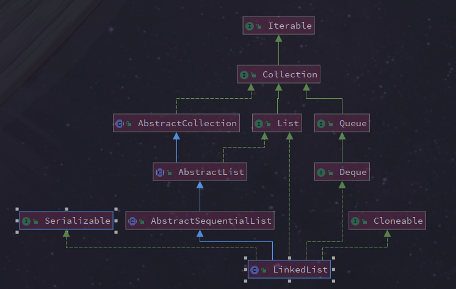

# LinkedList

## 继承体系

```java
public class LinkedList<E>
    extends AbstractSequentialList<E>
    implements List<E>, Deque<E>, Cloneable, java.io.Serializable
{
```

AbstractSequenceList 提供了List接口骨干性的实现以减少实现 List 接口的复杂度，Deque 接口定义了双端队列的操作。

在 LinkedList 中除了本身自己的方法外，还提供了一些可以使其作为栈、队列或者双端队列的方法。这些方法可能彼此之间只是名字不同，以使得这些名字在特定的环境中显得更加合适。

当你需要使用栈或者队列时，可以考虑使用 *LinkedList*，因为 Java 官方已经声明不建议使用 *Stack*。关于栈或队列，现在的首选是*ArrayDeque*，它有着比*LinkedList*（当作栈或队列使用时）有着更好的性能。



## 源码解析

*LinkedList*底层**通过双向链表实现**，双向链表的每个节点用内部类*Node*表示。*LinkedList*通过 `first` 和` last` 引用分别指向链表的第一个和最后一个元素。注意这里没有所谓的哑元，当链表为空的时候 `first` 和 `last` 都指向 `null`。

### 属性

```java
// 元素个数  
transient int size = 0;

/**
 * 头结点
 */
transient Node<E> first;

/**
 * 尾节点
 */
transient Node<E> last;
```

### 构造方法

```java
public LinkedList() {
}

public LinkedList(Collection<? extends E> c) {
    this();
    addAll(c);
}
```

### 内部类

```java
private static class Node<E> {
    E item;
    Node<E> next;
    Node<E> prev;

    Node(Node<E> prev, E element, Node<E> next) {
        this.item = element;
        this.next = next;
        this.prev = prev;
    }
}
```

### 增

```java
    /**
     * Appends the specified element to the end of this list.
     */
    public boolean add(E e) {
        linkLast(e);
        return true;
    }

    /**
     * Links e as last element.
     * 因为有last指向链表末尾，在末尾插入元素的花费是常数时间
     */
    void linkLast(E e) {
        final Node<E> l = last;
        final Node<E> newNode = new Node<>(l, e, null);
        last = newNode;
        if (l == null)
            first = newNode;
        else
            l.next = newNode;
        size++;
        modCount++;
    }
```


```java
    /**
     * Inserts the specified element at the specified position in this list.
     * Shifts the element currently at that position (if any) and any
     * subsequent elements to the right (adds one to their indices).
     */
    public void add(int index, E element) {
        checkPositionIndex(index);

        if (index == size)
            linkLast(element);
        else
            //1.先根据index找到要插入的位置
            linkBefore(element, node(index));
    }
```

```java
    /**
     * Inserts element e before non-null Node succ.
     */
    void linkBefore(E e, Node<E> succ) {
        // assert succ != null;
        final Node<E> pred = succ.prev;
        final Node<E> newNode = new Node<>(pred, e, succ);
        succ.prev = newNode;
        if (pred == null)
            first = newNode;
        else
            pred.next = newNode;
        size++;
        modCount++;
    }
```


## remove()

```java
    public boolean remove(Object o) {
        if (o == null) {
            for (Node<E> x = first; x != null; x = x.next) {
                if (x.item == null) {
                    unlink(x);
                    return true;
                }
            }
        } else {
            for (Node<E> x = first; x != null; x = x.next) {
                if (o.equals(x.item)) {
                    unlink(x);
                    return true;
                }
            }
        }
        return false;
    }
    

E unlink(Node<E> x) {
        // assert x != null;
        final E element = x.item;
        final Node<E> next = x.next;
        final Node<E> prev = x.prev;

        if (prev == null) {//删除的是第一个元素
            first = next;
        } else {
            prev.next = next;
            x.prev = null;
        }

        if (next == null) {//删除的是最后一个元素
            last = prev;
        } else {
            next.prev = prev;
            x.next = null;
        }

        x.item = null;
        size--;
        modCount++;
        return element;
    }
```


