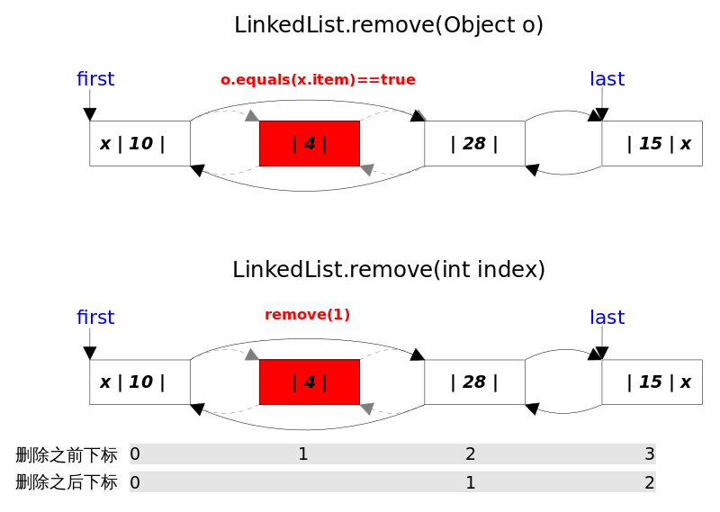

## 1. 概览

### 类结构定义

```java
public class LinkedHashMap<K,V> extends HashMap<K,V>
    implements Map<K,V> {

    ...
}
```

### 成员变量定义

```java
/**
 * The head (eldest) of the doubly linked list.
 */
transient LinkedHashMap.Entry<K,V> head;

/**
 * The tail (youngest) of the doubly linked list.
 */
transient LinkedHashMap.Entry<K,V> tail;

/**
 * The iteration ordering method for this linked hash map: <tt>true</tt>
 * for access-order, <tt>false</tt> for insertion-order.
 *
 * @serial
 */
final boolean accessOrder;  //true表示按照访问顺序迭代，false时表示按照插入顺序 
```

LinkedHashMap 实现了 Map 接口，即允许放入 key 为 null 的元素，也允许插入 value 为 null 的元素。从名字上可以看出该容器是 LinkedList 和 HashMap 的混合体，也就是说它同时满足 HashMap 和 LinkedList 的某些特性。**可将 LinkedHashMap 看作采用 LinkedList 增强的 HashMap。**


其中，HashMap与LinkedHashMap的Entry结构示意图如下图所示：


事实上 LinkedHashMap 是 HashMap 的直接子类，**二者唯一的区别是 LinkedHashMap 在 HashMap 的基础上，采用双向链表（doubly-linked list）的形式将所有 entry 连接起来，这样是为保证元素的迭代顺序跟插入顺序相同**。上图给出了 LinkedHashMap 的结构图，主体部分跟 HashMap 完全一样，多了 `header` 指向双向链表的头部（是一个哑元），**该双向链表的迭代顺序就是 entry 的插入顺序**。

除了可以保迭代历顺序，这种结构还有一个好处：**迭代 LinkedHashMap 时不需要像 HashMap 那样遍历整个table，而只需要直接遍历 header 指向的双向链表即可**，也就是说 LinkedHashMap 的迭代时间就只跟`entry`的个数相关，而跟`table`的大小无关。

```java
    static class Entry<K,V> extends HashMap.Node<K,V> {
        Entry<K,V> before, after;
        Entry(int hash, K key, V value, Node<K,V> next) {
            super(hash, key, value, next);
        }
    }
```

有两个参数可以影响 LinkedHashMap 的性能：**初始容量**（inital capacity）和**负载系数**（load factor）。初始容量指定了初始`table`的大小，负载系数用来指定自动扩容的临界值。当`entry`的数量超过 `capacity*load_factor` 时，容器将自动扩容并重新哈希。对于插入元素较多的场景，将初始容量设大可以减少重新哈希的次数。

将对象放入到 LinkedHashMap 或 LinkedHashSet 中时，有两个方法需要特别关心：`hashCode()` 和 `equals()`。**hashCode() 方法决定了对象会被放到哪个 bucket 里，当多个对象的哈希值冲突时，equals() 方法决定了这些对象是否是“同一个对象”**。所以，如果要将自定义的对象放入到 `LinkedHashMap` 或 `LinkedHashSet` 中，需要 *@Override*`hashCode()` 和 `equals()` 方法。

通过如下方式可以得到一个跟源 Map 迭代顺序 一样的 LinkedHashMap：

```java
void foo(Map m) {
    Map copy = new LinkedHashMap(m);
    ...
}
```

出于性能原因，LinkedHashMap 是非同步的（not synchronized），如果需要在多线程环境使用，需要程序员手动同步；或者通过如下方式将 LinkedHashMap 包装成（wrapped）同步的：

```java
Map m = Collections.synchronizedMap(new LinkedHashMap(...));
```

### 2. get()

`get(Object key)` 方法根据指定的 `key` 值返回对应的 `value`。该方法跟`HashMap.get()`方法的流程几乎完全一样。

### 3. put()

`put(K key, V value)` 方法是将指定的 `key, value` 对添加到 `map` 里。该方法首先会对 `map` 做一次查找，看是否包含该元组，如果已经包含则直接返回，查找过程类似于`get()`方法；如果没有找到，则会通过 `addEntry(int hash, K key, V value, int bucketIndex)` 方法插入新的 `entry`。

注意，这里的**插入有两重含义**：

> 1. 从`table`的角度看，新的`entry`需要插入到对应的`bucket`里，当有哈希冲突时，采用头插法将新的`entry`插入到冲突链表的头部。
> 2. 从`header`的角度看，新的`entry`需要插入到双向链表的尾部。


`addEntry()`代码如下：

```java
void addEntry(int hash, K key, V value, int bucketIndex) {
    if ((size >= threshold) && (null != table[bucketIndex])) {
        resize(2 * table.length);// 自动扩容，并重新哈希
        hash = (null != key) ? hash(key) : 0;
        bucketIndex = hash & (table.length-1);// hash%table.length
    }
    // 1.在冲突链表头部插入新的entry
    HashMap.Entry<K,V> old = table[bucketIndex];
    Entry<K,V> e = new Entry<>(hash, key, value, old);
    table[bucketIndex] = e;
    // 2.在双向链表的尾部插入新的entry
    e.addBefore(header);
    size++;
}
```

上述代码中用到了 `addBefore()`方 法将新 `entry e` 插入到双向链表头引用 `header` 的前面，这样 `e` 就成为双向链表中的最后一个元素。`addBefore()` 的代码如下：

```java
// LinkedHashMap.Entry.addBefor()，将this插入到existingEntry的前面
private void addBefore(Entry<K,V> existingEntry) {
    after  = existingEntry;
    before = existingEntry.before;
    before.after = this;
    after.before = this;
}
```

上述代码只是简单修改相关 `entry` 的引用而已。

### 4. remove()

`remove(Object key)`的作用是删除`key`值对应的`entry`，该方法的具体逻辑是在`removeEntryForKey(Object key)`里实现的。`removeEntryForKey()`方法会首先找到`key`值对应的`entry`，然后删除该`entry`（修改链表的相应引用）。查找过程跟`get()`方法类似。

注意，这里的**删除也有两重含义**：

> 1. 从`table`的角度看，需要将该`entry`从对应的`bucket`里删除，如果对应的冲突链表不空，需要修改冲突链表的相应引用。
> 2. 从`header`的角度来看，需要将该`entry`从双向链表中删除，同时修改链表中前面以及后面元素的相应引用。




`removeEntryForKey()` 对应的代码如下：

```java
final Node<K,V> removeNode(int hash, Object key, Object value,
                               boolean matchValue, boolean movable) {
        Node<K,V>[] tab; Node<K,V> p; int n, index;
        if ((tab = table) != null && (n = tab.length) > 0 &&
            (p = tab[index = (n - 1) & hash]) != null) {
            Node<K,V> node = null, e; K k; V v;
            if (p.hash == hash &&
                ((k = p.key) == key || (key != null && key.equals(k))))
                node = p;
            else if ((e = p.next) != null) {
                if (p instanceof TreeNode)
                    node = ((TreeNode<K,V>)p).getTreeNode(hash, key);
                else {
                    do {
                        if (e.hash == hash &&
                            ((k = e.key) == key ||
                             (key != null && key.equals(k)))) {
                            node = e;
                            break;
                        }
                        p = e;
                    } while ((e = e.next) != null);
                }
            }
            if (node != null && (!matchValue || (v = node.value) == value ||
                                 (value != null && value.equals(v)))) {
                if (node instanceof TreeNode)
                    ((TreeNode<K,V>)node).removeTreeNode(this, tab, movable);
                else if (node == p)
                    tab[index] = node.next;
                else
                    p.next = node.next;
                ++modCount;
                --size;
                afterNodeRemoval(node);
                return node;
            }
        }
        return null;
    }
```